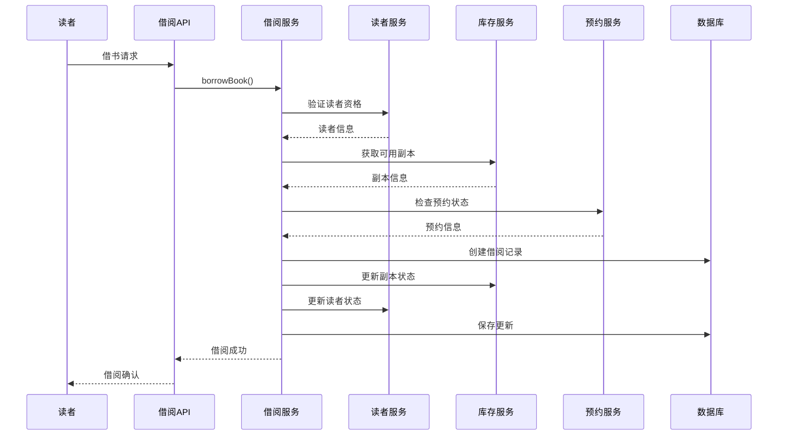
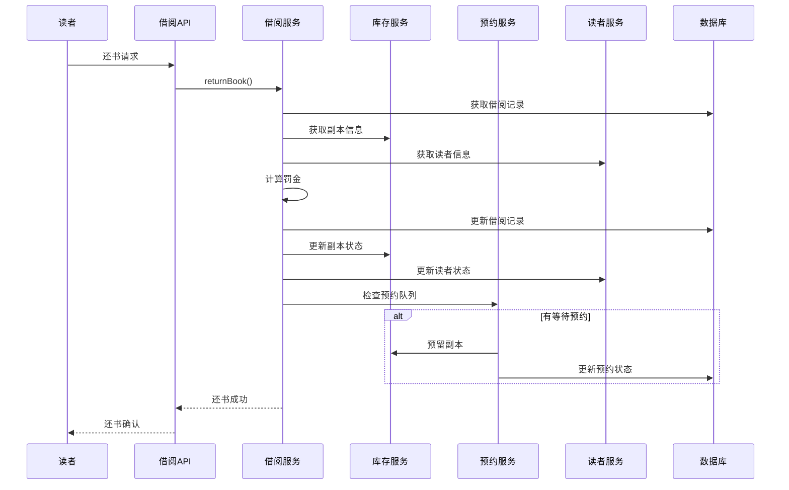

# 借阅上下文（Circulation Context）详细设计

## 1. 上下文概述

### 1.1 职责范围
借阅上下文是图书馆系统的核心业务上下文，负责：
- 借书和还书流程管理
- 图书预约管理
- 逾期罚金计算
- 借阅策略执行
- 借阅历史记录
- 续借管理

### 1.2 业务价值
- 确保借阅规则的正确执行
- 提供公平的图书分配机制
- 准确计算和管理罚金
- 维护借阅秩序和图书流通
- 提供优质的读者服务体验

### 1.3 核心概念
- **Loan（借阅记录）**: 读者借阅图书的完整记录
- **Hold（预约记录）**: 读者对图书的预约请求
- **Fine（罚金）**: 逾期产生的经济处罚
- **CirculationPolicy（借阅策略）**: 借阅规则和策略配置
- **Renewal（续借）**: 借阅期限的延长

## 2. 领域模型设计

### 2.1 聚合根：Loan

```java
package com.library.circulation.domain.model;

import javax.persistence.*;
import java.math.BigDecimal;
import java.math.RoundingMode;
import java.time.LocalDate;
import java.time.LocalDateTime;
import java.time.temporal.ChronoUnit;
import java.util.Objects;

/**
 * 借阅记录聚合根
 * 管理图书借阅的完整生命周期
 */
@Entity
@Table(name = "loans", indexes = {
    @Index(name = "idx_loan_patron", columnList = "patron_id"),
    @Index(name = "idx_loan_copy", columnList = "copy_id"),
    @Index(name = "idx_loan_status", columnList = "status"),
    @Index(name = "idx_loan_due_date", columnList = "due_date")
})
public class Loan {
    
    @EmbeddedId
    private LoanId id;
    
    @Embedded
    @AttributeOverride(name = "value", column = @Column(name = "copy_id"))
    private CopyId copyId;
    
    @Embedded
    @AttributeOverride(name = "value", column = @Column(name = "patron_id"))
    private PatronId patronId;
    
    @Embedded
    @AttributeOverride(name = "value", column = @Column(name = "book_id"))
    private BookId bookId;
    
    @Column(name = "loan_date", nullable = false)
    private LocalDateTime loanDate;
    
    @Column(name = "due_date", nullable = false)
    private LocalDateTime dueDate;
    
    @Column(name = "return_date")
    private LocalDateTime returnDate;
    
    @Enumerated(EnumType.STRING)
    @Column(nullable = false)
    private LoanStatus status;
    
    @Embedded
    private Fine fine;
    
    @Column(name = "renewal_count")
    private Integer renewalCount;
    
    @Column(name = "max_renewals_allowed")
    private Integer maxRenewalsAllowed;
    
    @Column(name = "recall_date")
    private LocalDateTime recallDate;
    
    @Column(name = "recall_reason", length = 500)
    private String recallReason;
    
    @Column(name = "reminder_sent")
    private Boolean reminderSent;
    
    @Column(name = "overdue_notice_sent")
    private Boolean overdueNoticeSent;
    
    @Column(name = "created_at", nullable = false, updatable = false)
    private LocalDateTime createdAt;
    
    @Column(name = "updated_at")
    private LocalDateTime updatedAt;
    
    // 借阅策略引用（通过应用服务注入）
    @Transient
    private CirculationPolicy circulationPolicy;
    
    protected Loan() {
        // JPA required
    }
    
    public Loan(LoanId id, CopyId copyId, PatronId patronId, BookId bookId,
                LocalDateTime loanDate, LocalDateTime dueDate, CirculationPolicy policy) {
        this.id = Objects.requireNonNull(id, "Loan ID cannot be null");
        this.copyId = Objects.requireNonNull(copyId, "Copy ID cannot be null");
        this.patronId = Objects.requireNonNull(patronId, "Patron ID cannot be null");
        this.bookId = Objects.requireNonNull(bookId, "Book ID cannot be null");
        this.loanDate = Objects.requireNonNull(loanDate, "Loan date cannot be null");
        this.dueDate = Objects.requireNonNull(dueDate, "Due date cannot be null");
        this.status = LoanStatus.ACTIVE;
        this.renewalCount = 0;
        this.maxRenewalsAllowed = policy.getMaxRenewalsAllowed();
        this.reminderSent = false;
        this.overdueNoticeSent = false;
        this.circulationPolicy = policy;
        this.createdAt = LocalDateTime.now();
        this.updatedAt = LocalDateTime.now();
    }
    
    // 领域行为：归还图书
    public void returnBook(LocalDateTime returnDate) {
        validateCanReturn();
        
        this.returnDate = Objects.requireNonNull(returnDate, "Return date cannot be null");
        
        // 计算是否逾期
        if (returnDate.isAfter(this.dueDate)) {
            calculateFine();
        }
        
        this.status = LoanStatus.RETURNED;
        this.updatedAt = LocalDateTime.now();
    }
    
    // 领域行为：续借
    public void renew(LocalDateTime renewalDate, CirculationPolicy policy) {
        validateCanRenew(renewalDate, policy);
        
        // 检查是否被召回
        if (this.recallDate != null) {
            throw new LoanRenewalException("Cannot renew recalled loan");
        }
        
        // 检查续借次数
        if (this.renewalCount >= this.maxRenewalsAllowed) {
            throw new LoanRenewalException("Maximum renewals reached: " + this.maxRenewalsAllowed);
        }
        
        // 检查是否有其他读者预约
        if (hasHolds()) {
            throw new LoanRenewalException("Cannot renew loan with pending holds");
        }
        
        // 延长借阅期限
        LocalDateTime oldDueDate = this.dueDate;
        this.dueDate = this.dueDate.plusDays(policy.getLoanPeriodDays());
        this.renewalCount++;
        this.updatedAt = LocalDateTime.now();
        
        // 发布续借事件
        DomainEventPublisher.publish(new LoanRenewedEvent(
            this.id,
            oldDueDate,
            this.dueDate,
            this.renewalCount,
            renewalDate
        ));
    }
    
    // 领域行为：召回图书
    public void recall(LocalDateTime recallDate, String reason) {
        if (this.status != LoanStatus.ACTIVE) {
            throw new InvalidOperationException("Cannot recall non-active loan");
        }
        
        if (recallDate.isBefore(LocalDateTime.now())) {
            throw new IllegalArgumentException("Recall date cannot be in the past");
        }
        
        this.recallDate = recallDate;
        this.recallReason = reason;
        this.updatedAt = LocalDateTime.now();
        
        // 缩短应还日期
        if (this.dueDate.isAfter(recallDate)) {
            this.dueDate = recallDate;
        }
        
        // 发布召回事件
        DomainEventPublisher.publish(new LoanRecalledEvent(
            this.id,
            recallDate,
            reason,
            LocalDateTime.now()
        ));
    }
    
    // 领域行为：标记提醒已发送
    public void markReminderSent() {
        this.reminderSent = true;
        this.updatedAt = LocalDateTime.now();
    }
    
    // 领域行为：标记逾期通知已发送
    public void markOverdueNoticeSent() {
        this.overdueNoticeSent = true;
        this.updatedAt = LocalDateTime.now();
    }
    
    // 领域行为：取消借阅记录（仅用于草稿或错误记录）
    public void cancel(String reason) {
        if (this.status == LoanStatus.RETURNED) {
            throw new InvalidOperationException("Cannot cancel returned loan");
        }
        
        this.status = LoanStatus.CANCELLED;
        this.updatedAt = LocalDateTime.now();
        
        DomainEventPublisher.publish(new LoanCancelledEvent(
            this.id,
            reason,
            LocalDateTime.now()
        ));
    }
    
    // 业务查询方法
    public boolean isOverdue(LocalDateTime currentDate) {
        return this.status == LoanStatus.ACTIVE && currentDate.isAfter(this.dueDate);
    }
    
    public boolean isDueSoon(LocalDateTime currentDate, int daysBeforeDue) {
        return this.status == LoanStatus.ACTIVE && 
               currentDate.plusDays(daysBeforeDue).isAfter(this.dueDate) &&
               !currentDate.isAfter(this.dueDate);
    }
    
    public boolean isRecalled() {
        return this.recallDate != null;
    }
    
    public boolean canBeRenewed(LocalDateTime currentDate, CirculationPolicy policy) {
        try {
            validateCanRenew(currentDate, policy);
            return true;
        } catch (Exception e) {
            return false;
        }
    }
    
    public long getOverdueDays(LocalDateTime currentDate) {
        if (!isOverdue(currentDate)) {
            return 0;
        }
        return ChronoUnit.DAYS.between(this.dueDate, currentDate);
    }
    
    public BigDecimal getCurrentFine(LocalDateTime currentDate) {
        if (this.fine != null) {
            return this.fine.getAmount();
        }
        
        if (isOverdue(currentDate)) {
            return calculateOverdueAmount(currentDate);
        }
        
        return BigDecimal.ZERO;
    }
    
    // 私有验证方法
    private void validateCanReturn() {
        if (this.status != LoanStatus.ACTIVE) {
            throw new InvalidOperationException("Loan is not active: " + this.status);
        }
    }
    
    private void validateCanRenew(LocalDateTime renewalDate, CirculationPolicy policy) {
        if (this.status != LoanStatus.ACTIVE) {
            throw new LoanRenewalException("Cannot renew non-active loan");
        }
        
        if (isOverdue(renewalDate)) {
            throw new LoanRenewalException("Cannot renew overdue loan");
        }
        
        if (this.renewalCount >= this.maxRenewalsAllowed) {
            throw new LoanRenewalException("Maximum renewals reached");
        }
    }
    
    // 计算罚金
    private void calculateFine() {
        if (this.returnDate == null || this.returnDate.isBefore(this.dueDate)) {
            return;
        }
        
        long overdueDays = ChronoUnit.DAYS.between(this.dueDate, this.returnDate);
        BigDecimal fineAmount = calculateOverdueAmount(overdueDays);
        
        this.fine = new Fine(
            FineId.generate(),
            this.id,
            fineAmount,
            overdueDays,
            LocalDateTime.now()
        );
    }
    
    private BigDecimal calculateOverdueAmount(LocalDateTime currentDate) {
        long overdueDays = getOverdueDays(currentDate);
        return calculateOverdueAmount(overdueDays);
    }
    
    private BigDecimal calculateOverdueAmount(long overdueDays) {
        if (this.circulationPolicy == null) {
            return BigDecimal.ZERO;
        }
        
        return this.circulationPolicy.getDailyFineRate()
            .multiply(new BigDecimal(overdueDays))
            .setScale(2, RoundingMode.HALF_UP);
    }
    
    // 假设有预约的方法（实际需要通过仓储查询）
    private boolean hasHolds() {
        // 这里需要通过领域服务或仓储查询
        // 暂时返回false
        return false;
    }
    
    // Getters
    public LoanId getId() { return id; }
    public CopyId getCopyId() { return copyId; }
    public PatronId getPatronId() { return patronId; }
    public BookId getBookId() { return bookId; }
    public LocalDateTime getLoanDate() { return loanDate; }
    public LocalDateTime getDueDate() { return dueDate; }
    public LocalDateTime getReturnDate() { return returnDate; }
    public LoanStatus getStatus() { return status; }
    public Fine getFine() { return fine; }
    public Integer getRenewalCount() { return renewalCount; }
    public Integer getMaxRenewalsAllowed() { return maxRenewalsAllowed; }
    public LocalDateTime getRecallDate() { return recallDate; }
    public String getRecallReason() { return recallReason; }
    public Boolean getReminderSent() { return reminderSent; }
    public Boolean getOverdueNoticeSent() { return overdueNoticeSent; }
    
    public void setCirculationPolicy(CirculationPolicy policy) {
        this.circulationPolicy = policy;
    }
}
```

### 2.2 聚合根：Hold

```java
package com.library.circulation.domain.model;

import javax.persistence.*;
import java.time.LocalDateTime;
import java.util.Objects;

/**
 * 预约记录聚合根
 * 管理图书预约的完整生命周期
 */
@Entity
@Table(name = "holds", indexes = {
    @Index(name = "idx_hold_book", columnList = "book_id"),
    @Index(name = "idx_hold_patron", columnList = "patron_id"),
    @Index(name = "idx_hold_status", columnList = "status"),
    @Index(name = "idx_hold_expiration", columnList = "expiration_date")
})
public class Hold {
    
    @EmbeddedId
    private HoldId id;
    
    @Embedded
    @AttributeOverride(name = "value", column = @Column(name = "book_id"))
    private BookId bookId;
    
    @Embedded
    @AttributeOverride(name = "value", column = @Column(name = "patron_id"))
    private PatronId patronId;
    
    @Column(name = "request_date", nullable = false)
    private LocalDateTime requestDate;
    
    @Column(name = "expiration_date", nullable = false)
    private LocalDateTime expirationDate;
    
    @Enumerated(EnumType.STRING)
    @Column(nullable = false)
    private HoldStatus status;
    
    @Column(name = "queue_position")
    private Integer queuePosition;
    
    @Embedded
    @AttributeOverride(name = "value", column = @Column(name = "fulfilled_copy_id"))
    private CopyId fulfilledCopyId;
    
    @Column(name = "fulfillment_date")
    private LocalDateTime fulfillmentDate;
    
    @Column(name = "available_until_date")
    private LocalDateTime availableUntilDate;
    
    @Column(name = "notification_sent")
    private Boolean notificationSent;
    
    @Column(name = "pickup_library_id")
    private String pickupLibraryId;
    
    @Column(name = "cancel_reason", length = 200)
    private String cancelReason;
    
    @Column(name = "created_at", nullable = false, updatable = false)
    private LocalDateTime createdAt;
    
    @Column(name = "updated_at")
    private LocalDateTime updatedAt;
    
    protected Hold() {
        // JPA required
    }
    
    public Hold(HoldId id, BookId bookId, PatronId patronId, 
                LocalDateTime requestDate, LocalDateTime expirationDate,
                Integer queuePosition) {
        this.id = Objects.requireNonNull(id, "Hold ID cannot be null");
        this.bookId = Objects.requireNonNull(bookId, "Book ID cannot be null");
        this.patronId = Objects.requireNonNull(patronId, "Patron ID cannot be null");
        this.requestDate = Objects.requireNonNull(requestDate, "Request date cannot be null");
        this.expirationDate = Objects.requireNonNull(expirationDate, "Expiration date cannot be null");
        this.queuePosition = queuePosition;
        this.status = HoldStatus.WAITING;
        this.notificationSent = false;
        this.createdAt = LocalDateTime.now();
        this.updatedAt = LocalDateTime.now();
    }
    
    // 领域行为：完成预约
    public void fulfill(CopyId copyId, LocalDateTime fulfillmentDate, int availableDays) {
        if (this.status != HoldStatus.WAITING) {
            throw new InvalidOperationException("Cannot fulfill hold in status: " + this.status);
        }
        
        if (isExpired(LocalDateTime.now())) {
            throw new InvalidOperationException("Cannot fulfill expired hold");
        }
        
        this.fulfilledCopyId = Objects.requireNonNull(copyId, "Copy ID cannot be null");
        this.fulfillmentDate = Objects.requireNonNull(fulfillmentDate, "Fulfillment date cannot be null");
        this.availableUntilDate = fulfillmentDate.plusDays(availableDays);
        this.status = HoldStatus.READY_FOR_PICKUP;
        this.updatedAt = LocalDateTime.now();
        
        DomainEventPublisher.publish(new HoldFulfilledEvent(
            this.id,
            this.bookId,
            this.patronId,
            copyId,
            this.availableUntilDate,
            LocalDateTime.now()
        ));
    }
    
    // 领域行为：取消预约
    public void cancel(String reason) {
        if (this.status == HoldStatus.FULFILLED || this.status == HoldStatus.CANCELLED) {
            throw new InvalidOperationException("Cannot cancel hold in status: " + this.status);
        }
        
        this.status = HoldStatus.CANCELLED;
        this.cancelReason = reason;
        this.updatedAt = LocalDateTime.now();
        
        DomainEventPublisher.publish(new HoldCancelledEvent(
            this.id,
            this.bookId,
            this.patronId,
            reason,
            LocalDateTime.now()
        ));
    }
    
    // 领域行为：标记为已取书
    public void markAsPickedUp(LocalDateTime pickupDate) {
        if (this.status != HoldStatus.READY_FOR_PICKUP) {
            throw new InvalidOperationException("Hold is not ready for pickup");
        }
        
        if (pickupDate.isAfter(this.availableUntilDate)) {
            throw new InvalidOperationException("Hold has expired for pickup");
        }
        
        this.status = HoldStatus.FULFILLED;
        this.updatedAt = LocalDateTime.now();
        
        DomainEventPublisher.publish(new HoldPickedUpEvent(
            this.id,
            this.bookId,
            this.patronId,
            this.fulfilledCopyId,
            pickupDate,
            LocalDateTime.now()
        ));
    }
    
    // 领域行为：标记为过期未取
    public void markAsExpiredNotPickedUp(LocalDateTime expiryDate) {
        if (this.status != HoldStatus.READY_FOR_PICKUP) {
            throw new InvalidOperationException("Hold is not ready for pickup");
        }
        
        this.status = HoldStatus.EXPIRED_NOT_PICKED_UP;
        this.updatedAt = LocalDateTime.now();
        
        DomainEventPublisher.publish(new HoldExpiredNotPickedUpEvent(
            this.id,
            this.bookId,
            this.patronId,
            this.fulfilledCopyId,
            expiryDate,
            LocalDateTime.now()
        ));
    }
    
    // 领域行为：更新队列位置
    public void updateQueuePosition(int newPosition) {
        if (newPosition < 1) {
            throw new IllegalArgumentException("Queue position must be positive");
        }
        
        this.queuePosition = newPosition;
        this.updatedAt = LocalDateTime.now();
    }
    
    // 领域行为：延长预约有效期
    public void extendExpiration(int additionalDays) {
        if (this.status != HoldStatus.WAITING) {
            throw new InvalidOperationException("Can only extend waiting holds");
        }
        
        this.expirationDate = this.expirationDate.plusDays(additionalDays);
        this.updatedAt = LocalDateTime.now();
    }
    
    // 领域行为：标记通知已发送
    public void markNotificationSent() {
        this.notificationSent = true;
        this.updatedAt = LocalDateTime.now();
    }
    
    // 业务查询方法
    public boolean isExpired(LocalDateTime currentDate) {
        return currentDate.isAfter(this.expirationDate);
    }
    
    public boolean isReadyForPickup() {
        return this.status == HoldStatus.READY_FOR_PICKUP;
    }
    
    public boolean isPickupExpired(LocalDateTime currentDate) {
        return this.status == HoldStatus.READY_FOR_PICKUP && 
               currentDate.isAfter(this.availableUntilDate);
    }
    
    public int getDaysUntilExpiration(LocalDateTime currentDate) {
        if (isExpired(currentDate)) {
            return 0;
        }
        return (int) ChronoUnit.DAYS.between(currentDate, this.expirationDate);
    }
    
    public int getDaysUntilPickupExpiry(LocalDateTime currentDate) {
        if (!isReadyForPickup()) {
            return -1;
        }
        if (isPickupExpired(currentDate)) {
            return 0;
        }
        return (int) ChronoUnit.DAYS.between(currentDate, this.availableUntilDate);
    }
    
    // Getters
    public HoldId getId() { return id; }
    public BookId getBookId() { return bookId; }
    public PatronId getPatronId() { return patronId; }
    public LocalDateTime getRequestDate() { return requestDate; }
    public LocalDateTime getExpirationDate() { return expirationDate; }
    public HoldStatus getStatus() { return status; }
    public Integer getQueuePosition() { return queuePosition; }
    public CopyId getFulfilledCopyId() { return fulfilledCopyId; }
    public LocalDateTime getFulfillmentDate() { return fulfillmentDate; }
    public LocalDateTime getAvailableUntilDate() { return availableUntilDate; }
    public Boolean getNotificationSent() { return notificationSent; }
    public String getPickupLibraryId() { return pickupLibraryId; }
    public String getCancelReason() { return cancelReason; }
}
```

### 2.3 值对象：Fine

```java
package com.library.circulation.domain.model;

import javax.persistence.Embeddable;
import java.math.BigDecimal;
import java.math.RoundingMode;
import java.time.LocalDateTime;
import java.util.Objects;

/**
 * 罚金值对象
 * 表示借阅逾期产生的罚金
 */
@Embeddable
public class Fine {
    
    @Embedded
    @AttributeOverride(name = "value", column = @Column(name = "fine_id"))
    private FineId id;
    
    @Column(name = "fine_amount", precision = 10, scale = 2)
    private BigDecimal amount;
    
    @Column(name = "overdue_days")
    private Integer overdueDays;
    
    @Column(name = "calculated_at")
    private LocalDateTime calculatedAt;
    
    @Column(name = "paid_date")
    private LocalDateTime paidDate;
    
    @Column(name = "waived_date")
    private LocalDateTime waivedDate;
    
    @Column(name = "waived_reason", length = 200)
    private String waivedReason;
    
    protected Fine() {
        // JPA required
    }
    
    public Fine(FineId id, LoanId loanId, BigDecimal amount, 
                int overdueDays, LocalDateTime calculatedAt) {
        this.id = Objects.requireNonNull(id, "Fine ID cannot be null");
        this.amount = validateAmount(amount);
        this.overdueDays = overdueDays;
        this.calculatedAt = Objects.requireNonNull(calculatedAt, "Calculated at cannot be null");
    }
    
    // 领域行为：支付罚金
    public void pay(BigDecimal paymentAmount, LocalDateTime paymentDate) {
        if (this.paidDate != null) {
            throw new InvalidOperationException("Fine has already been paid");
        }
        
        if (this.waivedDate != null) {
            throw new InvalidOperationException("Fine has been waived");
        }
        
        if (paymentAmount.compareTo(this.amount) < 0) {
            throw new IllegalArgumentException("Payment amount is less than fine amount");
        }
        
        this.paidDate = Objects.requireNonNull(paymentDate, "Payment date cannot be null");
    }
    
    // 领域行为：豁免罚金
    public void waive(String reason, LocalDateTime waivedDate) {
        if (this.paidDate != null) {
            throw new InvalidOperationException("Cannot waive paid fine");
        }
        
        if (this.waivedDate != null) {
            throw new InvalidOperationException("Fine has already been waived");
        }
        
        this.waivedDate = Objects.requireNonNull(waivedDate, "Waived date cannot be null");
        this.waivedReason = Objects.requireNonNull(reason, "Waive reason cannot be null");
    }
    
    // 业务查询方法
    public boolean isPaid() {
        return this.paidDate != null;
    }
    
    public boolean isWaived() {
        return this.waivedDate != null;
    }
    
    public boolean isOutstanding() {
        return !isPaid() && !isWaived();
    }
    
    public boolean isOverdueForPayment(LocalDateTime currentDate, int overdueDays) {
        if (!isOutstanding()) {
            return false;
        }
        return currentDate.isAfter(this.calculatedAt.plusDays(overdueDays));
    }
    
    // 验证方法
    private BigDecimal validateAmount(BigDecimal amount) {
        if (amount == null) {
            throw new IllegalArgumentException("Fine amount cannot be null");
        }
        if (amount.compareTo(BigDecimal.ZERO) < 0) {
            throw new IllegalArgumentException("Fine amount cannot be negative");
        }
        return amount.setScale(2, RoundingMode.HALF_UP);
    }
    
    // Getters
    public FineId getId() { return id; }
    public BigDecimal getAmount() { return amount; }
    public Integer getOverdueDays() { return overdueDays; }
    public LocalDateTime getCalculatedAt() { return calculatedAt; }
    public LocalDateTime getPaidDate() { return paidDate; }
    public LocalDateTime getWaivedDate() { return waivedDate; }
    public String getWaivedReason() { return waivedReason; }
    
    @Override
    public boolean equals(Object o) {
        if (this == o) return true;
        if (o == null || getClass() != o.getClass()) return false;
        Fine fine = (Fine) o;
        return id.equals(fine.id);
    }
    
    @Override
    public int hashCode() {
        return Objects.hash(id);
    }
}
```

### 2.4 值对象：CirculationPolicy

```java
package com.library.circulation.domain.model;

import javax.persistence.Embeddable;
import java.math.BigDecimal;
import java.time.Period;
import java.util.Objects;

/**
 * 借阅策略值对象
 * 定义借阅规则和策略配置
 */
@Embeddable
public class CirculationPolicy {
    
    @Column(name = "loan_period_days")
    private Integer loanPeriodDays;
    
    @Column(name = "max_renewals_allowed")
    private Integer maxRenewalsAllowed;
    
    @Column(name = "daily_fine_rate", precision = 5, scale = 2)
    private BigDecimal dailyFineRate;
    
    @Column(name = "max_fine_amount", precision = 10, scale = 2)
    private BigDecimal maxFineAmount;
    
    @Column(name = "grace_period_days")
    private Integer gracePeriodDays;
    
    @Column(name = "hold_expiration_days")
    private Integer holdExpirationDays;
    
    @Column(name = "hold_pickup_days")
    private Integer holdPickupDays;
    
    @Column(name = "recall_notice_days")
    private Integer recallNoticeDays;
    
    @Column(name = "reminder_days_before_due")
    private Integer reminderDaysBeforeDue;
    
    protected CirculationPolicy() {
        // JPA required
    }
    
    public CirculationPolicy(Integer loanPeriodDays, Integer maxRenewalsAllowed,
                           BigDecimal dailyFineRate, BigDecimal maxFineAmount,
                           Integer gracePeriodDays, Integer holdExpirationDays,
                           Integer holdPickupDays, Integer recallNoticeDays,
                           Integer reminderDaysBeforeDue) {
        this.loanPeriodDays = validatePositive(loanPeriodDays, "Loan period days");
        this.maxRenewalsAllowed = validateNonNegative(maxRenewalsAllowed, "Max renewals allowed");
        this.dailyFineRate = validatePositive(dailyFineRate, "Daily fine rate");
        this.maxFineAmount = validatePositive(maxFineAmount, "Max fine amount");
        this.gracePeriodDays = validateNonNegative(gracePeriodDays, "Grace period days");
        this.holdExpirationDays = validatePositive(holdExpirationDays, "Hold expiration days");
        this.holdPickupDays = validatePositive(holdPickupDays, "Hold pickup days");
        this.recallNoticeDays = validatePositive(recallNoticeDays, "Recall notice days");
        this.reminderDaysBeforeDue = validatePositive(reminderDaysBeforeDue, "Reminder days before due");
    }
    
    // 预定义策略
    public static CirculationPolicy STANDARD_POLICY = new CirculationPolicy(
        30,  // 30天借阅期
        2,   // 最多续借2次
        new BigDecimal("0.50"),  // 每天0.5元罚金
        new BigDecimal("50.00"), // 最高50元罚金
        3,   // 3天宽限期
        7,   // 7天预约有效期
        5,   // 5天取书期
        7,   // 7天召回通知期
        3    // 到期前3天提醒
    );
    
    public static CirculationPolicy FACULTY_POLICY = new CirculationPolicy(
        90,  // 90天借阅期
        3,   // 最多续借3次
        new BigDecimal("0.25"),  // 每天0.25元罚金
        new BigDecimal("30.00"), // 最高30元罚金
        7,   // 7天宽限期
        14,  // 14天预约有效期
        7,   // 7天取书期
        14,  // 14天召回通知期
        7    // 到期前7天提醒
    );
    
    // 业务方法
    public Period getLoanPeriod() {
        return Period.ofDays(loanPeriodDays);
    }
    
    public Period getGracePeriod() {
        return Period.ofDays(gracePeriodDays);
    }
    
    public Period getHoldExpirationPeriod() {
        return Period.ofDays(holdExpirationDays);
    }
    
    public Period getHoldPickupPeriod() {
        return Period.ofDays(holdPickupDays);
    }
    
    public boolean isInGracePeriod(LocalDateTime dueDate, LocalDateTime returnDate) {
        return returnDate.isAfter(dueDate) && 
               returnDate.isBefore(dueDate.plusDays(gracePeriodDays));
    }
    
    public BigDecimal calculateMaxFine(int overdueDays) {
        BigDecimal calculatedFine = dailyFineRate.multiply(new BigDecimal(overdueDays));
        return calculatedFine.min(maxFineAmount);
    }
    
    // 验证方法
    private Integer validatePositive(Integer value, String fieldName) {
        if (value == null || value <= 0) {
            throw new IllegalArgumentException(fieldName + " must be positive");
        }
        return value;
    }
    
    private Integer validateNonNegative(Integer value, String fieldName) {
        if (value == null || value < 0) {
            throw new IllegalArgumentException(fieldName + " must be non-negative");
        }
        return value;
    }
    
    private BigDecimal validatePositive(BigDecimal value, String fieldName) {
        if (value == null || value.compareTo(BigDecimal.ZERO) <= 0) {
            throw new IllegalArgumentException(fieldName + " must be positive");
        }
        return value;
    }
    
    // Getters
    public Integer getLoanPeriodDays() { return loanPeriodDays; }
    public Integer getMaxRenewalsAllowed() { return maxRenewalsAllowed; }
    public BigDecimal getDailyFineRate() { return dailyFineRate; }
    public BigDecimal getMaxFineAmount() { return maxFineAmount; }
    public Integer getGracePeriodDays() { return gracePeriodDays; }
    public Integer getHoldExpirationDays() { return holdExpirationDays; }
    public Integer getHoldPickupDays() { return holdPickupDays; }
    public Integer getRecallNoticeDays() { return recallNoticeDays; }
    public Integer getReminderDaysBeforeDue() { return reminderDaysBeforeDue; }
}
```

### 2.5 枚举定义

```java
package com.library.circulation.domain.model;

/**
 * 借阅状态枚举
 */
public enum LoanStatus {
    ACTIVE,          // 活跃借阅中
    RETURNED,        // 已归还
    OVERDUE,         // 已逾期
    RENEWED,         // 已续借
    RECALLED,        // 已召回
    CANCELLED,       // 已取消
    LOST             // 已丢失
}

/**
 * 预约状态枚举
 */
public enum HoldStatus {
    WAITING,                  // 等待中
    READY_FOR_PICKUP,         // 准备取书
    FULFILLED,                // 已完成
    CANCELLED,                // 已取消
    EXPIRED,                  // 已过期
    EXPIRED_NOT_PICKED_UP     // 过期未取
}
```

由于文档内容较长，我将继续添加领域服务、仓储接口和应用服务的设计...

## 3. 领域服务设计

### 3.1 借阅管理领域服务

```java
package com.library.circulation.domain.service;

import com.library.circulation.domain.model.*;
import com.library.circulation.domain.repository.*;
import com.library.circulation.domain.event.*;
import com.library.inventory.domain.model.*;
import com.library.inventory.domain.repository.*;
import com.library.patron.domain.model.*;
import com.library.patron.domain.repository.*;
import com.library.shared.domain.event.DomainEventPublisher;
import org.springframework.stereotype.Service;
import org.springframework.transaction.annotation.Transactional;

import java.time.LocalDateTime;
import java.util.List;
import java.util.Optional;

/**
 * 借阅管理领域服务
 * 处理跨聚合的复杂借阅业务逻辑
 */
@Service
public class LoanManagementService {
    
    private final LoanRepository loanRepository;
    private final HoldRepository holdRepository;
    private final BookCopyRepository copyRepository;
    private final CopyInventoryRepository inventoryRepository;
    private final PatronRepository patronRepository;
    private final DomainEventPublisher eventPublisher;
    private final CirculationPolicyService policyService;
    
    public LoanManagementService(LoanRepository loanRepository,
                                  HoldRepository holdRepository,
                                  BookCopyRepository copyRepository,
                                  CopyInventoryRepository inventoryRepository,
                                  PatronRepository patronRepository,
                                  DomainEventPublisher eventPublisher,
                                  CirculationPolicyService policyService) {
        this.loanRepository = loanRepository;
        this.holdRepository = holdRepository;
        this.copyRepository = copyRepository;
        this.inventoryRepository = inventoryRepository;
        this.patronRepository = patronRepository;
        this.eventPublisher = eventPublisher;
        this.policyService = policyService;
    }
    
    /**
     * 借书流程
     */
    @Transactional
    public Loan borrowBook(BorrowBookCommand command) {
        // 1. 验证读者资格
        Patron patron = patronRepository.findById(command.getPatronId())
            .orElseThrow(() -> new PatronNotFoundException(command.getPatronId()));
        
        if (!patron.canBorrow()) {
            throw new PatronCannotBorrowException(
                patron.getStatus(), 
                patron.getCurrentLoansCount(), 
                patron.getOutstandingFines()
            );
        }
        
        // 2. 检查读者是否有逾期未还书籍
        boolean hasOverdueLoans = loanRepository.hasOverdueLoans(command.getPatronId());
        if (hasOverdueLoans) {
            throw new PatronHasOverdueLoansException(command.getPatronId());
        }
        
        // 3. 获取可用副本
        BookCopy copy = copyRepository.findById(command.getCopyId())
            .orElseThrow(() -> new CopyNotFoundException(command.getCopyId()));
        
        if (!copy.isAvailable()) {
            throw new BookNotAvailableException(copy.getStatus());
        }
        
        // 4. 检查是否有该书的预约
        Optional<Hold> existingHold = holdRepository.findWaitingHoldForPatron(
            copy.getInventory().getBookId(), 
            command.getPatronId()
        );
        
        if (existingHold.isPresent()) {
            // 如果有预约，完成预约并借书
            Hold hold = existingHold.get();
            if (hold.getQueuePosition() != 1) {
                throw new HoldNotReadyException(hold.getId(), hold.getQueuePosition());
            }
            hold.markAsPickedUp(LocalDateTime.now());
            holdRepository.save(hold);
        } else {
            // 检查是否有其他读者等待
            boolean hasWaitingHolds = holdRepository.hasWaitingHolds(copy.getInventory().getBookId());
            if (hasWaitingHolds) {
                throw new BookHasWaitingHoldsException(copy.getInventory().getBookId());
            }
        }
        
        // 5. 获取借阅策略
        CirculationPolicy policy = policyService.getPolicyForPatron(patron);
        
        // 6. 创建借阅记录
        LocalDateTime now = LocalDateTime.now();
        LocalDateTime dueDate = now.plusDays(policy.getLoanPeriodDays());
        
        Loan loan = new Loan(
            LoanId.generate(),
            copy.getId(),
            patron.getId(),
            copy.getInventory().getBookId(),
            now,
            dueDate,
            policy
        );
        
        // 7. 更新副本和读者状态
        copy.markAsBorrowed();
        patron.recordLoan();
        
        // 8. 持久化
        copyRepository.save(copy);
        patronRepository.save(patron);
        Loan savedLoan = loanRepository.save(loan);
        
        // 9. 发布领域事件
        eventPublisher.publish(new BookBorrowedEvent(
            savedLoan.getId(),
            copy.getId(),
            patron.getId(),
            copy.getInventory().getBookId(),
            now,
            dueDate
        ));
        
        return savedLoan;
    }
    
    /**
     * 还书流程
     */
    @Transactional
    public void returnBook(ReturnBookCommand command) {
        // 1. 获取借阅记录
        Loan loan = loanRepository.findById(command.getLoanId())
            .orElseThrow(() -> new LoanNotFoundException(command.getLoanId()));
        
        if (loan.getStatus() == LoanStatus.RETURNED) {
            throw new LoanAlreadyReturnedException(command.getLoanId());
        }
        
        // 2. 获取副本
        BookCopy copy = copyRepository.findById(loan.getCopyId())
            .orElseThrow(() -> new CopyNotFoundException(loan.getCopyId()));
        
        // 3. 获取读者
        Patron patron = patronRepository.findById(loan.getPatronId())
            .orElseThrow(() -> new PatronNotFoundException(loan.getPatronId()));
        
        // 4. 执行还书
        LocalDateTime returnDate = command.getReturnDate() != null ? 
            command.getReturnDate() : LocalDateTime.now();
        
        loan.returnBook(returnDate);
        copy.markAsReturned();
        patron.recordReturn();
        
        // 5. 处理罚金
        if (loan.getFine() != null) {
            patron.addFine(loan.getFine().getAmount());
            
            eventPublisher.publish(new FineIncurredEvent(
                loan.getFine().getId(),
                loan.getId(),
                patron.getId(),
                loan.getFine().getAmount(),
                loan.getFine().getOverdueDays(),
                returnDate
            ));
        }
        
        // 6. 处理预约队列
        BookId bookId = copy.getInventory().getBookId();
        Optional<Hold> nextHold = holdRepository.findNextWaitingHold(bookId);
        
        if (nextHold.isPresent()) {
            Hold hold = nextHold.get();
            handleHoldFulfillment(hold, copy, returnDate);
        } else {
            // 没有预约，副本变为可用
            // 状态已在markAsReturned中更新
        }
        
        // 7. 持久化
        loanRepository.save(loan);
        copyRepository.save(copy);
        patronRepository.save(patron);
        
        // 8. 发布还书事件
        eventPublisher.publish(new BookReturnedEvent(
            loan.getId(),
            copy.getId(),
            patron.getId(),
            bookId,
            returnDate,
            loan.getFine() != null ? loan.getFine().getAmount() : null
        ));
    }
    
    /**
     * 续借流程
     */
    @Transactional
    public void renewLoan(RenewLoanCommand command) {
        // 1. 获取借阅记录
        Loan loan = loanRepository.findById(command.getLoanId())
            .orElseThrow(() -> new LoanNotFoundException(command.getLoanId()));
        
        // 2. 获取读者和策略
        Patron patron = patronRepository.findById(loan.getPatronId())
            .orElseThrow(() -> new PatronNotFoundException(loan.getPatronId()));
        
        CirculationPolicy policy = policyService.getPolicyForPatron(patron);
        
        // 3. 检查是否有等待的预约
        boolean hasWaitingHolds = holdRepository.hasWaitingHolds(loan.getBookId());
        if (hasWaitingHolds) {
            throw new CannotRenewWithHoldsException(loan.getBookId());
        }
        
        // 4. 执行续借
        LocalDateTime renewalDate = LocalDateTime.now();
        loan.renew(renewalDate, policy);
        
        // 5. 持久化
        loanRepository.save(loan);
        
        // 6. 发布续借事件
        eventPublisher.publish(new LoanRenewedEvent(
            loan.getId(),
            loan.getDueDate().minusDays(policy.getLoanPeriodDays()),
            loan.getDueDate(),
            loan.getRenewalCount(),
            renewalDate
        ));
    }
    
    /**
     * 召回图书
     */
    @Transactional
    public void recallBook(RecallBookCommand command) {
        // 1. 获取借阅记录
        Loan loan = loanRepository.findById(command.getLoanId())
            .orElseThrow(() -> new LoanNotFoundException(command.getLoanId()));
        
        if (loan.getStatus() != LoanStatus.ACTIVE) {
            throw new InvalidOperationException("Can only recall active loans");
        }
        
        // 2. 执行召回
        LocalDateTime recallDate = LocalDateTime.now();
        CirculationPolicy policy = policyService.getDefaultPolicy();
        LocalDateTime newDueDate = recallDate.plusDays(policy.getRecallNoticeDays());
        
        loan.recall(newDueDate, command.getReason());
        
        // 3. 持久化
        loanRepository.save(loan);
        
        // 4. 发布召回事件
        eventPublisher.publish(new LoanRecalledEvent(
            loan.getId(),
            newDueDate,
            command.getReason(),
            recallDate
        ));
    }
    
    /**
     * 处理预约完成
     */
    private void handleHoldFulfillment(Hold hold, BookCopy copy, LocalDateTime fulfillmentDate) {
        CirculationPolicy policy = policyService.getDefaultPolicy();
        
        // 标记副本为预约状态
        copy.markAsReserved();
        
        // 完成预约
        hold.fulfill(copy.getId(), fulfillmentDate, policy.getHoldPickupDays());
        
        // 持久化
        copyRepository.save(copy);
        holdRepository.save(hold);
        
        // 发布预约完成事件
        eventPublisher.publish(new HoldFulfilledEvent(
            hold.getId(),
            hold.getBookId(),
            hold.getPatronId(),
            copy.getId(),
            hold.getAvailableUntilDate(),
            fulfillmentDate
        ));
    }
    
    /**
     * 获取读者当前借阅
     */
    @Transactional(readOnly = true)
    public List<Loan> getCurrentLoans(PatronId patronId) {
        return loanRepository.findActiveLoansByPatron(patronId);
    }
    
    /**
     * 获取逾期借阅
     */
    @Transactional(readOnly = true)
    public List<Loan> getOverdueLoans() {
        return loanRepository.findOverdueLoans(LocalDateTime.now());
    }
    
    /**
     * 检查并发送提醒
     */
    @Transactional
    public void checkAndSendReminders() {
        LocalDateTime now = LocalDateTime.now();
        CirculationPolicy policy = policyService.getDefaultPolicy();
        
        // 到期提醒
        List<Loan> loansDueSoon = loanRepository.findLoansDueSoon(
            now, 
            policy.getReminderDaysBeforeDue()
        );
        
        for (Loan loan : loansDueSoon) {
            if (!loan.getReminderSent()) {
                loan.markReminderSent();
                loanRepository.save(loan);
                
                eventPublisher.publish(new DueDateReminderEvent(
                    loan.getId(),
                    loan.getPatronId(),
                    loan.getBookId(),
                    loan.getDueDate(),
                    now
                ));
            }
        }
        
        // 逾期提醒
        List<Loan> overdueLoans = loanRepository.findOverdueLoans(now);
        for (Loan loan : overdueLoans) {
            if (!loan.getOverdueNoticeSent()) {
                loan.markOverdueNoticeSent();
                loanRepository.save(loan);
                
                eventPublisher.publish(new OverdueNoticeEvent(
                    loan.getId(),
                    loan.getPatronId(),
                    loan.getBookId(),
                    loan.getDueDate(),
                    loan.getOverdueDays(now),
                    loan.getCurrentFine(now),
                    now
                ));
            }
        }
    }
}
```

### 3.2 预约管理领域服务

```java
package com.library.circulation.domain.service;

import com.library.circulation.domain.model.*;
import com.library.circulation.domain.repository.*;
import com.library.circulation.domain.event.*;
import com.library.patron.domain.model.*;
import com.library.patron.domain.repository.*;
import com.library.inventory.domain.repository.*;
import com.library.shared.domain.event.DomainEventPublisher;
import org.springframework.stereotype.Service;
import org.springframework.transaction.annotation.Transactional;

import java.time.LocalDateTime;
import java.util.List;
import java.util.Optional;

/**
 * 预约管理领域服务
 */
@Service
public class HoldManagementService {
    
    private final HoldRepository holdRepository;
    private final PatronRepository patronRepository;
    private final CopyInventoryRepository inventoryRepository;
    private final BookCopyRepository copyRepository;
    private final DomainEventPublisher eventPublisher;
    private final CirculationPolicyService policyService;
    
    public HoldManagementService(HoldRepository holdRepository,
                                  PatronRepository patronRepository,
                                  CopyInventoryRepository inventoryRepository,
                                  BookCopyRepository copyRepository,
                                  DomainEventPublisher eventPublisher,
                                  CirculationPolicyService policyService) {
        this.holdRepository = holdRepository;
        this.patronRepository = patronRepository;
        this.inventoryRepository = inventoryRepository;
        this.copyRepository = copyRepository;
        this.eventPublisher = eventPublisher;
        this.policyService = policyService;
    }
    
    /**
     * 创建预约
     */
    @Transactional
    public Hold placeHold(PlaceHoldCommand command) {
        // 1. 验证读者
        Patron patron = patronRepository.findById(command.getPatronId())
            .orElseThrow(() -> new PatronNotFoundException(command.getPatronId()));
        
        // 2. 检查是否已有该书的预约
        boolean hasExistingHold = holdRepository.hasActiveHold(
            command.getBookId(), 
            command.getPatronId()
        );
        
        if (hasExistingHold) {
            throw new DuplicateHoldException(command.getBookId(), command.getPatronId());
        }
        
        // 3. 检查该书的可用性
        List<CopyInventory> inventories = inventoryRepository.findByBookId(command.getBookId());
        boolean hasAvailableCopies = inventories.stream()
            .anyMatch(CopyInventory::hasAvailableCopies);
        
        if (hasAvailableCopies) {
            throw new BookAvailableException(command.getBookId());
        }
        
        // 4. 计算队列位置
        int queuePosition = holdRepository.getQueuePosition(command.getBookId()) + 1;
        
        // 5. 创建预约
        LocalDateTime now = LocalDateTime.now();
        CirculationPolicy policy = policyService.getDefaultPolicy();
        
        Hold hold = new Hold(
            HoldId.generate(),
            command.getBookId(),
            command.getPatronId(),
            now,
            now.plusDays(policy.getHoldExpirationDays()),
            queuePosition
        );
        
        hold.setPickupLibraryId(command.getPickupLibraryId());
        
        // 6. 持久化
        Hold savedHold = holdRepository.save(hold);
        
        // 7. 发布事件
        eventPublisher.publish(new HoldPlacedEvent(
            savedHold.getId(),
            command.getBookId(),
            command.getPatronId(),
            queuePosition,
            now
        ));
        
        return savedHold;
    }
    
    /**
     * 取消预约
     */
    @Transactional
    public void cancelHold(CancelHoldCommand command) {
        Hold hold = holdRepository.findById(command.getHoldId())
            .orElseThrow(() -> new HoldNotFoundException(command.getHoldId()));
        
        if (hold.getStatus() == HoldStatus.FULFILLED) {
            throw new InvalidOperationException("Cannot cancel fulfilled hold");
        }
        
        hold.cancel(command.getReason());
        holdRepository.save(hold);
        
        // 更新后续预约的队列位置
        updateQueuePositions(hold.getBookId());
        
        eventPublisher.publish(new HoldCancelledEvent(
            hold.getId(),
            hold.getBookId(),
            hold.getPatronId(),
            command.getReason(),
            LocalDateTime.now()
        ));
    }
    
    /**
     * 更新队列位置
     */
    @Transactional
    public void updateQueuePositions(BookId bookId) {
        List<Hold> waitingHolds = holdRepository.findWaitingHoldsByBook(bookId);
        
        for (int i = 0; i < waitingHolds.size(); i++) {
            Hold hold = waitingHolds.get(i);
            if (hold.getQueuePosition() != (i + 1)) {
                hold.updateQueuePosition(i + 1);
                holdRepository.save(hold);
            }
        }
    }
    
    /**
     * 处理过期预约
     */
    @Transactional
    public void processExpiredHolds() {
        LocalDateTime now = LocalDateTime.now();
        
        // 过期的等待预约
        List<Hold> expiredWaitingHolds = holdRepository.findExpiredWaitingHolds(now);
        for (Hold hold : expiredWaitingHolds) {
            hold.cancel("Expired");
            holdRepository.save(hold);
            updateQueuePositions(hold.getBookId());
            
            eventPublisher.publish(new HoldExpiredEvent(
                hold.getId(),
                hold.getBookId(),
                hold.getPatronId(),
                now
            ));
        }
        
        // 过期未取的预约
        List<Hold> expiredPickupHolds = holdRepository.findExpiredPickupHolds(now);
        for (Hold hold : expiredPickupHolds) {
            // 释放副本
            if (hold.getFulfilledCopyId() != null) {
                BookCopy copy = copyRepository.findById(hold.getFulfilledCopyId())
                    .orElse(null);
                
                if (copy != null) {
                    copy.markAsReturned(); // 重新变为可用状态
                    copyRepository.save(copy);
                }
            }
            
            hold.markAsExpiredNotPickedUp(now);
            holdRepository.save(hold);
            
            // 处理下一个预约
            processNextHold(hold.getBookId());
            
            eventPublisher.publish(new HoldExpiredNotPickedUpEvent(
                hold.getId(),
                hold.getBookId(),
                hold.getPatronId(),
                hold.getFulfilledCopyId(),
                now,
                LocalDateTime.now()
            ));
        }
    }
    
    /**
     * 处理下一个预约
     */
    @Transactional
    public void processNextHold(BookId bookId) {
        Optional<Hold> nextHold = holdRepository.findNextWaitingHold(bookId);
        
        if (nextHold.isPresent()) {
            Hold hold = nextHold.get();
            
            // 查找可用副本
            List<CopyInventory> inventories = inventoryRepository.findByBookId(bookId);
            for (CopyInventory inventory : inventories) {
                if (inventory.hasAvailableCopies()) {
                    try {
                        BookCopy copy = inventory.getAvailableCopy();
                        LocalDateTime now = LocalDateTime.now();
                        CirculationPolicy policy = policyService.getDefaultPolicy();
                        
                        copy.markAsReserved();
                        hold.fulfill(copy.getId(), now, policy.getHoldPickupDays());
                        
                        copyRepository.save(copy);
                        holdRepository.save(hold);
                        
                        eventPublisher.publish(new HoldFulfilledEvent(
                            hold.getId(),
                            bookId,
                            hold.getPatronId(),
                            copy.getId(),
                            hold.getAvailableUntilDate(),
                            now
                        ));
                        
                        break;
                    } catch (NoAvailableCopyException e) {
                        continue;
                    }
                }
            }
        }
    }
    
    /**
     * 获取读者的预约列表
     */
    @Transactional(readOnly = true)
    public List<Hold> getPatronHolds(PatronId patronId) {
        return holdRepository.findByPatronId(patronId);
    }
    
    /**
     * 获取图书的预约队列
     */
    @Transactional(readOnly = true)
    public List<Hold> getBookHoldQueue(BookId bookId) {
        return holdRepository.findWaitingHoldsByBook(bookId);
    }
}
```

## 4. 仓储接口设计

### 4.1 借阅仓储接口

```java
package com.library.circulation.domain.repository;

import com.library.circulation.domain.model.Loan;
import com.library.circulation.domain.model.LoanId;
import com.library.circulation.domain.model.LoanStatus;
import com.library.circulation.domain.model.PatronId;

import java.time.LocalDateTime;
import java.util.List;
import java.util.Optional;

/**
 * 借阅仓储接口
 */
public interface LoanRepository {
    
    Loan save(Loan loan);
    
    Optional<Loan> findById(LoanId id);
    
    List<Loan> findByPatronId(PatronId patronId);
    
    List<Loan> findActiveLoansByPatron(PatronId patronId);
    
    List<Loan> findByStatus(LoanStatus status);
    
    List<Loan> findOverdueLoans(LocalDateTime currentDate);
    
    List<Loan> findLoansDueSoon(LocalDateTime currentDate, int daysBeforeDue);
    
    boolean hasOverdueLoans(PatronId patronId);
    
    List<Loan> findLoansByCopyId(CopyId copyId);
    
    List<Loan> findActiveLoansByBookId(BookId bookId);
    
    void delete(LoanId id);
}
```

### 4.2 预约仓储接口

```java
package com.library.circulation.domain.repository;

import com.library.circulation.domain.model.Hold;
import com.library.circulation.domain.model.HoldId;
import com.library.circulation.domain.model.HoldStatus;
import com.library.circulation.domain.model.BookId;
import com.library.circulation.domain.model.PatronId;

import java.time.LocalDateTime;
import java.util.List;
import java.util.Optional;

/**
 * 预约仓储接口
 */
public interface HoldRepository {
    
    Hold save(Hold hold);
    
    Optional<Hold> findById(HoldId id);
    
    Optional<Hold> findWaitingHoldForPatron(BookId bookId, PatronId patronId);
    
    Optional<Hold> findNextWaitingHold(BookId bookId);
    
    List<Hold> findByPatronId(PatronId patronId);
    
    List<Hold> findByBookId(BookId bookId);
    
    List<Hold> findWaitingHoldsByBook(BookId bookId);
    
    List<Hold> findByStatus(HoldStatus status);
    
    List<Hold> findExpiredWaitingHolds(LocalDateTime currentDate);
    
    List<Hold> findExpiredPickupHolds(LocalDateTime currentDate);
    
    boolean hasActiveHold(BookId bookId, PatronId patronId);
    
    boolean hasWaitingHolds(BookId bookId);
    
    int getQueuePosition(BookId bookId);
    
    void delete(HoldId id);
}
```

## 5. 应用服务设计

### 5.1 借阅应用服务

```java
package com.library.circulation.application.service;

import com.library.circulation.application.command.*;
import com.library.circulation.application.dto.*;
import com.library.circulation.domain.model.*;
import com.library.circulation.domain.service.*;
import com.library.circulation.domain.repository.LoanRepository;
import org.springframework.data.domain.Page;
import org.springframework.data.domain.Pageable;
import org.springframework.stereotype.Service;
import org.springframework.transaction.annotation.Transactional;

import java.util.List;
import java.util.stream.Collectors;

/**
 * 借阅应用服务
 */
@Service
public class CirculationApplicationService {
    
    private final LoanManagementService loanManagementService;
    private final HoldManagementService holdManagementService;
    private final LoanRepository loanRepository;
    
    public CirculationApplicationService(LoanManagementService loanManagementService,
                                        HoldManagementService holdManagementService,
                                        LoanRepository loanRepository) {
        this.loanManagementService = loanManagementService;
        this.holdManagementService = holdManagementService;
        this.loanRepository = loanRepository;
    }
    
    /**
     * 借书用例
     */
    @Transactional
    public LoanDTO borrowBook(BorrowBookRequest request) {
        BorrowBookCommand command = new BorrowBookCommand(
            request.getCopyId(),
            request.getPatronId()
        );
        
        Loan loan = loanManagementService.borrowBook(command);
        return LoanDTO.fromDomain(loan);
    }
    
    /**
     * 还书用例
     */
    @Transactional
    public void returnBook(ReturnBookRequest request) {
        ReturnBookCommand command = new ReturnBookCommand(
            request.getLoanId(),
            request.getReturnDate()
        );
        
        loanManagementService.returnBook(command);
    }
    
    /**
     * 续借用例
     */
    @Transactional
    public void renewLoan(RenewLoanRequest request) {
        RenewLoanCommand command = new RenewLoanCommand(
            request.getLoanId()
        );
        
        loanManagementService.renewLoan(command);
    }
    
    /**
     * 创建预约用例
     */
    @Transactional
    public HoldDTO placeHold(PlaceHoldRequest request) {
        PlaceHoldCommand command = new PlaceHoldCommand(
            request.getBookId(),
            request.getPatronId(),
            request.getPickupLibraryId()
        );
        
        Hold hold = holdManagementService.placeHold(command);
        return HoldDTO.fromDomain(hold);
    }
    
    /**
     * 获取读者当前借阅用例
     */
    public List<LoanDTO> getCurrentLoans(PatronId patronId) {
        List<Loan> loans = loanManagementService.getCurrentLoans(patronId);
        return loans.stream()
            .map(LoanDTO::fromDomain)
            .collect(Collectors.toList());
    }
    
    /**
     * 获取读者预约用例
     */
    public List<HoldDTO> getPatronHolds(PatronId patronId) {
        List<Hold> holds = holdManagementService.getPatronHolds(patronId);
        return holds.stream()
            .map(HoldDTO::fromDomain)
            .collect(Collectors.toList());
    }
}
```

## 6. 业务流程

### 6.1 借书流程



### 6.2 还书流程



## 7. 配置和实现

### 7.1 借阅策略配置

```java
package com.library.circulation.config;

import com.library.circulation.domain.model.CirculationPolicy;
import org.springframework.context.annotation.Bean;
import org.springframework.context.annotation.Configuration;

/**
 * 借阅策略配置
 */
@Configuration
public class CirculationPolicyConfig {
    
    @Bean
    public CirculationPolicy standardPolicy() {
        return CirculationPolicy.STANDARD_POLICY;
    }
    
    @Bean
    public CirculationPolicy facultyPolicy() {
        return CirculationPolicy.FACULTY_POLICY;
    }
    
    @Bean
    public CirculationPolicy studentPolicy() {
        return new CirculationPolicy(
            21,  // 21天借阅期
            1,   // 最多续借1次
            new BigDecimal("0.50"),  // 每天0.5元罚金
            new BigDecimal("30.00"), // 最高30元罚金
            3,   // 3天宽限期
            7,   // 7天预约有效期
            5,   // 5天取书期
            7,   // 7天召回通知期
            3    // 到期前3天提醒
        );
    }
}
```

### 7.2 定时任务配置

```java
package com.library.circulation.config;

import com.library.circulation.domain.service.LoanManagementService;
import com.library.circulation.domain.service.HoldManagementService;
import org.springframework.scheduling.annotation.Scheduled;
import org.springframework.stereotype.Component;

/**
 * 借阅上下文定时任务
 */
@Component
public class CirculationScheduledTasks {
    
    private final LoanManagementService loanManagementService;
    private final HoldManagementService holdManagementService;
    
    public CirculationScheduledTasks(LoanManagementService loanManagementService,
                                     HoldManagementService holdManagementService) {
        this.loanManagementService = loanManagementService;
        this.holdManagementService = holdManagementService;
    }
    
    /**
     * 每天早上8点检查并发送提醒
     */
    @Scheduled(cron = "0 0 8 * * ?")
    public void checkAndSendReminders() {
        loanManagementService.checkAndSendReminders();
    }
    
    /**
     * 每小时处理过期预约
     */
    @Scheduled(cron = "0 0 * * * ?")
    public void processExpiredHolds() {
        holdManagementService.processExpiredHolds();
    }
    
    /**
     * 每天凌晨2点处理逾期罚金
     */
    @Scheduled(cron = "0 0 2 * * ?")
    public void processOverdueFines() {
        // 实现逾期罚金处理逻辑
    }
}
```

## 8. 测试策略

### 8.1 借阅聚合测试

```java
package com.library.circulation.domain.model;

import org.junit.jupiter.api.Test;
import java.math.BigDecimal;
import java.time.LocalDateTime;
import static org.junit.jupiter.api.Assertions.*;

class LoanTest {
    
    @Test
    void shouldCreateLoanWithValidData() {
        LoanId loanId = LoanId.generate();
        CopyId copyId = CopyId.generate();
        PatronId patronId = PatronId.generate();
        BookId bookId = BookId.generate();
        
        LocalDateTime loanDate = LocalDateTime.now();
        LocalDateTime dueDate = loanDate.plusDays(30);
        CirculationPolicy policy = CirculationPolicy.STANDARD_POLICY;
        
        Loan loan = new Loan(loanId, copyId, patronId, bookId, loanDate, dueDate, policy);
        
        assertEquals(loanId, loan.getId());
        assertEquals(LoanStatus.ACTIVE, loan.getStatus());
        assertEquals(0, loan.getRenewalCount());
        assertFalse(loan.isOverdue(LocalDateTime.now()));
    }
    
    @Test
    void shouldCalculateFineWhenOverdue() {
        Loan loan = createTestLoan();
        LocalDateTime returnDate = loan.getDueDate().plusDays(5);
        
        loan.returnBook(returnDate);
        
        assertNotNull(loan.getFine());
        assertTrue(loan.getFine().getAmount().compareTo(BigDecimal.ZERO) > 0);
        assertEquals(5, loan.getFine().getOverdueDays());
    }
    
    @Test
    void shouldRenewLoanWhenValid() {
        Loan loan = createTestLoan();
        CirculationPolicy policy = CirculationPolicy.STANDARD_POLICY;
        
        loan.renew(LocalDateTime.now(), policy);
        
        assertEquals(1, loan.getRenewalCount());
        assertEquals(LoanStatus.ACTIVE, loan.getStatus());
    }
    
    @Test
    void shouldThrowExceptionWhenRenewingOverdueLoan() {
        Loan loan = createTestLoan();
        LocalDateTime overdueDate = loan.getDueDate().plusDays(1);
        
        assertThrows(LoanRenewalException.class, () -> 
            loan.renew(overdueDate, CirculationPolicy.STANDARD_POLICY));
    }
}
```

## 9. 部署配置

### 9.1 application.yml

```yaml
spring:
  application:
    name: circulation-service
  
  datasource:
    url: jdbc:postgresql://localhost:5432/library_circulation
    username: ${DB_USERNAME:circulation_user}
    password: ${DB_PASSWORD:circulation_pass}
  
  jpa:
    hibernate:
      ddl-auto: validate
    properties:
      hibernate:
        dialect: org.hibernate.dialect.PostgreSQLDialect
  
  kafka:
    bootstrap-servers: ${KAFKA_SERVERS:localhost:9092}
    producer:
      key-serializer: org.apache.kafka.common.serialization.StringSerializer
      value-serializer: org.springframework.kafka.support.serializer.JsonSerializer

circulation:
  policy:
    default: STANDARD
    faculty-patron-types: FACULTY, STAFF
  
  scheduling:
    reminder-cron: "0 0 8 * * ?"
    hold-expiry-cron: "0 0 * * * ?"
    fine-processing-cron: "0 0 2 * * ?"
  
  recall:
    enabled: true
    default-notice-days: 7

management:
  endpoints:
    web:
      exposure:
        include: health,info,metrics,circulation
  endpoint:
    health:
      show-details: always
  metrics:
    export:
      prometheus:
        enabled: true

logging:
  level:
    com.library.circulation: DEBUG
```

## 10. 监控和指标

### 10.1 关键业务指标

- 当前活跃借阅数量
- 逾期借阅数量
- 今日借阅量
- 今日还书量
- 平均借阅周期
- 续借率
- 预约完成率
- 预约过期率

### 10.2 性能指标

- 借书处理时间
- 还书处理时间
- 续借处理时间
- 预约处理时间
- 数据库查询性能

## 11. 总结

借阅上下文是图书馆系统的核心业务上下文，负责管理图书的借阅、归还、预约等核心业务流程。本设计文档详细描述了：

1. **核心聚合**: Loan和Hold聚合的设计，封装完整的业务不变量
2. **业务规则**: 借阅策略、罚金计算、预约队列管理等复杂业务逻辑
3. **流程管理**: 借书、还书、续借、预约等核心业务流程
4. **事件驱动**: 通过领域事件实现与其他上下文的解耦
5. **定时任务**: 自动化提醒、过期处理等后台任务
6. **监控指标**: 关键业务指标和性能指标的监控

该设计确保了借阅业务规则的正确执行，提供了良好的用户体验，同时保持了系统的可维护性和可扩展性。

---

**文档版本**: v1.0  
**创建日期**: 2026-05-02  
**最后更新**: 2026-05-02  
**状态**: 初稿完成

---

## 实现状态（2026-05-31 更新）

> 本文档原为设计文档，以下为实际代码实现情况

### 实际代码结构

**领域层 (domain/)**:
- 实体/聚合根: Loan, Hold, Fine, CirculationPolicy
- 值对象: CirculationPolicy
- 枚举: HoldStatus, LoanStatus
- 领域事件: 14 个 — BookBorrowedEvent, BookReturnedEvent, DueDateReminderEvent, FineIncurredEvent, HoldCancelledEvent, HoldExpiredEvent, HoldExpiredNotPickedUpEvent, HoldFulfilledEvent, HoldPickedUpEvent, HoldPlacedEvent, LoanCancelledEvent, LoanRecalledEvent, LoanRenewedEvent, OverdueNoticeEvent
- 领域服务: CirculationManagementService
- 仓储接口: HoldRepository, LoanRepository
- 领域异常: 6 个

**应用层 (application/)**:
- 应用服务: CirculationApplicationService
- 事件处理器: PatronSuspendedEventHandler

**基础设施层 (infrastructure/)**:
- Kafka 发布者: CirculationDomainEventPublisher（topic: library.circulation.events）
- Kafka 消费者: PatronEventConsumer（监听 library.patron.events）

**接口层 (interfaces/)**:
- REST 控制器: AdminController, HoldController, LoanController

### 测试覆盖

| 类型 | 数量 |
|------|------|
| 单元/集成测试 | 7 |
| BDD Step 定义 | 1 |
| BDD Feature 文件 | 2 |

### 与设计文档的偏差

实现与设计文档基本一致。主要差异：
- 实际领域事件数量（14 个）多于设计文档中显式列出的事件，包含了 HoldExpiredEvent、HoldExpiredNotPickedUpEvent、HoldCancelledEvent 等预约生命周期事件
- 实际实现将控制器拆分为 AdminController、HoldController、LoanController 三个独立控制器
- 实际实现了 PatronSuspendedEventHandler 用于响应会员暂停事件，以及 PatronEventConsumer 监听会员上下文的 Kafka 事件
- 设计文档中描述的 LoanManagementService 和 HoldManagementService 在实现中合并为统一的 CirculationManagementService
