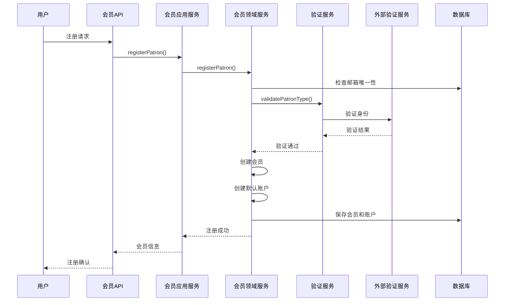
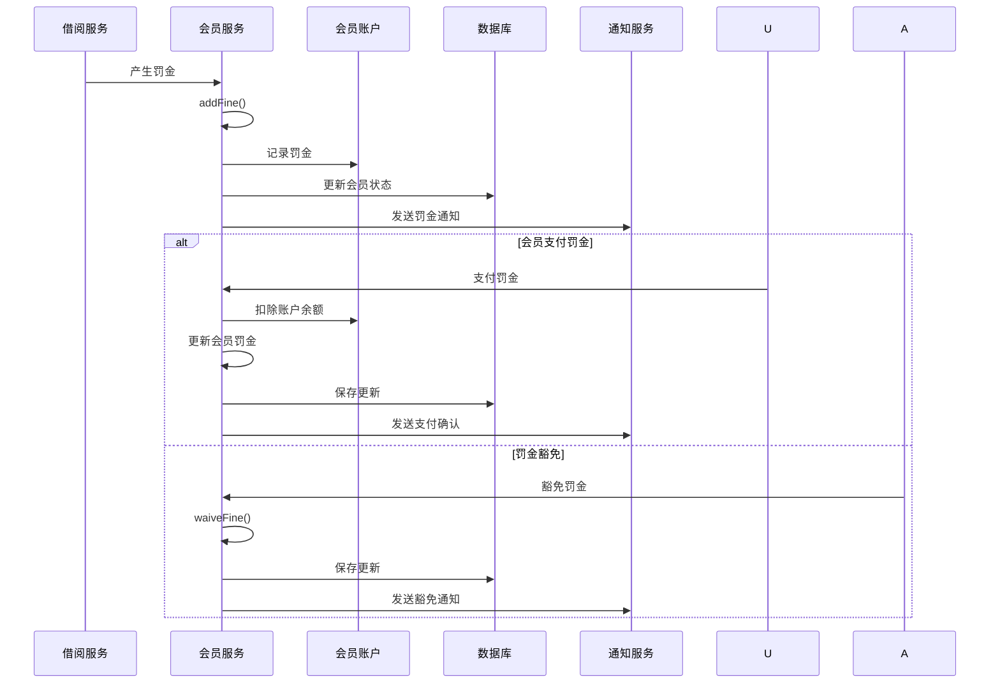

# 会员上下文（Patron Context）详细设计

## 1. 上下文概述

### 1.1 职责范围
会员上下文负责图书馆读者/会员的完整生命周期管理，包括：
- 会员注册和认证
- 会员信息管理
- 会员等级和权限管理
- 借阅资格控制
- 会员状态管理
- 罚金和账户管理
- 会员历史记录

### 1.2 业务价值
- 确保只有合格读者才能借阅图书
- 提供个性化的借阅服务
- 维护读者账户和信用记录
- 支持会员等级和差异化服务
- 提供完整的会员管理功能

### 1.3 核心概念
- **Patron（会员）**: 图书馆的注册读者
- **Membership（会员资格）**: 会员的订阅状态
- **PatronType（会员类型）**: 不同类型的会员（学生、教师、员工等）
- **PatronAccount（会员账户）**: 会员的财务账户
- **BorrowingPrivilege（借阅权限）**: 会员的借阅特权
- **PatronProfile（会员档案）**: 会员的详细档案信息

## 2. 领域模型设计

### 2.1 聚合根：Patron

```java
package com.library.patron.domain.model;

import javax.persistence.*;
import java.math.BigDecimal;
import java.time.LocalDate;
import java.time.LocalDateTime;
import java.util.ArrayList;
import java.util.List;
import java.util.Objects;

/**
 * 会员聚合根
 * 管理读者的完整信息和状态
 */
@Entity
@Table(name = "patrons", indexes = {
    @Index(name = "idx_patron_email", columnList = "email"),
    @Index(name = "idx_patron_status", columnList = "status"),
    @Index(name = "idx_patron_type", columnList = "patron_type")
})
public class Patron {
    
    @EmbeddedId
    private PatronId id;
    
    @Column(nullable = false, length = 100)
    private String firstName;
    
    @Column(nullable = false, length = 100)
    private String lastName;
    
    @Column(nullable = false, unique = true, length = 150)
    private String email;
    
    @Column(length = 20)
    private String phone;
    
    @Column(length = 200)
    private String address;
    
    @Column(length = 100)
    private String city;
    
    @Column(length = 10)
    private String postalCode;
    
    @Enumerated(EnumType.STRING)
    @Column(nullable = false)
    private PatronType patronType;
    
    @Enumerated(EnumType.STRING)
    @Column(nullable = false)
    private MembershipStatus status;
    
    @Column(name = "member_since", nullable = false)
    private LocalDate memberSince;
    
    @Column(name = "membership_expiry")
    private LocalDate membershipExpiry;
    
    @Column(name = "current_loans", nullable = false)
    private Integer currentLoans;
    
    @Column(name = "outstanding_fines", precision = 10, scale = 2)
    private BigDecimal outstandingFines;
    
    @Column(name = "total_borrowed")
    private Integer totalBorrowed;
    
    @Column(name = "last_borrow_date")
    private LocalDate lastBorrowDate;
    
    @Column(name = "last_return_date")
    private LocalDate lastReturnDate;
    
    @Embedded
    private BorrowingPrivilege borrowingPrivilege;
    
    @OneToMany(mappedBy = "patron", cascade = CascadeType.ALL, orphanRemoval = true)
    private List<PatronAccount> accounts = new ArrayList<>();
    
    @OneToMany(mappedBy = "patron", cascade = CascadeType.ALL)
    private List<MembershipHistory> membershipHistory = new ArrayList<>();
    
    @Column(name = "notes", length = 1000)
    private String notes;
    
    @Column(name = "created_at", nullable = false, updatable = false)
    private LocalDateTime createdAt;
    
    @Column(name = "updated_at")
    private LocalDateTime updatedAt;
    
    @Column(name = "created_by")
    private String createdBy;
    
    @Column(name = "updated_by")
    private String updatedBy;
    
    // 构造函数
    protected Patron() {
        // JPA required
    }
    
    public Patron(PatronId id, String firstName, String lastName, String email, 
                  PatronType patronType, String createdBy) {
        this.id = Objects.requireNonNull(id, "Patron ID cannot be null");
        this.firstName = validateName(firstName, "First name");
        this.lastName = validateName(lastName, "Last name");
        this.email = validateEmail(email);
        this.patronType = Objects.requireNonNull(patronType, "Patron type cannot be null");
        this.status = MembershipStatus.ACTIVE;
        this.memberSince = LocalDate.now();
        this.currentLoans = 0;
        this.outstandingFines = BigDecimal.ZERO;
        this.totalBorrowed = 0;
        this.borrowingPrivilege = new BorrowingPrivilege(patronType);
        this.createdAt = LocalDateTime.now();
        this.updatedAt = LocalDateTime.now();
        this.createdBy = createdBy;
        this.updatedBy = createdBy;
        
        // 记录会员历史
        this.recordMembershipHistory(MembershipAction.JOINED, "Initial membership", createdBy);
    }
    
    // 领域行为：更新基本信息
    public void updatePersonalInfo(String firstName, String lastName, String email, 
                                   String phone, String address, String city, 
                                   String postalCode, String updatedBy) {
        if (this.status == MembershipStatus.TERMINATED) {
            throw new InvalidOperationException("Cannot update terminated patron");
        }
        
        this.firstName = validateName(firstName, "First name");
        this.lastName = validateName(lastName, "Last name");
        
        if (email != null && !email.equals(this.email)) {
            this.email = validateEmail(email);
        }
        
        this.phone = phone;
        this.address = address;
        this.city = city;
        this.postalCode = postalCode;
        this.updatedBy = updatedBy;
        this.updatedAt = LocalDateTime.now();
    }
    
    // 领域行为：更新会员类型
    public void updatePatronType(PatronType newType, String reason, String updatedBy) {
        if (newType == null) {
            throw new IllegalArgumentException("Patron type cannot be null");
        }
        
        PatronType oldType = this.patronType;
        this.patronType = newType;
        this.borrowingPrivilege = new BorrowingPrivilege(newType);
        this.updatedBy = updatedBy;
        this.updatedAt = LocalDateTime.now();
        
        this.recordMembershipHistory(MembershipAction.TYPE_CHANGED, 
            String.format("Changed from %s to %s: %s", oldType, newType, reason), updatedBy);
    }
    
    // 领域行为：检查借阅资格
    public boolean canBorrow() {
        if (this.status != MembershipStatus.ACTIVE) {
            return false;
        }
        
        if (this.currentLoans >= this.borrowingPrivilege.getMaxLoans()) {
            return false;
        }
        
        if (this.outstandingFines.compareTo(MAX_ALLOWED_FINE) >= 0) {
            return false;
        }
        
        if (this.membershipExpiry != null && this.membershipExpiry.isBefore(LocalDate.now())) {
            return false;
        }
        
        return true;
    }
    
    // 领域行为：记录借阅
    public void recordLoan() {
        if (!canBorrow()) {
            throw new PatronCannotBorrowException(
                this.status, this.currentLoans, this.outstandingFines);
        }
        
        this.currentLoans++;
        this.totalBorrowed++;
        this.lastBorrowDate = LocalDate.now();
        this.updatedAt = LocalDateTime.now();
    }
    
    // 领域行为：记录归还
    public void recordReturn() {
        if (this.currentLoans <= 0) {
            throw new InvalidOperationException("No active loans to return");
        }
        
        this.currentLoans--;
        this.lastReturnDate = LocalDate.now();
        this.updatedAt = LocalDateTime.now();
    }
    
    // 领域行为：添加罚金
    public void addFine(BigDecimal amount) {
        if (amount == null || amount.compareTo(BigDecimal.ZERO) <= 0) {
            throw new IllegalArgumentException("Fine amount must be positive");
        }
        
        BigDecimal oldFines = this.outstandingFines;
        this.outstandingFines = this.outstandingFines.add(amount);
        this.updatedAt = LocalDateTime.now();
        
        // 检查是否需要暂停会员资格
        if (this.outstandingFines.compareTo(MAX_ALLOWED_FINE) >= 0 && 
            this.status == MembershipStatus.ACTIVE) {
            this.status = MembershipStatus.SUSPENDED;
            this.recordMembershipHistory(MembershipAction.SUSPENDED, 
                String.format("Suspended due to excessive fines: %s", this.outstandingFines), 
                "SYSTEM");
        }
    }
    
    // 领域行为：支付罚金
    public void payFine(BigDecimal amount, PaymentMethod paymentMethod) {
        if (amount == null || amount.compareTo(BigDecimal.ZERO) <= 0) {
            throw new IllegalArgumentException("Payment amount must be positive");
        }
        
        if (amount.compareTo(this.outstandingFines) > 0) {
            throw new IllegalArgumentException("Payment exceeds outstanding fines");
        }
        
        BigDecimal oldFines = this.outstandingFines;
        this.outstandingFines = this.outstandingFines.subtract(amount);
        this.updatedAt = LocalDateTime.now();
        
        // 恢复会员资格（如果之前被暂停且现在罚金已降低）
        if (this.status == MembershipStatus.SUSPENDED && 
            this.outstandingFines.compareTo(MAX_ALLOWED_FINE) < 0) {
            this.status = MembershipStatus.ACTIVE;
            this.recordMembershipHistory(MembershipAction.REACTIVATED, 
                "Reactivated after fine payment", "SYSTEM");
        }
    }
    
    // 领域行为：豁免罚金
    public void waiveFine(BigDecimal amount, String reason, String waivedBy) {
        if (amount == null || amount.compareTo(BigDecimal.ZERO) <= 0) {
            throw new IllegalArgumentException("Waive amount must be positive");
        }
        
        if (amount.compareTo(this.outstandingFines) > 0) {
            throw new IllegalArgumentException("Waive amount exceeds outstanding fines");
        }
        
        this.outstandingFines = this.outstandingFines.subtract(amount);
        this.updatedAt = LocalDateTime.now();
        this.updatedBy = waivedBy;
        
        this.recordMembershipHistory(MembershipAction.FINE_WAIVED, 
            String.format("Waived %s: %s", amount, reason), waivedBy);
    }
    
    // 领域行为：暂停会员资格
    public void suspend(String reason, String suspendedBy) {
        if (this.status == MembershipStatus.TERMINATED) {
            throw new InvalidOperationException("Cannot suspend terminated patron");
        }
        
        if (this.status == MembershipStatus.SUSPENDED) {
            throw new InvalidOperationException("Patron is already suspended");
        }
        
        MembershipStatus oldStatus = this.status;
        this.status = MembershipStatus.SUSPENDED;
        this.updatedBy = suspendedBy;
        this.updatedAt = LocalDateTime.now();
        
        this.recordMembershipHistory(MembershipAction.SUSPENDED, 
            String.format("Suspended: %s", reason), suspendedBy);
    }
    
    // 领域行为：恢复会员资格
    public void reactivate(String reason, String reactivatedBy) {
        if (this.status != MembershipStatus.SUSPENDED) {
            throw new InvalidOperationException("Can only reactivate suspended patron");
        }
        
        if (this.outstandingFines.compareTo(MAX_ALLOWED_FINE) >= 0) {
            throw new InvalidOperationException("Cannot reactivate with excessive fines");
        }
        
        this.status = MembershipStatus.ACTIVE;
        this.updatedBy = reactivatedBy;
        this.updatedAt = LocalDateTime.now();
        
        this.recordMembershipHistory(MembershipAction.REACTIVATED, 
            String.format("Reactivated: %s", reason), reactivatedBy);
    }
    
    // 领域行为：终止会员资格
    public void terminate(String reason, String terminatedBy) {
        if (this.status == MembershipStatus.TERMINATED) {
            throw new InvalidOperationException("Patron is already terminated");
        }
        
        if (this.currentLoans > 0) {
            throw new InvalidOperationException("Cannot terminate patron with active loans");
        }
        
        if (this.outstandingFines.compareTo(BigDecimal.ZERO) > 0) {
            throw new InvalidOperationException("Cannot terminate patron with outstanding fines");
        }
        
        MembershipStatus oldStatus = this.status;
        this.status = MembershipStatus.TERMINATED;
        this.membershipExpiry = LocalDate.now();
        this.updatedBy = terminatedBy;
        this.updatedAt = LocalDateTime.now();
        
        this.recordMembershipHistory(MembershipAction.TERMINATED, 
            String.format("Terminated: %s", reason), terminatedBy);
    }
    
    // 领域行为：更新会员有效期
    public void extendMembership(int months, String reason, String extendedBy) {
        if (this.status == MembershipStatus.TERMINATED) {
            throw new InvalidOperationException("Cannot extend terminated membership");
        }
        
        LocalDate currentExpiry = this.membershipExpiry != null ? 
            this.membershipExpiry : LocalDate.now();
        
        LocalDate newExpiry = currentExpiry.plusMonths(months);
        LocalDate oldExpiry = this.membershipExpiry;
        this.membershipExpiry = newExpiry;
        this.updatedBy = extendedBy;
        this.updatedAt = LocalDateTime.now();
        
        this.recordMembershipHistory(MembershipAction.EXTENDED, 
            String.format("Extended from %s to %s: %s", oldExpiry, newExpiry, reason), extendedBy);
    }
    
    // 领域行为：添加备注
    public void addNote(String note, String addedBy) {
        if (note == null || note.trim().isEmpty()) {
            throw new IllegalArgumentException("Note cannot be empty");
        }
        
        String timestampedNote = String.format("[%s] %s: %s", 
            LocalDateTime.now(), addedBy, note);
        
        if (this.notes == null || this.notes.isEmpty()) {
            this.notes = timestampedNote;
        } else {
            this.notes = this.notes + "\n" + timestampedNote;
        }
        
        this.updatedAt = LocalDateTime.now();
    }
    
    // 私有方法：记录会员历史
    private void recordMembershipHistory(MembershipAction action, String description, String performedBy) {
        MembershipHistory history = new MembershipHistory(
            this,
            action,
            description,
            this.status,
            performedBy
        );
        this.membershipHistory.add(history);
    }
    
    // 验证方法
    private String validateName(String name, String fieldName) {
        if (name == null || name.trim().isEmpty()) {
            throw new IllegalArgumentException(fieldName + " cannot be empty");
        }
        if (name.length() > 100) {
            throw new IllegalArgumentException(fieldName + " cannot exceed 100 characters");
        }
        return name.trim();
    }
    
    private String validateEmail(String email) {
        if (email == null || email.trim().isEmpty()) {
            throw new IllegalArgumentException("Email cannot be empty");
        }
        
        String emailRegex = "^[A-Za-z0-9+_.-]+@[A-Za-z0-9.-]+$";
        if (!email.matches(emailRegex)) {
            throw new IllegalArgumentException("Invalid email format");
        }
        
        if (email.length() > 150) {
            throw new IllegalArgumentException("Email cannot exceed 150 characters");
        }
        
        return email.toLowerCase().trim();
    }
    
    // 业务查询方法
    public String getFullName() {
        return this.firstName + " " + this.lastName;
    }
    
    public boolean isActive() {
        return this.status == MembershipStatus.ACTIVE;
    }
    
    public boolean isSuspended() {
        return this.status == MembershipStatus.SUSPENDED;
    }
    
    public boolean isTerminated() {
        return this.status == MembershipStatus.TERMINATED;
    }
    
    public boolean hasOutstandingFines() {
        return this.outstandingFines.compareTo(BigDecimal.ZERO) > 0;
    }
    
    public boolean isMembershipValid() {
        if (this.membershipExpiry == null) {
            return true;
        }
        return !this.membershipExpiry.isBefore(LocalDate.now());
    }
    
    public int getRemainingLoanQuota() {
        return Math.max(0, this.borrowingPrivilege.getMaxLoans() - this.currentLoans);
    }
    
    public boolean isNearLoanLimit() {
        int remaining = getRemainingLoanQuota();
        return remaining <= 2 && remaining > 0;
    }
    
    // Getters
    public PatronId getId() { return id; }
    public String getFirstName() { return firstName; }
    public String getLastName() { return lastName; }
    public String getEmail() { return email; }
    public String getPhone() { return phone; }
    public String getAddress() { return address; }
    public String getCity() { return city; }
    public String getPostalCode() { return postalCode; }
    public PatronType getPatronType() { return patronType; }
    public MembershipStatus getStatus() { return status; }
    public LocalDate getMemberSince() { return memberSince; }
    public LocalDate getMembershipExpiry() { return membershipExpiry; }
    public Integer getCurrentLoans() { return currentLoans; }
    public BigDecimal getOutstandingFines() { return outstandingFines; }
    public Integer getTotalBorrowed() { return totalBorrowed; }
    public LocalDate getLastBorrowDate() { return lastBorrowDate; }
    public LocalDate getLastReturnDate() { return lastReturnDate; }
    public BorrowingPrivilege getBorrowingPrivilege() { return borrowingPrivilege; }
    public String getNotes() { return notes; }
    
    // 常量
    private static final BigDecimal MAX_ALLOWED_FINE = new BigDecimal("50.00");
}
```

### 2.2 值对象：BorrowingPrivilege

```java
package com.library.patron.domain.model;

import javax.persistence.Embeddable;
import java.math.BigDecimal;
import java.time.Period;
import java.util.Objects;

/**
 * 借阅特权值对象
 * 定义会员的借阅权限和规则
 */
@Embeddable
public class BorrowingPrivilege {
    
    @Column(name = "max_loans")
    private Integer maxLoans;
    
    @Column(name = "loan_period_days")
    private Integer loanPeriodDays;
    
    @Column(name = "max_renewals")
    private Integer maxRenewals;
    
    @Column(name = "daily_fine_rate", precision = 5, scale = 2)
    private BigDecimal dailyFineRate;
    
    @Column(name = "max_fine_amount", precision = 10, scale = 2)
    private BigDecimal maxFineAmount;
    
    @Column(name = "can_place_holds")
    private Boolean canPlaceHolds;
    
    @Column(name = "max_holds")
    private Integer maxHolds;
    
    @Column(name = "can_recall_books")
    private Boolean canRecallBooks;
    
    protected BorrowingPrivilege() {
        // JPA required
    }
    
    public BorrowingPrivilege(PatronType patronType) {
        Objects.requireNonNull(patronType, "Patron type cannot be null");
        
        switch (patronType) {
            case STUDENT:
                this.maxLoans = 5;
                this.loanPeriodDays = 21;
                this.maxRenewals = 1;
                this.dailyFineRate = new BigDecimal("0.50");
                this.maxFineAmount = new BigDecimal("30.00");
                this.canPlaceHolds = true;
                this.maxHolds = 3;
                this.canRecallBooks = false;
                break;
                
            case FACULTY:
                this.maxLoans = 20;
                this.loanPeriodDays = 90;
                this.maxRenewals = 3;
                this.dailyFineRate = new BigDecimal("0.25");
                this.maxFineAmount = new BigDecimal("50.00");
                this.canPlaceHolds = true;
                this.maxHolds = 10;
                this.canRecallBooks = true;
                break;
                
            case STAFF:
                this.maxLoans = 10;
                this.loanPeriodDays = 30;
                this.maxRenewals = 2;
                this.dailyFineRate = new BigDecimal("0.30");
                this.maxFineAmount = new BigDecimal("40.00");
                this.canPlaceHolds = true;
                this.maxHolds = 5;
                this.canRecallBooks = false;
                break;
                
            case ALUMNI:
                this.maxLoans = 3;
                this.loanPeriodDays = 14;
                this.maxRenewals = 0;
                this.dailyFineRate = new BigDecimal("0.75");
                this.maxFineAmount = new BigDecimal("20.00");
                this.canPlaceHolds = true;
                this.maxHolds = 2;
                this.canRecallBooks = false;
                break;
                
            case COMMUNITY:
                this.maxLoans = 2;
                this.loanPeriodDays = 7;
                this.maxRenewals = 0;
                this.dailyFineRate = new BigDecimal("1.00");
                this.maxFineAmount = new BigDecimal("15.00");
                this.canPlaceHolds = false;
                this.maxHolds = 0;
                this.canRecallBooks = false;
                break;
                
            default:
                throw new IllegalArgumentException("Unknown patron type: " + patronType);
        }
    }
    
    // 自定义构造函数
    public BorrowingPrivilege(Integer maxLoans, Integer loanPeriodDays, Integer maxRenewals,
                             BigDecimal dailyFineRate, BigDecimal maxFineAmount,
                             Boolean canPlaceHolds, Integer maxHolds, Boolean canRecallBooks) {
        this.maxLoans = validatePositive(maxLoans, "Max loans");
        this.loanPeriodDays = validatePositive(loanPeriodDays, "Loan period days");
        this.maxRenewals = validateNonNegative(maxRenewals, "Max renewals");
        this.dailyFineRate = validatePositive(dailyFineRate, "Daily fine rate");
        this.maxFineAmount = validatePositive(maxFineAmount, "Max fine amount");
        this.canPlaceHolds = canPlaceHolds != null ? canPlaceHolds : false;
        this.maxHolds = validateNonNegative(maxHolds, "Max holds");
        this.canRecallBooks = canRecallBooks != null ? canRecallBooks : false;
    }
    
    // 业务方法
    public Period getLoanPeriod() {
        return Period.ofDays(loanPeriodDays);
    }
    
    public boolean hasRenewalQuota(int currentRenewals) {
        return currentRenewals < this.maxRenewals;
    }
    
    public boolean hasHoldQuota(int currentHolds) {
        return this.canPlaceHolds && currentHolds < this.maxHolds;
    }
    
    // 验证方法
    private Integer validatePositive(Integer value, String fieldName) {
        if (value == null || value <= 0) {
            throw new IllegalArgumentException(fieldName + " must be positive");
        }
        return value;
    }
    
    private Integer validateNonNegative(Integer value, String fieldName) {
        if (value == null || value < 0) {
            throw new IllegalArgumentException(fieldName + " must be non-negative");
        }
        return value;
    }
    
    private BigDecimal validatePositive(BigDecimal value, String fieldName) {
        if (value == null || value.compareTo(BigDecimal.ZERO) <= 0) {
            throw new IllegalArgumentException(fieldName + " must be positive");
        }
        return value;
    }
    
    // Getters
    public Integer getMaxLoans() { return maxLoans; }
    public Integer getLoanPeriodDays() { return loanPeriodDays; }
    public Integer getMaxRenewals() { return maxRenewals; }
    public BigDecimal getDailyFineRate() { return dailyFineRate; }
    public BigDecimal getMaxFineAmount() { return maxFineAmount; }
    public Boolean getCanPlaceHolds() { return canPlaceHolds; }
    public Integer getMaxHolds() { return maxHolds; }
    public Boolean getCanRecallBooks() { return canRecallBooks; }
}
```

### 2.3 实体：PatronAccount

```java
package com.library.patron.domain.model;

import javax.persistence.*;
import java.math.BigDecimal;
import java.time.LocalDateTime;
import java.util.ArrayList;
import java.util.List;
import java.util.Objects;

/**
 * 会员账户实体
 * 管理会员的财务账户和交易记录
 */
@Entity
@Table(name = "patron_accounts")
public class PatronAccount {
    
    @EmbeddedId
    private PatronAccountId id;
    
    @ManyToOne(fetch = FetchType.LAZY)
    @JoinColumn(name = "patron_id")
    private Patron patron;
    
    @Enumerated(EnumType.STRING)
    @Column(nullable = false)
    private AccountType accountType;
    
    @Column(name = "account_number", unique = true, length = 20)
    private String accountNumber;
    
    @Column(name = "balance", precision = 10, scale = 2)
    private BigDecimal balance;
    
    @Column(name = "credit_limit", precision = 10, scale = 2)
    private BigDecimal creditLimit;
    
    @Column(name = "is_active")
    private Boolean active;
    
    @Column(name = "created_at", nullable = false, updatable = false)
    private LocalDateTime createdAt;
    
    @Column(name = "updated_at")
    private LocalDateTime updatedAt;
    
    @OneToMany(mappedBy = "account", cascade = CascadeType.ALL)
    private List<AccountTransaction> transactions = new ArrayList<>();
    
    protected PatronAccount() {
        // JPA required
    }
    
    public PatronAccount(PatronAccountId id, Patron patron, AccountType accountType) {
        this.id = Objects.requireNonNull(id, "Account ID cannot be null");
        this.patron = Objects.requireNonNull(patron, "Patron cannot be null");
        this.accountType = Objects.requireNonNull(accountType, "Account type cannot be null");
        this.accountNumber = generateAccountNumber(patron.getId(), accountType);
        this.balance = BigDecimal.ZERO;
        this.creditLimit = accountType.getDefaultCreditLimit();
        this.active = true;
        this.createdAt = LocalDateTime.now();
        this.updatedAt = LocalDateTime.now();
    }
    
    // 领域行为：存款
    public void deposit(BigDecimal amount, String description, String processedBy) {
        if (amount == null || amount.compareTo(BigDecimal.ZERO) <= 0) {
            throw new IllegalArgumentException("Deposit amount must be positive");
        }
        
        if (!this.active) {
            throw new InvalidOperationException("Cannot deposit to inactive account");
        }
        
        BigDecimal oldBalance = this.balance;
        this.balance = this.balance.add(amount);
        this.updatedAt = LocalDateTime.now();
        
        recordTransaction(TransactionType.DEPOSIT, amount, oldBalance, this.balance, description, processedBy);
    }
    
    // 领域行为：扣款
    public void withdraw(BigDecimal amount, String description, String processedBy) {
        if (amount == null || amount.compareTo(BigDecimal.ZERO) <= 0) {
            throw new IllegalArgumentException("Withdrawal amount must be positive");
        }
        
        if (!this.active) {
            throw new InvalidOperationException("Cannot withdraw from inactive account");
        }
        
        BigDecimal availableBalance = this.balance.add(this.creditLimit);
        if (amount.compareTo(availableBalance) > 0) {
            throw new InsufficientFundsException("Insufficient funds. Available: " + availableBalance);
        }
        
        BigDecimal oldBalance = this.balance;
        this.balance = this.balance.subtract(amount);
        this.updatedAt = LocalDateTime.now();
        
        recordTransaction(TransactionType.WITHDRAWAL, amount, oldBalance, this.balance, description, processedBy);
    }
    
    // 领域行为：支付罚金
    public void payFine(BigDecimal amount, String referenceNumber, String processedBy) {
        withdraw(amount, "Fine payment - Ref: " + referenceNumber, processedBy);
    }
    
    // 领域行为：充值预付款
    public void topUp(BigDecimal amount, String paymentMethod, String processedBy) {
        deposit(amount, "Top up via " + paymentMethod, processedBy);
    }
    
    // 领域行为：冻结账户
    public void freeze(String reason, String frozenBy) {
        if (!this.active) {
            throw new InvalidOperationException("Account is already inactive");
        }
        
        this.active = false;
        this.updatedAt = LocalDateTime.now();
        
        recordTransaction(TransactionType.ACCOUNT_FREEZE, BigDecimal.ZERO, 
            this.balance, this.balance, "Account frozen: " + reason, frozenBy);
    }
    
    // 领域行为：解冻账户
    public void unfreeze(String reason, String unfrozenBy) {
        if (this.active) {
            throw new InvalidOperationException("Account is already active");
        }
        
        this.active = true;
        this.updatedAt = LocalDateTime.now();
        
        recordTransaction(TransactionType.ACCOUNT_UNFREEZE, BigDecimal.ZERO, 
            this.balance, this.balance, "Account unfrozen: " + reason, unfrozenBy);
    }
    
    // 领域行为：调整信用额度
    public void adjustCreditLimit(BigDecimal newLimit, String reason, String adjustedBy) {
        if (newLimit == null || newLimit.compareTo(BigDecimal.ZERO) < 0) {
            throw new IllegalArgumentException("Credit limit cannot be negative");
        }
        
        BigDecimal oldLimit = this.creditLimit;
        this.creditLimit = newLimit;
        this.updatedAt = LocalDateTime.now();
        
        recordTransaction(TransactionType.CREDIT_LIMIT_ADJUSTMENT, BigDecimal.ZERO, 
            this.balance, this.balance, 
            String.format("Credit limit changed from %s to %s: %s", oldLimit, newLimit, reason), 
            adjustedBy);
    }
    
    // 私有方法：记录交易
    private void recordTransaction(TransactionType type, BigDecimal amount, 
                                  BigDecimal oldBalance, BigDecimal newBalance,
                                  String description, String processedBy) {
        AccountTransaction transaction = new AccountTransaction(
            this,
            type,
            amount,
            oldBalance,
            newBalance,
            description,
            processedBy
        );
        this.transactions.add(transaction);
    }
    
    // 辅助方法
    private String generateAccountNumber(PatronId patronId, AccountType accountType) {
        String prefix = accountType.getCodePrefix();
        String patronPart = patronId.getValue().substring(0, 8);
        String timestamp = String.valueOf(System.currentTimeMillis()).substring(8);
        return String.format("%s%s%s", prefix, patronPart, timestamp);
    }
    
    // 业务查询方法
    public BigDecimal getAvailableBalance() {
        return this.balance.add(this.creditLimit);
    }
    
    public boolean isOverdrawn() {
        return this.balance.compareTo(BigDecimal.ZERO) < 0;
    }
    
    public BigDecimal getOverdrawnAmount() {
        if (this.balance.compareTo(BigDecimal.ZERO) >= 0) {
            return BigDecimal.ZERO;
        }
        return this.balance.abs();
    }
    
    // Getters
    public PatronAccountId getId() { return id; }
    public Patron getPatron() { return patron; }
    public AccountType getAccountType() { return accountType; }
    public String getAccountNumber() { return accountNumber; }
    public BigDecimal getBalance() { return balance; }
    public BigDecimal getCreditLimit() { return creditLimit; }
    public Boolean getActive() { return active; }
    public List<AccountTransaction> getTransactions() { 
        return new ArrayList<>(transactions); 
    }
}
```

由于文档内容较长，我将继续添加更多设计内容...

### 2.4 实体：MembershipHistory

```java
package com.library.patron.domain.model;

import javax.persistence.*;
import java.time.LocalDateTime;
import java.util.Objects;

/**
 * 会员历史记录实体
 * 记录会员状态变更历史
 */
@Entity
@Table(name = "membership_history")
public class MembershipHistory {
    
    @EmbeddedId
    private MembershipHistoryId id;
    
    @ManyToOne(fetch = FetchType.LAZY)
    @JoinColumn(name = "patron_id")
    private Patron patron;
    
    @Enumerated(EnumType.STRING)
    @Column(nullable = false)
    private MembershipAction action;
    
    @Column(nullable = false, length = 500)
    private String description;
    
    @Enumerated(EnumType.STRING)
    @Column(name = "status_after")
    private MembershipStatus statusAfter;
    
    @Column(name = "performed_by", length = 100)
    private String performedBy;
    
    @Column(name = "performed_at", nullable = false)
    private LocalDateTime performedAt;
    
    protected MembershipHistory() {
        // JPA required
    }
    
    public MembershipHistory(Patron patron, MembershipAction action, String description,
                           MembershipStatus statusAfter, String performedBy) {
        this.id = MembershipHistoryId.generate();
        this.patron = Objects.requireNonNull(patron, "Patron cannot be null");
        this.action = Objects.requireNonNull(action, "Action cannot be null");
        this.description = Objects.requireNonNull(description, "Description cannot be null");
        this.statusAfter = statusAfter;
        this.performedBy = performedBy;
        this.performedAt = LocalDateTime.now();
    }
    
    // Getters
    public MembershipHistoryId getId() { return id; }
    public Patron getPatron() { return patron; }
    public MembershipAction getAction() { return action; }
    public String getDescription() { return description; }
    public MembershipStatus getStatusAfter() { return statusAfter; }
    public String getPerformedBy() { return performedBy; }
    public LocalDateTime getPerformedAt() { return performedAt; }
}
```

### 2.5 枚举定义

```java
package com.library.patron.domain.model;

/**
 * 会员类型枚举
 */
public enum PatronType {
    STUDENT,      // 学生
    FACULTY,      // 教师
    STAFF,        // 员工
    ALUMNI,       // 校友
    COMMUNITY     // 社区读者
}

/**
 * 会员状态枚举
 */
public enum MembershipStatus {
    ACTIVE,       // 活跃
    SUSPENDED,    // 暂停
    TERMINATED,   // 终止
    PENDING       // 待审核
}

/**
 * 账户类型枚举
 */
public enum AccountType {
    FINE_ACCOUNT("FINE", new BigDecimal("0.00")),      // 罚金账户
    PREPAID_ACCOUNT("PREPAID", new BigDecimal("100.00")), // 预付账户
    DEPOSIT_ACCOUNT("DEPOSIT", new BigDecimal("50.00"));   // 押金账户
    
    private final String codePrefix;
    private final BigDecimal defaultCreditLimit;
    
    AccountType(String codePrefix, BigDecimal defaultCreditLimit) {
        this.codePrefix = codePrefix;
        this.defaultCreditLimit = defaultCreditLimit;
    }
    
    public String getCodePrefix() {
        return codePrefix;
    }
    
    public BigDecimal getDefaultCreditLimit() {
        return defaultCreditLimit;
    }
}

/**
 * 会员操作枚举
 */
public enum MembershipAction {
    JOINED,             // 加入
    SUSPENDED,          // 暂停
    REACTIVATED,        // 恢复
    TERMINATED,         // 终止
    TYPE_CHANGED,       // 类型变更
    EXTENDED,           // 延期
    FINE_WAIVED,        // 罚金豁免
    PRIVILEGE_CHANGED,  // 权限变更
    INFO_UPDATED        // 信息更新
}

/**
 * 交易类型枚举
 */
public enum TransactionType {
    DEPOSIT,                    // 存款
    WITHDRAWAL,                 // 取款
    FINE_PAYMENT,               // 罚金支付
    REFUND,                     // 退款
    ACCOUNT_FREEZE,             // 账户冻结
    ACCOUNT_UNFREEZE,           // 账户解冻
    CREDIT_LIMIT_ADJUSTMENT,    // 信用额度调整
    ADJUSTMENT                  // 调整
}

/**
 * 支付方式枚举
 */
public enum PaymentMethod {
    CASH,           // 现金
    CREDIT_CARD,    // 信用卡
    DEBIT_CARD,     // 借记卡
    ONLINE_PAYMENT, // 在线支付
    CHECK,          // 支票
    TRANSFER        // 转账
}
```

## 3. 领域服务设计

### 3.1 会员管理领域服务

```java
package com.library.patron.domain.service;

import com.library.patron.domain.model.*;
import com.library.patron.domain.repository.*;
import com.library.patron.domain.event.*;
import com.library.shared.domain.event.DomainEventPublisher;
import org.springframework.stereotype.Service;
import org.springframework.transaction.annotation.Transactional;

import java.math.BigDecimal;
import java.time.LocalDate;
import java.util.List;
import java.util.Optional;

/**
 * 会员管理领域服务
 */
@Service
public class PatronManagementService {
    
    private final PatronRepository patronRepository;
    private final PatronAccountRepository accountRepository;
    private final DomainEventPublisher eventPublisher;
    private final MembershipValidatorService validatorService;
    
    public PatronManagementService(PatronRepository patronRepository,
                                  PatronAccountRepository accountRepository,
                                  DomainEventPublisher eventPublisher,
                                  MembershipValidatorService validatorService) {
        this.patronRepository = patronRepository;
        this.accountRepository = accountRepository;
        this.eventPublisher = eventPublisher;
        this.validatorService = validatorService;
    }
    
    /**
     * 注册新会员
     */
    @Transactional
    public Patron registerPatron(RegisterPatronCommand command) {
        // 1. 验证邮箱唯一性
        if (patronRepository.existsByEmail(command.getEmail())) {
            throw new DuplicateEmailException(command.getEmail());
        }
        
        // 2. 验证会员资格
        validatorService.validatePatronType(command.getPatronType(), command.getPatronIdNumber());
        
        // 3. 创建会员
        PatronId patronId = PatronId.generate();
        Patron patron = new Patron(
            patronId,
            command.getFirstName(),
            command.getLastName(),
            command.getEmail(),
            command.getPatronType(),
            command.getRegisteredBy()
        );
        
        // 设置可选信息
        if (command.getPhone() != null) {
            patron.updatePersonalInfo(
                command.getFirstName(),
                command.getLastName(),
                command.getEmail(),
                command.getPhone(),
                command.getAddress(),
                command.getCity(),
                command.getPostalCode(),
                command.getRegisteredBy()
            );
        }
        
        // 4. 创建默认账户
        createDefaultAccounts(patron, command.getRegisteredBy());
        
        // 5. 保存会员
        Patron savedPatron = patronRepository.save(patron);
        
        // 6. 发布领域事件
        eventPublisher.publish(new PatronRegisteredEvent(
            savedPatron.getId(),
            savedPatron.getFullName(),
            savedPatron.getEmail(),
            savedPatron.getPatronType(),
            savedPatron.getMemberSince(),
            LocalDateTime.now()
        ));
        
        return savedPatron;
    }
    
    /**
     * 更新会员信息
     */
    @Transactional
    public void updatePatronInfo(UpdatePatronInfoCommand command) {
        Patron patron = patronRepository.findById(command.getPatronId())
            .orElseThrow(() -> new PatronNotFoundException(command.getPatronId()));
        
        // 如果邮箱变更，验证新邮箱的唯一性
        if (command.getEmail() != null && !command.getEmail().equals(patron.getEmail())) {
            if (patronRepository.existsByEmail(command.getEmail())) {
                throw new DuplicateEmailException(command.getEmail());
            }
        }
        
        patron.updatePersonalInfo(
            command.getFirstName(),
            command.getLastName(),
            command.getEmail(),
            command.getPhone(),
            command.getAddress(),
            command.getCity(),
            command.getPostalCode(),
            command.getUpdatedBy()
        );
        
        patronRepository.save(patron);
        
        eventPublisher.publish(new PatronInfoUpdatedEvent(
            command.getPatronId(),
            LocalDateTime.now()
        ));
    }
    
    /**
     * 升级/降级会员类型
     */
    @Transactional
    public void changePatronType(ChangePatronTypeCommand command) {
        Patron patron = patronRepository.findById(command.getPatronId())
            .orElseThrow(() -> new PatronNotFoundException(command.getPatronId()));
        
        // 验证类型变更的合法性
        validatorService.validatePatronTypeChange(
            patron.getPatronType(), 
            command.getNewType(),
            command.getSupportingDocuments()
        );
        
        patron.updatePatronType(command.getNewType(), command.getReason(), command.getChangedBy());
        patronRepository.save(patron);
        
        eventPublisher.publish(new PatronTypeChangedEvent(
            command.getPatronId(),
            patron.getPatronType(),
            command.getNewType(),
            command.getReason(),
            LocalDateTime.now()
        ));
    }
    
    /**
     * 暂停会员资格
     */
    @Transactional
    public void suspendPatron(SuspendPatronCommand command) {
        Patron patron = patronRepository.findById(command.getPatronId())
            .orElseThrow(() -> new PatronNotFoundException(command.getPatronId()));
        
        patron.suspend(command.getReason(), command.getSuspendedBy());
        patronRepository.save(patron);
        
        eventPublisher.publish(new PatronSuspendedEvent(
            command.getPatronId(),
            command.getReason(),
            LocalDateTime.now()
        ));
    }
    
    /**
     * 恢复会员资格
     */
    @Transactional
    public void reactivatePatron(ReactivatePatronCommand command) {
        Patron patron = patronRepository.findById(command.getPatronId())
            .orElseThrow(() -> new PatronNotFoundException(command.getPatronId()));
        
        patron.reactivate(command.getReason(), command.getReactivatedBy());
        patronRepository.save(patron);
        
        eventPublisher.publish(new PatronReactivatedEvent(
            command.getPatronId(),
            command.getReason(),
            LocalDateTime.now()
        ));
    }
    
    /**
     * 终止会员资格
     */
    @Transactional
    public void terminatePatron(TerminatePatronCommand command) {
        Patron patron = patronRepository.findById(command.getPatronId())
            .orElseThrow(() -> new PatronNotFoundException(command.getPatronId()));
        
        // 检查是否有活跃借阅
        if (patron.getCurrentLoans() > 0) {
            throw new InvalidOperationException("Cannot terminate patron with active loans");
        }
        
        // 检查是否有未结罚金
        if (patron.getOutstandingFines().compareTo(BigDecimal.ZERO) > 0) {
            throw new InvalidOperationException("Cannot terminate patron with outstanding fines");
        }
        
        patron.terminate(command.getReason(), command.getTerminatedBy());
        patronRepository.save(patron);
        
        // 冻结所有账户
        freezeAllAccounts(patron.getId(), "Patron terminated", command.getTerminatedBy());
        
        eventPublisher.publish(new PatronTerminatedEvent(
            command.getPatronId(),
            command.getReason(),
            LocalDateTime.now()
        ));
    }
    
    /**
     * 处理罚金
     */
    @Transactional
    public void processFine(ProcessFineCommand command) {
        Patron patron = patronRepository.findById(command.getPatronId())
            .orElseThrow(() -> new PatronNotFoundException(command.getPatronId()));
        
        patron.addFine(command.getAmount());
        patronRepository.save(patron);
        
        eventPublisher.publish(new FineAddedEvent(
            command.getPatronId(),
            command.getLoanId(),
            command.getAmount(),
            command.getReason(),
            LocalDateTime.now()
        ));
    }
    
    /**
     * 支付罚金
     */
    @Transactional
    public void payFine(PayFineCommand command) {
        Patron patron = patronRepository.findById(command.getPatronId())
            .orElseThrow(() -> new PatronNotFoundException(command.getPatronId()));
        
        // 获取罚金账户
        PatronAccount fineAccount = accountRepository
            .findByPatronAndType(command.getPatronId(), AccountType.FINE_ACCOUNT)
            .orElseThrow(() -> new AccountNotFoundException(command.getPatronId(), AccountType.FINE_ACCOUNT));
        
        // 从账户扣款
        fineAccount.payFine(command.getAmount(), command.getReferenceNumber(), command.getProcessedBy());
        accountRepository.save(fineAccount);
        
        // 更新会员罚金
        patron.payFine(command.getAmount(), command.getPaymentMethod());
        patronRepository.save(patron);
        
        eventPublisher.publish(new FinePaidEvent(
            command.getPatronId(),
            command.getAmount(),
            command.getPaymentMethod(),
            LocalDateTime.now()
        ));
    }
    
    /**
     * 豁免罚金
     */
    @Transactional
    public void waiveFine(WaiveFineCommand command) {
        Patron patron = patronRepository.findById(command.getPatronId())
            .orElseThrow(() -> new PatronNotFoundException(command.getPatronId()));
        
        // 验证豁免权限
        if (!command.getWaivedByRoles().contains("ADMIN") && 
            !command.getWaivedByRoles().contains("LIBRARIAN")) {
            throw new AuthorizationException("Insufficient privileges to waive fines");
        }
        
        patron.waiveFine(command.getAmount(), command.getReason(), command.getWaivedBy());
        patronRepository.save(patron);
        
        eventPublisher.publish(new FineWaivedEvent(
            command.getPatronId(),
            command.getAmount(),
            command.getReason(),
            command.getWaivedBy(),
            LocalDateTime.now()
        ));
    }
    
    /**
     * 延长会员有效期
     */
    @Transactional
    public void extendMembership(ExtendMembershipCommand command) {
        Patron patron = patronRepository.findById(command.getPatronId())
            .orElseThrow(() -> new PatronNotFoundException(command.getPatronId()));
        
        patron.extendMembership(command.getMonths(), command.getReason(), command.getExtendedBy());
        patronRepository.save(patron);
        
        eventPublisher.publish(new MembershipExtendedEvent(
            command.getPatronId(),
            command.getMonths(),
            command.getReason(),
            LocalDateTime.now()
        ));
    }
    
    /**
     * 批量暂停过期会员
     */
    @Transactional
    public int suspendExpiredMemberships() {
        LocalDate today = LocalDate.now();
        List<Patron> expiredMembers = patronRepository.findExpiredActiveMembers(today);
        
        for (Patron member : expiredMembers) {
            try {
                member.suspend("Membership expired", "SYSTEM");
                patronRepository.save(member);
                
                eventPublisher.publish(new PatronSuspendedEvent(
                    member.getId(),
                    "Membership expired",
                    LocalDateTime.now()
                ));
            } catch (Exception e) {
                // 记录错误但继续处理其他会员
                System.err.println("Failed to suspend expired patron " + member.getId() + ": " + e.getMessage());
            }
        }
        
        return expiredMembers.size();
    }
    
    // 私有方法
    private void createDefaultAccounts(Patron patron, String createdBy) {
        // 创建罚金账户
        PatronAccountId fineAccountId = PatronAccountId.generate();
        PatronAccount fineAccount = new PatronAccount(fineAccountId, patron, AccountType.FINE_ACCOUNT);
        accountRepository.save(fineAccount);
        
        // 根据会员类型创建其他账户
        if (patron.getPatronType() == PatronType.COMMUNITY) {
            // 社区读者需要押金账户
            PatronAccountId depositAccountId = PatronAccountId.generate();
            PatronAccount depositAccount = new PatronAccount(depositAccountId, patron, AccountType.DEPOSIT_ACCOUNT);
            accountRepository.save(depositAccount);
        } else {
            // 其他类型创建预付账户
            PatronAccountId prepaidAccountId = PatronAccountId.generate();
            PatronAccount prepaidAccount = new PatronAccount(prepaidAccountId, patron, AccountType.PREPAID_ACCOUNT);
            accountRepository.save(prepaidAccount);
        }
    }
    
    private void freezeAllAccounts(PatronId patronId, String reason, String frozenBy) {
        List<PatronAccount> accounts = accountRepository.findByPatronId(patronId);
        for (PatronAccount account : accounts) {
            if (account.getActive()) {
                account.freeze(reason, frozenBy);
                accountRepository.save(account);
            }
        }
    }
}
```

### 3.2 会员验证服务

```java
package com.library.patron.domain.service;

import com.library.patron.domain.model.PatronType;
import org.springframework.stereotype.Service;

import java.util.List;

/**
 * 会员验证服务
 * 负责验证会员资格和类型变更的合法性
 */
@Service
public class MembershipValidatorService {
    
    private final ExternalIdentityVerificationService externalVerificationService;
    
    public MembershipValidatorService(ExternalIdentityVerificationService externalVerificationService) {
        this.externalVerificationService = externalVerificationService;
    }
    
    /**
     * 验证会员类型资格
     */
    public void validatePatronType(PatronType patronType, String idNumber) {
        switch (patronType) {
            case STUDENT:
                validateStudentStatus(idNumber);
                break;
            case FACULTY:
                validateFacultyStatus(idNumber);
                break;
            case STAFF:
                validateStaffStatus(idNumber);
                break;
            case ALUMNI:
                validateAlumniStatus(idNumber);
                break;
            case COMMUNITY:
                // 社区读者不需要特殊验证
                break;
            default:
                throw new IllegalArgumentException("Unknown patron type: " + patronType);
        }
    }
    
    /**
     * 验证会员类型变更
     */
    public void validatePatronTypeChange(PatronType oldType, PatronType newType, 
                                        List<String> supportingDocuments) {
        // 定义允许的类型变更路径
        boolean validChange = false;
        
        switch (oldType) {
            case STUDENT:
                validChange = newType == PatronType.FACULTY || newType == PatronType.ALUMNI || newType == PatronType.STAFF;
                break;
            case FACULTY:
                validChange = newType == PatronType.ALUMNI || newType == PatronType.STAFF;
                break;
            case STAFF:
                validChange = newType == PatronType.FACULTY || newType == PatronType.ALUMNI;
                break;
            case ALUMNI:
                validChange = newType == PatronType.COMMUNITY;
                break;
            case COMMUNITY:
                validChange = false; // 社区读者不能升级到其他类型
                break;
        }
        
        if (!validChange) {
            throw new InvalidPatronTypeChangeException(
                "Cannot change patron type from " + oldType + " to " + newType);
        }
        
        // 验证支持文档
        if (supportingDocuments == null || supportingDocuments.isEmpty()) {
            throw new MissingSupportingDocumentsException(
                "Supporting documents required for type change from " + oldType + " to " + newType);
        }
        
        // 调用外部验证服务
        externalVerificationService.verifyTypeChange(oldType, newType, supportingDocuments);
    }
    
    private void validateStudentStatus(String idNumber) {
        // 验证学生身份
        boolean isValidStudent = externalVerificationService.verifyStudentStatus(idNumber);
        if (!isValidStudent) {
            throw new InvalidPatronTypeException("Invalid student ID: " + idNumber);
        }
    }
    
    private void validateFacultyStatus(String idNumber) {
        // 验证教师身份
        boolean isValidFaculty = externalVerificationService.verifyFacultyStatus(idNumber);
        if (!isValidFaculty) {
            throw new InvalidPatronTypeException("Invalid faculty ID: " + idNumber);
        }
    }
    
    private void validateStaffStatus(String idNumber) {
        // 验证员工身份
        boolean isValidStaff = externalVerificationService.verifyStaffStatus(idNumber);
        if (!isValidStaff) {
            throw new InvalidPatronTypeException("Invalid staff ID: " + idNumber);
        }
    }
    
    private void validateAlumniStatus(String idNumber) {
        // 验证校友身份
        boolean isValidAlumni = externalVerificationService.verifyAlumniStatus(idNumber);
        if (!isValidAlumni) {
            throw new InvalidPatronTypeException("Invalid alumni ID: " + idNumber);
        }
    }
}
```

## 4. 仓储接口设计

### 4.1 会员仓储接口

```java
package com.library.patron.domain.repository;

import com.library.patron.domain.model.Patron;
import com.library.patron.domain.model.PatronId;
import com.library.patron.domain.model.PatronType;
import com.library.patron.domain.model.MembershipStatus;

import java.time.LocalDate;
import java.util.List;
import java.util.Optional;

/**
 * 会员仓储接口
 */
public interface PatronRepository {
    
    Patron save(Patron patron);
    
    Optional<Patron> findById(PatronId id);
    
    Optional<Patron> findByEmail(String email);
    
    List<Patron> findByStatus(MembershipStatus status);
    
    List<Patron> findByPatronType(PatronType patronType);
    
    List<Patron> findByNameContaining(String name);
    
    List<Patron> findActivePatronsWithOverdueFines();
    
    List<Patron> findExpiredActiveMembers(LocalDate currentDate);
    
    List<Patron> findPatronsNearLoanLimit();
    
    boolean existsByEmail(String email);
    
    void delete(PatronId id);
    
    long countByStatus(MembershipStatus status);
    
    long countByPatronType(PatronType patronType);
}
```

### 4.2 会员账户仓储接口

```java
package com.library.patron.domain.repository;

import com.library.patron.domain.model.PatronAccount;
import com.library.patron.domain.model.PatronAccountId;
import com.library.patron.domain.model.PatronId;
import com.library.patron.domain.model.AccountType;

import java.util.List;
import java.util.Optional;

/**
 * 会员账户仓储接口
 */
public interface PatronAccountRepository {
    
    PatronAccount save(PatronAccount account);
    
    Optional<PatronAccount> findById(PatronAccountId id);
    
    Optional<PatronAccount> findByAccountNumber(String accountNumber);
    
    List<PatronAccount> findByPatronId(PatronId patronId);
    
    Optional<PatronAccount> findByPatronAndType(PatronId patronId, AccountType accountType);
    
    List<PatronAccount> findByType(AccountType accountType);
    
    List<PatronAccount> findOverdrawnAccounts();
    
    List<PatronAccount> findInactiveAccountsWithBalance();
    
    void delete(PatronAccountId id);
}
```

## 5. 应用服务设计

### 5.1 会员应用服务

```java
package com.library.patron.application.service;

import com.library.patron.application.command.*;
import com.library.patron.application.dto.*;
import com.library.patron.domain.model.*;
import com.library.patron.domain.service.*;
import com.library.patron.domain.repository.PatronRepository;
import org.springframework.data.domain.Page;
import org.springframework.data.domain.Pageable;
import org.springframework.stereotype.Service;
import org.springframework.transaction.annotation.Transactional;

import java.util.List;
import java.util.stream.Collectors;

/**
 * 会员应用服务
 */
@Service
public class PatronApplicationService {
    
    private final PatronManagementService patronManagementService;
    private final PatronRepository patronRepository;
    
    public PatronApplicationService(PatronManagementService patronManagementService,
                                    PatronRepository patronRepository) {
        this.patronManagementService = patronManagementService;
        this.patronRepository = patronRepository;
    }
    
    /**
     * 注册会员用例
     */
    @Transactional
    public PatronDTO registerPatron(RegisterPatronRequest request) {
        RegisterPatronCommand command = new RegisterPatronCommand(
            request.getFirstName(),
            request.getLastName(),
            request.getEmail(),
            request.getPhone(),
            request.getAddress(),
            request.getCity(),
            request.getPostalCode(),
            request.getPatronType(),
            request.getPatronIdNumber(),
            request.getRegisteredBy()
        );
        
        Patron patron = patronManagementService.registerPatron(command);
        return PatronDTO.fromDomain(patron);
    }
    
    /**
     * 更新会员信息用例
     */
    @Transactional
    public void updatePatronInfo(UpdatePatronInfoRequest request) {
        UpdatePatronInfoCommand command = new UpdatePatronInfoCommand(
            request.getPatronId(),
            request.getFirstName(),
            request.getLastName(),
            request.getEmail(),
            request.getPhone(),
            request.getAddress(),
            request.getCity(),
            request.getPostalCode(),
            request.getUpdatedBy()
        );
        
        patronManagementService.updatePatronInfo(command);
    }
    
    /**
     * 获取会员详情用例
     */
    public PatronDTO getPatron(PatronId patronId) {
        Patron patron = patronRepository.findById(patronId)
            .orElseThrow(() -> new PatronNotFoundException(patronId));
        return PatronDTO.fromDomain(patron);
    }
    
    /**
     * 搜索会员用例
     */
    public Page<PatronDTO> searchPatrons(PatronSearchQuery query, Pageable pageable) {
        Page<Patron> patrons = patronRepository.search(query, pageable);
        return patrons.map(PatronDTO::fromDomain);
    }
    
    /**
     * 暂停会员用例
     */
    @Transactional
    public void suspendPatron(SuspendPatronRequest request) {
        SuspendPatronCommand command = new SuspendPatronCommand(
            request.getPatronId(),
            request.getReason(),
            request.getSuspendedBy()
        );
        
        patronManagementService.suspendPatron(command);
    }
    
    /**
     * 支付罚金用例
     */
    @Transactional
    public void payFine(PayFineRequest request) {
        PayFineCommand command = new PayFineCommand(
            request.getPatronId(),
            request.getAmount(),
            request.getPaymentMethod(),
            request.getReferenceNumber(),
            request.getProcessedBy()
        );
        
        patronManagementService.payFine(command);
    }
}
```

## 6. 业务流程

### 6.1 会员注册流程



### 6.2 罚金处理流程



## 7. 配置和实现

### 7.1 会员策略配置

```java
package com.library.patron.config;

import com.library.patron.domain.model.PatronType;
import org.springframework.context.annotation.Configuration;

/**
 * 会员策略配置
 */
@Configuration
public class PatronPolicyConfig {
    
    // 会员类型转换规则
    public boolean isValidTypeChange(PatronType fromType, PatronType toType) {
        switch (fromType) {
            case STUDENT:
                return toType == PatronType.FACULTY || 
                       toType == PatronType.ALUMNI || 
                       toType == PatronType.STAFF;
            case FACULTY:
                return toType == PatronType.ALUMNI || toType == PatronType.STAFF;
            case STAFF:
                return toType == PatronType.FACULTY || toType == PatronType.ALUMNI;
            case ALUMNI:
                return toType == PatronType.COMMUNITY;
            case COMMUNITY:
                return false;
            default:
                return false;
        }
    }
    
    // 会员费用配置
    public BigDecimal getMembershipFee(PatronType patronType) {
        switch (patronType) {
            case STUDENT:
                return BigDecimal.ZERO;
            case FACULTY:
            case STAFF:
                return BigDecimal.ZERO;
            case ALUMNI:
                return new BigDecimal("50.00");
            case COMMUNITY:
                return new BigDecimal("100.00");
            default:
                throw new IllegalArgumentException("Unknown patron type: " + patronType);
        }
    }
}
```

### 7.2 定时任务配置

```java
package com.library.patron.config;

import com.library.patron.domain.service.PatronManagementService;
import org.springframework.scheduling.annotation.Scheduled;
import org.springframework.stereotype.Component;

/**
 * 会员上下文定时任务
 */
@Component
public class PatronScheduledTasks {
    
    private final PatronManagementService patronManagementService;
    
    public PatronScheduledTasks(PatronManagementService patronManagementService) {
        this.patronManagementService = patronManagementService;
    }
    
    /**
     * 每天凌晨1点暂停过期会员
     */
    @Scheduled(cron = "0 0 1 * * ?")
    public void suspendExpiredMemberships() {
        int suspendedCount = patronManagementService.suspendExpiredMemberships();
        System.out.println("Suspended " + suspendedCount + " expired memberships");
    }
    
    /**
     * 每周周一上午9点发送会员状态提醒
     */
    @Scheduled(cron = "0 0 9 ? * MON")
    public void sendMembershipStatusReminders() {
        // 实现会员状态提醒发送逻辑
    }
}
```

## 8. 测试策略

### 8.1 会员聚合测试

```java
package com.library.patron.domain.model;

import org.junit.jupiter.api.Test;
import java.math.BigDecimal;
import java.time.LocalDate;
import static org.junit.jupiter.api.Assertions.*;

class PatronTest {
    
    @Test
    void shouldCreatePatronWithValidData() {
        PatronId patronId = PatronId.generate();
        
        Patron patron = new Patron(
            patronId,
            "John",
            "Doe",
            "john.doe@example.com",
            PatronType.STUDENT,
            "SYSTEM"
        );
        
        assertEquals(patronId, patron.getId());
        assertEquals("John", patron.getFirstName());
        assertEquals("Doe", patron.getLastName());
        assertEquals(PatronType.STUDENT, patron.getPatronType());
        assertEquals(MembershipStatus.ACTIVE, patron.getStatus());
        assertTrue(patron.canBorrow());
    }
    
    @Test
    void shouldRecordLoanSuccessfully() {
        Patron patron = createTestPatron();
        
        patron.recordLoan();
        
        assertEquals(1, patron.getCurrentLoans());
        assertEquals(1, patron.getTotalBorrowed());
        assertEquals(LocalDate.now(), patron.getLastBorrowDate());
    }
    
    @Test
    void shouldAddFineAndSuspendWhenLimitExceeded() {
        Patron patron = createTestPatron();
        
        // 添加超过限制的罚金
        patron.addFine(new BigDecimal("60.00"));
        
        assertEquals(new BigDecimal("60.00"), patron.getOutstandingFines());
        assertEquals(MembershipStatus.SUSPENDED, patron.getStatus());
        assertFalse(patron.canBorrow());
    }
    
    @Test
    void shouldReactivateAfterFinePayment() {
        Patron patron = createTestPatron();
        patron.addFine(new BigDecimal("60.00"));
        
        // 支付部分罚金
        patron.payFine(new BigDecimal("20.00"), PaymentMethod.CASH);
        
        assertEquals(new BigDecimal("40.00"), patron.getOutstandingFines());
        assertEquals(MembershipStatus.ACTIVE, patron.getStatus());
        assertTrue(patron.canBorrow());
    }
}
```

## 9. 部署配置

### 9.1 application.yml

```yaml
spring:
  application:
    name: patron-service
  
  datasource:
    url: jdbc:postgresql://localhost:5432/library_patron
    username: ${DB_USERNAME:patron_user}
    password: ${DB_PASSWORD:patron_pass}
  
  jpa:
    hibernate:
      ddl-auto: validate
    properties:
      hibernate:
        dialect: org.hibernate.dialect.PostgreSQLDialect
  
  kafka:
    bootstrap-servers: ${KAFKA_SERVERS:localhost:9092}
    producer:
      key-serializer: org.apache.kafka.common.serialization.StringSerializer
      value-serializer: org.springframework.kafka.support.serializer.JsonSerializer

patron:
  validation:
    enabled: true
    external-service-url: ${EXTERNAL_VALIDATION_URL:http://localhost:8080/api/validate}
    timeout-ms: 5000
  
  membership:
    default-expiry-years: 4
    renewal-reminder-days: 30
    expiry-warning-days: 7
  
  fines:
    max-allowed: 50.00
    payment-timeout-days: 30
    auto-suspend-threshold: 50.00

management:
  endpoints:
    web:
      exposure:
        include: health,info,metrics,patron
  endpoint:
    health:
      show-details: always
  metrics:
    export:
      prometheus:
        enabled: true

logging:
  level:
    com.library.patron: DEBUG
```

## 10. 监控和指标

### 10.1 关键业务指标

- 活跃会员数量
- 按类型分组的会员数量
- 新注册会员数量（日/周/月）
- 会员暂停/终止数量
- 平均会员活跃期
- 罚金总额和支付率
- 会员账户余额分布

### 10.2 性能指标

- 会员注册处理时间
- 会员信息查询时间
- 罚金处理时间
- 账户交易处理时间

## 11. 安全考虑

### 11.1 数据保护
- 会员个人信息加密存储
- 敏感操作审计日志
- 访问控制和权限管理

### 11.2 身份验证
- 与学校身份系统集成
- 多因素认证支持
- 密码策略和过期管理

## 12. 总结

会员上下文是图书馆系统的重要基础上下文，负责管理读者的完整生命周期。本设计文档详细描述了：

1. **核心聚合**: Patron聚合根，封装会员的完整业务规则
2. **财务管理**: PatronAccount实体和交易记录
3. **权限管理**: BorrowingPrivilege值对象和会员类型系统
4. **验证机制**: 会员资格验证和类型变更验证
5. **业务流程**: 注册、信息更新、罚金处理等核心流程
6. **定时任务**: 自动化会员管理和提醒功能

该设计确保了会员管理的规范性和安全性，为借阅等业务上下文提供了可靠的会员服务。

---

**文档版本**: v1.0  
**创建日期**: 2026-05-03  
**最后更新**: 2026-05-03  
**状态**: 初稿完成
