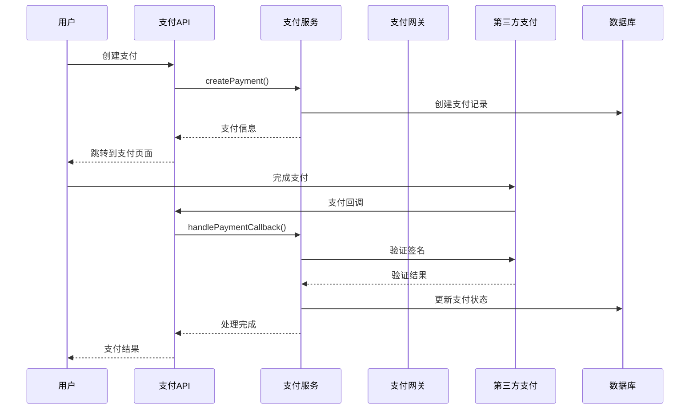
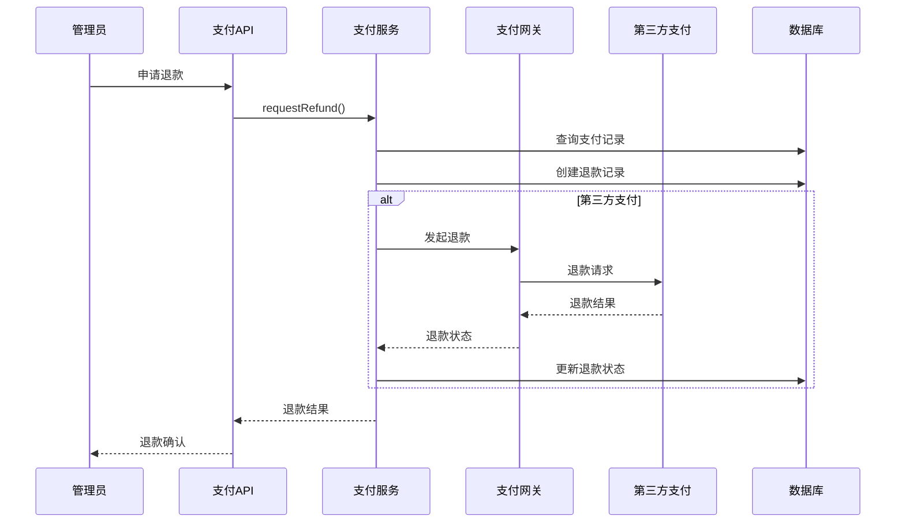

# 支付上下文（Payment Context）详细设计

## 1. 上下文概述

### 1.1 职责范围
支付上下文负责图书馆系统的所有财务交易处理，包括：
- 罚金支付处理
- 会员费用收取
- 第三方支付集成
- 退款处理
- 支付记录管理
- 财务报表生成
- 支付网关管理

### 1.2 业务价值
- 提供便捷的支付方式
- 确保交易的安全性和准确性
- 支持多种支付渠道
- 提供完整的交易记录
- 便于财务管理和审计

### 1.3 核心概念
- **Payment（支付）**: 单次支付交易记录
- **PaymentMethod（支付方式）**: 支付渠道和方式
- **PaymentGateway（支付网关）**: 第三方支付服务提供商
- **Refund（退款）**: 退款交易记录
- **Transaction（交易）**: 所有财务交易的基类
- **Invoice（发票）**: 财务发票和收据

## 2. 领域模型设计

### 2.1 聚合根：Payment

```java
package com.library.payment.domain.model;

import javax.persistence.*;
import java.math.BigDecimal;
import java.time.LocalDateTime;
import java.util.Objects;
import java.util.UUID;

/**
 * 支付聚合根
 * 管理支付交易的完整生命周期
 */
@Entity
@Table(name = "payments", indexes = {
    @Index(name = "idx_payment_patron", columnList = "patron_id"),
    @Index(name = "idx_payment_status", columnList = "status"),
    @Index(name = "idx_payment_date", columnList = "payment_date"),
    @Index(name = "idx_payment_reference", columnList = "reference_number")
})
public class Payment {
    
    @EmbeddedId
    private PaymentId id;
    
    @Embedded
    @AttributeOverride(name = "value", column = @Column(name = "patron_id"))
    private PatronId patronId;
    
    @Enumerated(EnumType.STRING)
    @Column(nullable = false)
    private PaymentType paymentType;
    
    @Column(name = "amount", nullable = false, precision = 10, scale = 2)
    private BigDecimal amount;
    
    @Enumerated(EnumType.STRING)
    @Column(nullable = false)
    private PaymentMethod paymentMethod;
    
    @Enumerated(EnumType.STRING)
    @Column(nullable = false)
    private PaymentStatus status;
    
    @Column(name = "reference_number", unique = true, length = 50)
    private String referenceNumber;
    
    @Column(name = "external_transaction_id", length = 100)
    private String externalTransactionId;
    
    @Column(name = "payment_date")
    private LocalDateTime paymentDate;
    
    @Column(name = "processed_date")
    private LocalDateTime processedDate;
    
    @Column(name = "description", length = 500)
    private String description;
    
    @Embedded
    private PaymentGateway paymentGateway;
    
    @Column(name = "currency", length = 3)
    private String currency;
    
    @Column(name = "fee_amount", precision = 8, scale = 2)
    private BigDecimal feeAmount;
    
    @Column(name = "net_amount", precision = 10, scale = 2)
    private BigDecimal netAmount;
    
    @Column(name = "ip_address", length = 45)
    private String ipAddress;
    
    @Column(name = "user_agent", length = 500)
    private String userAgent;
    
    @Column(name = "failure_reason", length = 500)
    private String failureReason;
    
    @Column(name = "created_at", nullable = false, updatable = false)
    private LocalDateTime createdAt;
    
    @Column(name = "updated_at")
    private LocalDateTime updatedAt;
    
    @Column(name = "created_by")
    private String createdBy;
    
    @Column(name = "processed_by")
    private String processedBy;
    
    // 关联实体
    @OneToMany(mappedBy = "payment", cascade = CascadeType.ALL)
    private List<PaymentItem> items = new ArrayList<>();
    
    @OneToMany(mappedBy = "originalPayment", cascade = CascadeType.ALL)
    private List<Refund> refunds = new ArrayList<>();
    
    protected Payment() {
        // JPA required
    }
    
    public Payment(PaymentId id, PatronId patronId, PaymentType paymentType, 
                  BigDecimal amount, PaymentMethod paymentMethod, String description) {
        this.id = Objects.requireNonNull(id, "Payment ID cannot be null");
        this.patronId = Objects.requireNonNull(patronId, "Patron ID cannot be null");
        this.paymentType = Objects.requireNonNull(paymentType, "Payment type cannot be null");
        this.amount = validateAmount(amount);
        this.paymentMethod = Objects.requireNonNull(paymentMethod, "Payment method cannot be null");
        this.description = description;
        this.status = PaymentStatus.PENDING;
        this.referenceNumber = generateReferenceNumber();
        this.currency = "CNY"; // 默认人民币
        this.feeAmount = BigDecimal.ZERO;
        this.netAmount = this.amount;
        this.createdAt = LocalDateTime.now();
        this.updatedAt = LocalDateTime.now();
    }
    
    // 领域行为：处理支付
    public void process(String externalTransactionId, String processedBy) {
        if (this.status != PaymentStatus.PENDING) {
            throw new InvalidOperationException("Payment is not in pending status");
        }
        
        this.externalTransactionId = externalTransactionId;
        this.status = PaymentStatus.PROCESSING;
        this.updatedAt = LocalDateTime.now();
        
        DomainEventPublisher.publish(new PaymentProcessingEvent(
            this.id,
            this.patronId,
            this.amount,
            this.paymentMethod,
            LocalDateTime.now()
        ));
    }
    
    // 领域行为：完成支付
    public void complete(String processedBy) {
        if (this.status != PaymentStatus.PROCESSING) {
            throw new InvalidOperationException("Payment is not in processing status");
        }
        
        this.status = PaymentStatus.COMPLETED;
        this.paymentDate = LocalDateTime.now();
        this.processedDate = LocalDateTime.now();
        this.processedBy = processedBy;
        this.updatedAt = LocalDateTime.now();
        
        DomainEventPublisher.publish(new PaymentCompletedEvent(
            this.id,
            this.patronId,
            this.amount,
            this.paymentMethod,
            this.referenceNumber,
            this.paymentDate
        ));
    }
    
    // 领域行为：支付失败
    public void fail(String failureReason) {
        if (this.status == PaymentStatus.COMPLETED || this.status == PaymentStatus.REFUNDED) {
            throw new InvalidOperationException("Cannot fail completed or refunded payment");
        }
        
        this.status = PaymentStatus.FAILED;
        this.failureReason = failureReason;
        this.updatedAt = LocalDateTime.now();
        
        DomainEventPublisher.publish(new PaymentFailedEvent(
            this.id,
            this.patronId,
            this.amount,
            this.paymentMethod,
            failureReason,
            LocalDateTime.now()
        ));
    }
    
    // 领域行为：取消支付
    public void cancel(String reason) {
        if (this.status != PaymentStatus.PENDING) {
            throw new InvalidOperationException("Can only cancel pending payments");
        }
        
        this.status = PaymentStatus.CANCELLED;
        this.failureReason = reason;
        this.updatedAt = LocalDateTime.now();
        
        DomainEventPublisher.publish(new PaymentCancelledEvent(
            this.id,
            this.patronId,
            this.amount,
            reason,
            LocalDateTime.now()
        ));
    }
    
    // 领域行为：申请退款
    public Refund requestRefund(BigDecimal refundAmount, String reason, String requestedBy) {
        validateRefundRequest(refundAmount);
        
        if (this.status != PaymentStatus.COMPLETED) {
            throw new InvalidOperationException("Can only refund completed payments");
        }
        
        // 检查是否已全额退款
        BigDecimal alreadyRefunded = calculateTotalRefunded();
        BigDecimal remainingRefundable = this.amount.subtract(alreadyRefunded);
        
        if (refundAmount.compareTo(remainingRefundable) > 0) {
            throw new IllegalArgumentException("Refund amount exceeds remaining refundable amount");
        }
        
        RefundId refundId = RefundId.generate();
        Refund refund = new Refund(
            refundId,
            this,
            refundAmount,
            reason,
            requestedBy
        );
        
        this.refunds.add(refund);
        this.updatedAt = LocalDateTime.now();
        
        // 如果是全额退款，更新支付状态
        if (refundAmount.add(alreadyRefunded).compareTo(this.amount) >= 0) {
            this.status = PaymentStatus.REFUNDED;
        }
        
        DomainEventPublisher.publish(new RefundRequestedEvent(
            refundId,
            this.id,
            this.patronId,
            refundAmount,
            reason,
            LocalDateTime.now()
        ));
        
        return refund;
    }
    
    // 领域行为：设置支付网关信息
    public void setPaymentGateway(PaymentGateway gateway, BigDecimal feeRate) {
        this.paymentGateway = Objects.requireNonNull(gateway, "Payment gateway cannot be null");
        
        if (feeRate != null && feeRate.compareTo(BigDecimal.ZERO) > 0) {
            this.feeAmount = this.amount.multiply(feeRate).setScale(2, RoundingMode.HALF_UP);
            this.netAmount = this.amount.subtract(this.feeAmount);
        }
        
        this.updatedAt = LocalDateTime.now();
    }
    
    // 领域行为：添加支付项目
    public void addItem(String itemType, String itemId, String description, 
                      BigDecimal itemAmount, int quantity) {
        if (this.status != PaymentStatus.PENDING) {
            throw new InvalidOperationException("Can only add items to pending payments");
        }
        
        PaymentItemId itemId = PaymentItemId.generate();
        PaymentItem item = new PaymentItem(
            itemId,
            this,
            itemType,
            itemId,
            description,
            itemAmount,
            quantity
        );
        
        this.items.add(item);
        this.updatedAt = LocalDateTime.now();
    }
    
    // 领域行为：设置交易元数据
    public void setTransactionMetadata(String ipAddress, String userAgent) {
        this.ipAddress = ipAddress;
        this.userAgent = userAgent;
        this.updatedAt = LocalDateTime.now();
    }
    
    // 私有验证方法
    private BigDecimal validateAmount(BigDecimal amount) {
        if (amount == null || amount.compareTo(BigDecimal.ZERO) <= 0) {
            throw new IllegalArgumentException("Payment amount must be positive");
        }
        return amount.setScale(2, RoundingMode.HALF_UP);
    }
    
    private void validateRefundRequest(BigDecimal refundAmount) {
        if (refundAmount == null || refundAmount.compareTo(BigDecimal.ZERO) <= 0) {
            throw new IllegalArgumentException("Refund amount must be positive");
        }
        
        if (refundAmount.compareTo(this.amount) > 0) {
            throw new IllegalArgumentException("Refund amount cannot exceed payment amount");
        }
    }
    
    private BigDecimal calculateTotalRefunded() {
        return this.refunds.stream()
            .filter(r -> r.getStatus() == RefundStatus.COMPLETED)
            .map(Refund::getAmount)
            .reduce(BigDecimal.ZERO, BigDecimal::add);
    }
    
    private String generateReferenceNumber() {
        String timestamp = String.valueOf(System.currentTimeMillis());
        String random = UUID.randomUUID().toString().substring(0, 8).toUpperCase();
        return "PAY" + timestamp + random;
    }
    
    // 业务查询方法
    public boolean isPending() {
        return this.status == PaymentStatus.PENDING;
    }
    
    public boolean isCompleted() {
        return this.status == PaymentStatus.COMPLETED;
    }
    
    public boolean isFailed() {
        return this.status == PaymentStatus.FAILED;
    }
    
    public boolean isRefunded() {
        return this.status == PaymentStatus.REFUNDED;
    }
    
    public boolean canBeRefunded() {
        return this.status == PaymentStatus.COMPLETED && 
               calculateTotalRefunded().compareTo(this.amount) < 0;
    }
    
    public BigDecimal getRefundableAmount() {
        if (!isCompleted()) {
            return BigDecimal.ZERO;
        }
        return this.amount.subtract(calculateTotalRefunded());
    }
    
    public boolean isPartialRefund() {
        return isRefunded() && calculateTotalRefunded().compareTo(this.amount) < 0;
    }
    
    // Getters
    public PaymentId getId() { return id; }
    public PatronId getPatronId() { return patronId; }
    public PaymentType getPaymentType() { return paymentType; }
    public BigDecimal getAmount() { return amount; }
    public PaymentMethod getPaymentMethod() { return paymentMethod; }
    public PaymentStatus getStatus() { return status; }
    public String getReferenceNumber() { return referenceNumber; }
    public String getExternalTransactionId() { return externalTransactionId; }
    public LocalDateTime getPaymentDate() { return paymentDate; }
    public String getDescription() { return description; }
    public PaymentGateway getPaymentGateway() { return paymentGateway; }
    public String getCurrency() { return currency; }
    public BigDecimal getFeeAmount() { return feeAmount; }
    public BigDecimal getNetAmount() { return netAmount; }
    public List<PaymentItem> getItems() { return new ArrayList<>(items); }
    public List<Refund> getRefunds() { return new ArrayList<>(refunds); }
}
```

### 2.2 实体：Refund

```java
package com.library.payment.domain.model;

import javax.persistence.*;
import java.math.BigDecimal;
import java.time.LocalDateTime;
import java.util.Objects;

/**
 * 退款实体
 * 管理退款交易的详细信息
 */
@Entity
@Table(name = "refunds", indexes = {
    @Index(name = "idx_refund_payment", columnList = "payment_id"),
    @Index(name = "idx_refund_status", columnList = "status")
})
public class Refund {
    
    @EmbeddedId
    private RefundId id;
    
    @ManyToOne(fetch = FetchType.LAZY)
    @JoinColumn(name = "payment_id")
    private Payment originalPayment;
    
    @Column(name = "amount", nullable = false, precision = 10, scale = 2)
    private BigDecimal amount;
    
    @Enumerated(EnumType.STRING)
    @Column(nullable = false)
    private RefundStatus status;
    
    @Column(name = "reason", length = 500)
    private String reason;
    
    @Column(name = "external_refund_id", length = 100)
    private String externalRefundId;
    
    @Column(name = "requested_date", nullable = false)
    private LocalDateTime requestedDate;
    
    @Column(name = "processed_date")
    private LocalDateTime processedDate;
    
    @Column(name = "refund_method")
    private String refundMethod;
    
    @Column(name = "refund_account", length = 200)
    private String refundAccount;
    
    @Column(name = "created_by")
    private String createdBy;
    
    @Column(name = "processed_by")
    private String processedBy;
    
    protected Refund() {
        // JPA required
    }
    
    public Refund(RefundId id, Payment originalPayment, BigDecimal amount, 
                 String reason, String requestedBy) {
        this.id = Objects.requireNonNull(id, "Refund ID cannot be null");
        this.originalPayment = Objects.requireNonNull(originalPayment, "Original payment cannot be null");
        this.amount = validateAmount(amount);
        this.reason = reason;
        this.status = RefundStatus.PENDING;
        this.requestedDate = LocalDateTime.now();
        this.createdBy = requestedBy;
    }
    
    // 领域行为：处理退款
    public void process(String externalRefundId, String processedBy) {
        if (this.status != RefundStatus.PENDING) {
            throw new InvalidOperationException("Refund is not in pending status");
        }
        
        this.externalRefundId = externalRefundId;
        this.status = RefundStatus.PROCESSING;
        this.updatedAt = LocalDateTime.now();
        
        DomainEventPublisher.publish(new RefundProcessingEvent(
            this.id,
            this.originalPayment.getId(),
            this.amount,
            LocalDateTime.now()
        ));
    }
    
    // 领域行为：完成退款
    public void complete(String refundMethod, String refundAccount, String processedBy) {
        if (this.status != RefundStatus.PROCESSING) {
            throw new InvalidOperationException("Refund is not in processing status");
        }
        
        this.status = RefundStatus.COMPLETED;
        this.processedDate = LocalDateTime.now();
        this.refundMethod = refundMethod;
        this.refundAccount = refundAccount;
        this.processedBy = processedBy;
        this.updatedAt = LocalDateTime.now();
        
        DomainEventPublisher.publish(new RefundCompletedEvent(
            this.id,
            this.originalPayment.getId(),
            this.amount,
            refundMethod,
            this.processedDate
        ));
    }
    
    // 领域行为：退款失败
    public void fail(String failureReason) {
        if (this.status == RefundStatus.COMPLETED) {
            throw new InvalidOperationException("Cannot fail completed refund");
        }
        
        this.status = RefundStatus.FAILED;
        this.updatedAt = LocalDateTime.now();
        
        DomainEventPublisher.publish(new RefundFailedEvent(
            this.id,
            this.originalPayment.getId(),
            this.amount,
            failureReason,
            LocalDateTime.now()
        ));
    }
    
    // 领域行为：取消退款
    public void cancel(String reason) {
        if (this.status != RefundStatus.PENDING) {
            throw new InvalidOperationException("Can only cancel pending refunds");
        }
        
        this.status = RefundStatus.CANCELLED;
        this.updatedAt = LocalDateTime.now();
        
        DomainEventPublisher.publish(new RefundCancelledEvent(
            this.id,
            this.originalPayment.getId(),
            this.amount,
            reason,
            LocalDateTime.now()
        ));
    }
    
    // 验证方法
    private BigDecimal validateAmount(BigDecimal amount) {
        if (amount == null || amount.compareTo(BigDecimal.ZERO) <= 0) {
            throw new IllegalArgumentException("Refund amount must be positive");
        }
        return amount.setScale(2, RoundingMode.HALF_UP);
    }
    
    // 业务查询方法
    public boolean isPending() {
        return this.status == RefundStatus.PENDING;
    }
    
    public boolean isCompleted() {
        return this.status == RefundStatus.COMPLETED;
    }
    
    public boolean isFailed() {
        return this.status == RefundStatus.FAILED;
    }
    
    // Getters
    public RefundId getId() { return id; }
    public Payment getOriginalPayment() { return originalPayment; }
    public BigDecimal getAmount() { return amount; }
    public RefundStatus getStatus() { return status; }
    public String getReason() { return reason; }
    public String getExternalRefundId() { return externalRefundId; }
    public LocalDateTime getRequestedDate() { return requestedDate; }
    public LocalDateTime getProcessedDate() { return processedDate; }
    public String getRefundMethod() { return refundMethod; }
    public String getRefundAccount() { return refundAccount; }
}
```

### 2.3 值对象：PaymentGateway

```java
package com.library.payment.domain.model;

import javax.persistence.Embeddable;
import java.util.Objects;

/**
 * 支付网关值对象
 * 表示第三方支付服务提供商
 */
@Embeddable
public class PaymentGateway {
    
    @Column(name = "gateway_code", length = 20)
    private String gatewayCode;
    
    @Column(name = "gateway_name", length = 100)
    private String gatewayName;
    
    @Column(name = "gateway_type", length = 20)
    private String gatewayType;
    
    @Column(name = "merchant_id", length = 100)
    private String merchantId;
    
    @Column(name = "api_version", length = 20)
    private String apiVersion;
    
    protected PaymentGateway() {
        // JPA required
    }
    
    public PaymentGateway(String gatewayCode, String gatewayName, String gatewayType, 
                        String merchantId, String apiVersion) {
        this.gatewayCode = Objects.requireNonNull(gatewayCode, "Gateway code cannot be null");
        this.gatewayName = Objects.requireNonNull(gatewayName, "Gateway name cannot be null");
        this.gatewayType = Objects.requireNonNull(gatewayType, "Gateway type cannot be null");
        this.merchantId = merchantId;
        this.apiVersion = apiVersion;
    }
    
    // 预定义网关
    public static PaymentGateway ALIPAY = new PaymentGateway(
        "ALIPAY", "支付宝", "THIRD_PARTY", null, "v3.0"
    );
    
    public static PaymentGateway WECHAT_PAY = new PaymentGateway(
        "WECHAT", "微信支付", "THIRD_PARTY", null, "v3.0"
    );
    
    public static PaymentGateway UNION_PAY = new PaymentGateway(
        "UNION", "银联支付", "THIRD_PARTY", null, "v5.0"
    );
    
    public static PaymentGateway CASH = new PaymentGateway(
        "CASH", "现金支付", "INTERNAL", null, null
    );
    
    // 业务方法
    public boolean isThirdParty() {
        return "THIRD_PARTY".equals(this.gatewayType);
    }
    
    public boolean isInternal() {
        return "INTERNAL".equals(this.gatewayType);
    }
    
    // Getters
    public String getGatewayCode() { return gatewayCode; }
    public String getGatewayName() { return gatewayName; }
    public String getGatewayType() { return gatewayType; }
    public String getMerchantId() { return merchantId; }
    public String getApiVersion() { return apiVersion; }
    
    @Override
    public boolean equals(Object o) {
        if (this == o) return true;
        if (o == null || getClass() != o.getClass()) return false;
        PaymentGateway that = (PaymentGateway) o;
        return gatewayCode.equals(that.gatewayCode);
    }
    
    @Override
    public int hashCode() {
        return Objects.hash(gatewayCode);
    }
}
```

### 2.4 枚举定义

```java
package com.library.payment.domain.model;

/**
 * 支付类型枚举
 */
public enum PaymentType {
    FINE_PAYMENT,      // 罚金支付
    MEMBERSHIP_FEE,    // 会员费
    BOOK_PURCHASE,     // 图书购买
    DONATION,          // 捐赠
    SERVICE_FEE,       // 服务费
    DEPOSIT,           // 押金
    OTHER              // 其他
}

/**
 * 支付方式枚举
 */
public enum PaymentMethod {
    CASH,             // 现金
    CREDIT_CARD,      // 信用卡
    DEBIT_CARD,       // 借记卡
    ALIPAY,           // 支付宝
    WECHAT_PAY,       // 微信支付
    UNION_PAY,        // 银联支付
    BANK_TRANSFER,    // 银行转账
    CHECK,            // 支票
    ONLINE_PAYMENT    // 在线支付
}

/**
 * 支付状态枚举
 */
public enum PaymentStatus {
    PENDING,          // 待支付
    PROCESSING,       // 处理中
    COMPLETED,        // 已完成
    FAILED,           // 失败
    CANCELLED,        // 已取消
    REFUNDED,         // 已退款
    PARTIALLY_REFUNDED // 部分退款
}

/**
 * 退款状态枚举
 */
public enum RefundStatus {
    PENDING,          // 待退款
    PROCESSING,       // 处理中
    COMPLETED,        // 已完成
    FAILED,           // 失败
    CANCELLED         // 已取消
}
```

## 3. 领域服务设计

### 3.1 支付处理领域服务

```java
package com.library.payment.domain.service;

import com.library.payment.domain.model.*;
import com.library.payment.domain.repository.*;
import com.library.payment.domain.event.*;
import com.library.shared.domain.event.DomainEventPublisher;
import org.springframework.stereotype.Service;
import org.springframework.transaction.annotation.Transactional;

import java.math.BigDecimal;
import java.time.LocalDateTime;
import java.util.List;

/**
 * 支付处理领域服务
 */
@Service
public class PaymentProcessingService {
    
    private final PaymentRepository paymentRepository;
    private final RefundRepository refundRepository;
    private final PaymentGatewayService gatewayService;
    private final DomainEventPublisher eventPublisher;
    
    public PaymentProcessingService(PaymentRepository paymentRepository,
                                   RefundRepository refundRepository,
                                   PaymentGatewayService gatewayService,
                                   DomainEventPublisher eventPublisher) {
        this.paymentRepository = paymentRepository;
        this.refundRepository = refundRepository;
        this.gatewayService = gatewayService;
        this.eventPublisher = eventPublisher;
    }
    
    /**
     * 创建支付
     */
    @Transactional
    public Payment createPayment(CreatePaymentCommand command) {
        // 1. 创建支付记录
        PaymentId paymentId = PaymentId.generate();
        Payment payment = new Payment(
            paymentId,
            command.getPatronId(),
            command.getPaymentType(),
            command.getAmount(),
            command.getPaymentMethod(),
            command.getDescription()
        );
        
        // 2. 添加支付项目
        for (PaymentItemCommand item : command.getItems()) {
            payment.addItem(
                item.getItemType(),
                item.getItemId(),
                item.getDescription(),
                item.getAmount(),
                item.getQuantity()
            );
        }
        
        // 3. 设置支付网关
        PaymentGateway gateway = determinePaymentGateway(command.getPaymentMethod());
        payment.setPaymentGateway(gateway, gatewayService.getFeeRate(gateway));
        
        // 4. 设置元数据
        payment.setTransactionMetadata(command.getIpAddress(), command.getUserAgent());
        
        // 5. 保存支付
        Payment savedPayment = paymentRepository.save(payment);
        
        // 6. 发布事件
        eventPublisher.publish(new PaymentCreatedEvent(
            savedPayment.getId(),
            savedPayment.getPatronId(),
            savedPayment.getAmount(),
            savedPayment.getPaymentMethod(),
            savedPayment.getReferenceNumber(),
            LocalDateTime.now()
        ));
        
        return savedPayment;
    }
    
    /**
     * 处理支付
     */
    @Transactional
    public Payment processPayment(ProcessPaymentCommand command) {
        Payment payment = paymentRepository.findById(command.getPaymentId())
            .orElseThrow(() -> new PaymentNotFoundException(command.getPaymentId()));
        
        if (!payment.isPending()) {
            throw new InvalidOperationException("Payment is not in pending status");
        }
        
        // 根据支付方式选择处理策略
        if (payment.getPaymentGateway().isThirdParty()) {
            return processThirdPartyPayment(payment, command);
        } else {
            return processInternalPayment(payment, command);
        }
    }
    
    /**
     * 处理第三方支付
     */
    private Payment processThirdPartyPayment(Payment payment, ProcessPaymentCommand command) {
        try {
            // 调用第三方支付网关
            ThirdPartyPaymentRequest gatewayRequest = new ThirdPartyPaymentRequest(
                payment.getId(),
                payment.getAmount(),
                payment.getCurrency(),
                payment.getDescription(),
                command.getReturnUrl(),
                command.getNotifyUrl()
            );
            
            ThirdPartyPaymentResponse gatewayResponse = gatewayService.initiatePayment(
                payment.getPaymentGateway(),
                gatewayRequest
            );
            
            // 更新支付状态
            payment.process(gatewayResponse.getTransactionId(), "SYSTEM");
            paymentRepository.save(payment);
            
            return payment;
            
        } catch (PaymentGatewayException e) {
            payment.fail(e.getMessage());
            paymentRepository.save(payment);
            throw e;
        }
    }
    
    /**
     * 处理内部支付
     */
    private Payment processInternalPayment(Payment payment, ProcessPaymentCommand command) {
        try {
            // 标记为处理中
            payment.process("INTERNAL-" + System.currentTimeMillis(), command.getProcessedBy());
            
            // 验证支付信息
            validateInternalPayment(payment, command);
            
            // 完成支付
            payment.complete(command.getProcessedBy());
            paymentRepository.save(payment);
            
            return payment;
            
        } catch (PaymentValidationException e) {
            payment.fail(e.getMessage());
            paymentRepository.save(payment);
            throw e;
        }
    }
    
    /**
     * 处理支付回调
     */
    @Transactional
    public void handlePaymentCallback(PaymentCallbackCommand command) {
        Payment payment = paymentRepository.findByReferenceNumber(command.getReferenceNumber())
            .orElseThrow(() -> new PaymentNotFoundException(command.getReferenceNumber()));
        
        if (payment.isCompleted()) {
            return; // 避免重复处理
        }
        
        // 验证回调签名
        if (!gatewayService.verifyCallback(payment.getPaymentGateway(), command)) {
            throw new InvalidCallbackException("Invalid callback signature");
        }
        
        // 根据回调结果更新支付状态
        if (command.isSuccess()) {
            payment.complete("GATEWAY_CALLBACK");
        } else {
            payment.fail(command.getErrorMessage());
        }
        
        payment.setExternalTransactionId(command.getTransactionId());
        paymentRepository.save(payment);
        
        // 发布相应事件
        if (payment.isCompleted()) {
            eventPublisher.publish(new PaymentCompletedEvent(
                payment.getId(),
                payment.getPatronId(),
                payment.getAmount(),
                payment.getPaymentMethod(),
                payment.getReferenceNumber(),
                payment.getPaymentDate()
            ));
        } else {
            eventPublisher.publish(new PaymentFailedEvent(
                payment.getId(),
                payment.getPatronId(),
                payment.getAmount(),
                payment.getPaymentMethod(),
                payment.getFailureReason(),
                LocalDateTime.now()
            ));
        }
    }
    
    /**
     * 申请退款
     */
    @Transactional
    public Refund requestRefund(RequestRefundCommand command) {
        Payment payment = paymentRepository.findById(command.getPaymentId())
            .orElseThrow(() -> new PaymentNotFoundException(command.getPaymentId()));
        
        // 验证退款条件
        if (!payment.canBeRefunded()) {
            throw new InvalidOperationException("Payment cannot be refunded");
        }
        
        // 创建退款
        Refund refund = payment.requestRefund(
            command.getRefundAmount(),
            command.getReason(),
            command.getRequestedBy()
        );
        
        paymentRepository.save(payment);
        Refund savedRefund = refundRepository.save(refund);
        
        // 如果是第三方支付，立即发起退款
        if (payment.getPaymentGateway().isThirdParty()) {
            processThirdPartyRefund(savedRefund, payment);
        }
        
        return savedRefund;
    }
    
    /**
     * 处理第三方退款
     */
    private void processThirdPartyRefund(Refund refund, Payment payment) {
        try {
            ThirdPartyRefundRequest request = new ThirdPartyRefundRequest(
                refund.getId(),
                payment.getExternalTransactionId(),
                refund.getAmount(),
                refund.getReason()
            );
            
            ThirdPartyRefundResponse response = gatewayService.initiateRefund(
                payment.getPaymentGateway(),
                request
            );
            
            refund.process(response.getRefundId(), "SYSTEM");
            refundRepository.save(refund);
            
        } catch (PaymentGatewayException e) {
            refund.fail(e.getMessage());
            refundRepository.save(refund);
        }
    }
    
    /**
     * 查询支付状态
     */
    @Transactional(readOnly = true)
    public PaymentStatus queryPaymentStatus(PaymentId paymentId) {
        Payment payment = paymentRepository.findById(paymentId)
            .orElseThrow(() -> new PaymentNotFoundException(paymentId));
        
        // 如果是第三方支付，查询网关状态
        if (payment.isPending() || payment.getPaymentGateway().isThirdParty()) {
            try {
                ThirdPartyPaymentStatus status = gatewayService.queryPaymentStatus(
                    payment.getPaymentGateway(),
                    payment.getExternalTransactionId()
                );
                
                // 同步状态
                if (status == ThirdPartyPaymentStatus.SUCCESS && !payment.isCompleted()) {
                    payment.complete("STATUS_QUERY");
                    paymentRepository.save(payment);
                } else if (status == ThirdPartyPaymentStatus.FAILED && !payment.isFailed()) {
                    payment.fail("Payment failed at gateway");
                    paymentRepository.save(payment);
                }
            } catch (PaymentGatewayException e) {
                // 查询失败，返回当前状态
            }
        }
        
        return payment.getStatus();
    }
    
    // 辅助方法
    private PaymentGateway determinePaymentGateway(PaymentMethod method) {
        switch (method) {
            case ALIPAY:
                return PaymentGateway.ALIPAY;
            case WECHAT_PAY:
                return PaymentGateway.WECHAT_PAY;
            case UNION_PAY:
                return PaymentGateway.UNION_PAY;
            case CASH:
            case CHECK:
            case BANK_TRANSFER:
                return PaymentGateway.CASH;
            default:
                return PaymentGateway.ALIPAY; // 默认支付宝
        }
    }
    
    private void validateInternalPayment(Payment payment, ProcessPaymentCommand command) {
        // 验证现金支付
        if (payment.getPaymentMethod() == PaymentMethod.CASH) {
            if (command.getCashReceived() == null) {
                throw new PaymentValidationException("Cash amount received is required");
            }
            if (command.getCashReceived().compareTo(payment.getAmount()) < 0) {
                throw new PaymentValidationException("Insufficient cash received");
            }
        }
        
        // 验证支票支付
        if (payment.getPaymentMethod() == PaymentMethod.CHECK) {
            if (command.getCheckNumber() == null) {
                throw new PaymentValidationException("Check number is required");
            }
        }
    }
}
```

由于文档内容较长，我将继续添加仓储接口、应用服务等内容...

## 4. 仓储接口设计

### 4.1 支付仓储接口

```java
package com.library.payment.domain.repository;

import com.library.payment.domain.model.Payment;
import com.library.payment.domain.model.PaymentId;
import com.library.payment.domain.model.PatronId;
import com.library.payment.domain.model.PaymentStatus;
import com.library.payment.domain.model.PaymentType;

import java.time.LocalDateTime;
import java.util.List;
import java.util.Optional;

/**
 * 支付仓储接口
 */
public interface PaymentRepository {
    
    Payment save(Payment payment);
    
    Optional<Payment> findById(PaymentId id);
    
    Optional<Payment> findByReferenceNumber(String referenceNumber);
    
    List<Payment> findByPatronId(PatronId patronId);
    
    List<Payment> findByStatus(PaymentStatus status);
    
    List<Payment> findByType(PaymentType paymentType);
    
    List<Payment> findPendingPayments();
    
    List<Payment> findProcessingPayments();
    
    List<Payment> findFailedPayments();
    
    List<Payment> findPaymentsBetweenDates(LocalDateTime startDate, LocalDateTime endDate);
    
    List<Payment> findPaymentsByPatronAndType(PatronId patronId, PaymentType paymentType);
    
    boolean existsByReferenceNumber(String referenceNumber);
    
    void delete(PaymentId id);
}
```

### 4.2 退款仓储接口

```java
package com.library.payment.domain.repository;

import com.library.payment.domain.model.Refund;
import com.library.payment.domain.model.RefundId;
import com.library.payment.domain.model.RefundStatus;

import java.time.LocalDateTime;
import java.util.List;
import java.util.Optional;

/**
 * 退款仓储接口
 */
public interface RefundRepository {
    
    Refund save(Refund refund);
    
    Optional<Refund> findById(RefundId id);
    
    List<Refund> findByOriginalPaymentId(PaymentId paymentId);
    
    List<Refund> findByStatus(RefundStatus status);
    
    List<Refund> findPendingRefunds();
    
    List<Refund> findRefundsBetweenDates(LocalDateTime startDate, LocalDateTime endDate);
    
    void delete(RefundId id);
}
```

## 5. 应用服务设计

### 5.1 支付应用服务

```java
package com.library.payment.application.service;

import com.library.payment.application.command.*;
import com.library.payment.application.dto.*;
import com.library.payment.domain.model.*;
import com.library.payment.domain.service.*;
import com.library.payment.domain.repository.PaymentRepository;
import org.springframework.data.domain.Page;
import org.springframework.data.domain.Pageable;
import org.springframework.stereotype.Service;
import org.springframework.transaction.annotation.Transactional;

import java.math.BigDecimal;
import java.util.List;
import java.util.stream.Collectors;

/**
 * 支付应用服务
 */
@Service
public class PaymentApplicationService {
    
    private final PaymentProcessingService paymentProcessingService;
    private final PaymentRepository paymentRepository;
    
    public PaymentApplicationService(PaymentProcessingService paymentProcessingService,
                                    PaymentRepository paymentRepository) {
        this.paymentProcessingService = paymentProcessingService;
        this.paymentRepository = paymentRepository;
    }
    
    /**
     * 创建支付用例
     */
    @Transactional
    public PaymentDTO createPayment(CreatePaymentRequest request) {
        CreatePaymentCommand command = new CreatePaymentCommand(
            request.getPatronId(),
            request.getPaymentType(),
            request.getAmount(),
            request.getPaymentMethod(),
            request.getDescription(),
            request.getItems(),
            request.getIpAddress(),
            request.getUserAgent()
        );
        
        Payment payment = paymentProcessingService.createPayment(command);
        return PaymentDTO.fromDomain(payment);
    }
    
    /**
     * 处理支付用例
     */
    @Transactional
    public PaymentDTO processPayment(ProcessPaymentRequest request) {
        ProcessPaymentCommand command = new ProcessPaymentCommand(
            request.getPaymentId(),
            request.getReturnUrl(),
            request.getNotifyUrl(),
            request.getCashReceived(),
            request.getCheckNumber(),
            request.getProcessedBy()
        );
        
        Payment payment = paymentProcessingService.processPayment(command);
        return PaymentDTO.fromDomain(payment);
    }
    
    /**
     * 处理支付回调用例
     */
    @Transactional
    public void handlePaymentCallback(PaymentCallbackRequest request) {
        PaymentCallbackCommand command = new PaymentCallbackCommand(
            request.getReferenceNumber(),
            request.getTransactionId(),
            request.isSuccess(),
            request.getErrorMessage(),
            request.getSignature(),
            request.getCallbackData()
        );
        
        paymentProcessingService.handlePaymentCallback(command);
    }
    
    /**
     * 申请退款用例
     */
    @Transactional
    public RefundDTO requestRefund(RequestRefundRequest request) {
        RequestRefundCommand command = new RequestRefundCommand(
            request.getPaymentId(),
            request.getRefundAmount(),
            request.getReason(),
            request.getRequestedBy()
        );
        
        Refund refund = paymentProcessingService.requestRefund(command);
        return RefundDTO.fromDomain(refund);
    }
    
    /**
     * 查询支付状态用例
     */
    public PaymentStatusDTO queryPaymentStatus(PaymentId paymentId) {
        PaymentStatus status = paymentProcessingService.queryPaymentStatus(paymentId);
        return new PaymentStatusDTO(paymentId, status);
    }
    
    /**
     * 获取支付详情用例
     */
    public PaymentDTO getPayment(PaymentId paymentId) {
        Payment payment = paymentRepository.findById(paymentId)
            .orElseThrow(() -> new PaymentNotFoundException(paymentId));
        return PaymentDTO.fromDomain(payment);
    }
    
    /**
     * 获取会员支付历史用例
     */
    public Page<PaymentDTO> getPatronPaymentHistory(PatronId patronId, Pageable pageable) {
        Page<Payment> payments = paymentRepository.findByPatronId(patronId, pageable);
        return payments.map(PaymentDTO::fromDomain);
    }
}
```

## 6. 第三方支付集成

### 6.1 支付网关服务

```java
package com.library.payment.domain.service;

import com.library.payment.domain.model.*;
import org.springframework.stereotype.Service;

import java.math.BigDecimal;

/**
 * 支付网关服务
 * 处理与第三方支付系统的集成
 */
@Service
public class PaymentGatewayService {
    
    private final AlipayService alipayService;
    private final WechatPayService wechatPayService;
    private final UnionPayService unionPayService;
    
    public PaymentGatewayService(AlipayService alipayService,
                               WechatPayService wechatPayService,
                               UnionPayService unionPayService) {
        this.alipayService = alipayService;
        this.wechatPayService = wechatPayService;
        this.unionPayService = unionPayService;
    }
    
    /**
     * 发起支付
     */
    public ThirdPartyPaymentResponse initiatePayment(PaymentGateway gateway, 
                                                    ThirdPartyPaymentRequest request) {
        switch (gateway.getGatewayCode()) {
            case "ALIPAY":
                return alipayService.createPayment(request);
            case "WECHAT":
                return wechatPayService.createPayment(request);
            case "UNION":
                return unionPayService.createPayment(request);
            default:
                throw new UnsupportedPaymentGatewayException(gateway.getGatewayCode());
        }
    }
    
    /**
     * 发起退款
     */
    public ThirdPartyRefundResponse initiateRefund(PaymentGateway gateway, 
                                                  ThirdPartyRefundRequest request) {
        switch (gateway.getGatewayCode()) {
            case "ALIPAY":
                return alipayService.createRefund(request);
            case "WECHAT":
                return wechatPayService.createRefund(request);
            case "UNION":
                return unionPayService.createRefund(request);
            default:
                throw new UnsupportedPaymentGatewayException(gateway.getGatewayCode());
        }
    }
    
    /**
     * 查询支付状态
     */
    public ThirdPartyPaymentStatus queryPaymentStatus(PaymentGateway gateway, 
                                                     String transactionId) {
        switch (gateway.getGatewayCode()) {
            case "ALIPAY":
                return alipayService.queryStatus(transactionId);
            case "WECHAT":
                return wechatPayService.queryStatus(transactionId);
            case "UNION":
                return unionPayService.queryStatus(transactionId);
            default:
                throw new UnsupportedPaymentGatewayException(gateway.getGatewayCode());
        }
    }
    
    /**
     * 验证回调签名
     */
    public boolean verifyCallback(PaymentGateway gateway, PaymentCallbackCommand callback) {
        switch (gateway.getGatewayCode()) {
            case "ALIPAY":
                return alipayService.verifyCallback(callback);
            case "WECHAT":
                return wechatPayService.verifyCallback(callback);
            case "UNION":
                return unionPayService.verifyCallback(callback);
            default:
                return false;
        }
    }
    
    /**
     * 获取手续费率
     */
    public BigDecimal getFeeRate(PaymentGateway gateway) {
        switch (gateway.getGatewayCode()) {
            case "ALIPAY":
                return alipayService.getFeeRate();
            case "WECHAT":
                return wechatPayService.getFeeRate();
            case "UNION":
                return unionPayService.getFeeRate();
            default:
                return BigDecimal.ZERO;
        }
    }
}
```

### 6.2 支付宝服务示例

```java
package com.library.payment.domain.service;

import com.alipay.api.AlipayClient;
import com.alipay.api.request.AlipayTradeCreateRequest;
import com.alipay.api.request.AlipayTradeQueryRequest;
import com.alipay.api.request.AlipayTradeRefundRequest;
import com.alipay.api.response.AlipayTradeCreateResponse;
import com.alipay.api.response.AlipayTradeQueryResponse;
import com.alipay.api.response.AlipayTradeRefundResponse;
import org.springframework.stereotype.Service;

import java.math.BigDecimal;

/**
 * 支付宝服务
 */
@Service
public class AlipayService {
    
    private final AlipayClient alipayClient;
    
    public AlipayService(AlipayClient alipayClient) {
        this.alipayClient = alipayClient;
    }
    
    public ThirdPartyPaymentResponse createPayment(ThirdPartyPaymentRequest request) {
        AlipayTradeCreateRequest alipayRequest = new AlipayTradeCreateRequest();
        alipayRequest.setBizContent(String.format(
            "{\"out_trade_no\":\"%s\",\"total_amount\":\"%s\",\"subject\":\"%s\"}",
            request.getPaymentId(),
            request.getAmount(),
            request.getDescription()
        ));
        
        try {
            AlipayTradeCreateResponse response = alipayClient.execute(alipayRequest);
            
            if (response.isSuccess()) {
                return new ThirdPartyPaymentResponse(
                    response.getTradeNo(),
                    response.getOutTradeNo(),
                    ThirdPartyPaymentStatus.PENDING
                );
            } else {
                throw new PaymentGatewayException("Alipay payment failed: " + response.getSubMsg());
            }
        } catch (Exception e) {
            throw new PaymentGatewayException("Alipay payment error", e);
        }
    }
    
    public ThirdPartyRefundResponse createRefund(ThirdPartyRefundRequest request) {
        AlipayTradeRefundRequest alipayRequest = new AlipayTradeRefundRequest();
        alipayRequest.setBizContent(String.format(
            "{\"out_trade_no\":\"%s\",\"refund_amount\":\"%s\",\"refund_reason\":\"%s\"}",
            request.getOriginalTransactionId(),
            request.getAmount(),
            request.getReason()
        ));
        
        try {
            AlipayTradeRefundResponse response = alipayClient.execute(alipayRequest);
            
            if (response.isSuccess()) {
                return new ThirdPartyRefundResponse(
                    response.getRefundId(),
                    ThirdPartyRefundStatus.SUCCESS
                );
            } else {
                throw new PaymentGatewayException("Alipay refund failed: " + response.getSubMsg());
            }
        } catch (Exception e) {
            throw new PaymentGatewayException("Alipay refund error", e);
        }
    }
    
    public ThirdPartyPaymentStatus queryStatus(String transactionId) {
        AlipayTradeQueryRequest request = new AlipayTradeQueryRequest();
        request.setBizContent(String.format("{\"out_trade_no\":\"%s\"}", transactionId));
        
        try {
            AlipayTradeQueryResponse response = alipayClient.execute(request);
            
            if (response.isSuccess()) {
                return mapAlipayStatus(response.getTradeStatus());
            } else {
                return ThirdPartyPaymentStatus.UNKNOWN;
            }
        } catch (Exception e) {
            return ThirdPartyPaymentStatus.UNKNOWN;
        }
    }
    
    public boolean verifyCallback(PaymentCallbackCommand callback) {
        // 实现支付宝回调签名验证
        return true; // 简化示例
    }
    
    public BigDecimal getFeeRate() {
        return new BigDecimal("0.006"); // 0.6% 手续费
    }
    
    private ThirdPartyPaymentStatus mapAlipayStatus(String alipayStatus) {
        switch (alipayStatus) {
            case "WAIT_BUYER_PAY":
                return ThirdPartyPaymentStatus.PENDING;
            case "TRADE_SUCCESS":
            case "TRADE_FINISHED":
                return ThirdPartyPaymentStatus.SUCCESS;
            case "TRADE_CLOSED":
                return ThirdPartyPaymentStatus.FAILED;
            default:
                return ThirdPartyPaymentStatus.UNKNOWN;
        }
    }
}
```

## 7. 业务流程

### 7.1 在线支付流程



### 7.2 退款流程



## 8. 配置和实现

### 8.1 支付网关配置

```java
package com.library.payment.config;

import com.alipay.api.AlipayClient;
import com.alipay.api.DefaultAlipayClient;
import org.springframework.beans.factory.annotation.Value;
import org.springframework.context.annotation.Bean;
import org.springframework.context.annotation.Configuration;

/**
 * 支付网关配置
 */
@Configuration
public class PaymentGatewayConfig {
    
    @Value("${payment.alipay.app-id}")
    private String alipayAppId;
    
    @Value("${payment.alipay.private-key}")
    private String alipayPrivateKey;
    
    @Value("${payment.alipay.public-key}")
    private String alipayPublicKey;
    
    @Value("${payment.alipay.server-url}")
    private String alipayServerUrl;
    
    @Value("${payment.wechat.app-id}")
    private String wechatAppId;
    
    @Value("${payment.wechat.mch-id}")
    private String wechatMchId;
    
    @Value("${payment.wechat.api-key}")
    private String wechatApiKey;
    
    @Bean
    public AlipayClient alipayClient() {
        return new DefaultAlipayClient(
            alipayServerUrl,
            alipayAppId,
            alipayPrivateKey,
            "json",
            "UTF-8",
            alipayPublicKey,
            "RSA2"
        );
    }
    
    // 其他支付网关配置...
}
```

### 8.2 application.yml

```yaml
spring:
  application:
    name: payment-service
  
  datasource:
    url: jdbc:postgresql://localhost:5432/library_payment
    username: ${DB_USERNAME:payment_user}
    password: ${DB_PASSWORD:payment_pass}
  
  jpa:
    hibernate:
      ddl-auto: validate
    properties:
      hibernate:
        dialect: org.hibernate.dialect.PostgreSQLDialect

payment:
  alipay:
    app-id: ${ALIPAY_APP_ID:your_app_id}
    private-key: ${ALIPAY_PRIVATE_KEY:your_private_key}
    public-key: ${ALIPAY_PUBLIC_KEY:your_public_key}
    server-url: ${ALIPAY_SERVER_URL:https://openapi.alipay.com/gateway.do}
  
  wechat:
    app-id: ${WECHAT_APP_ID:your_app_id}
    mch-id: ${WECHAT_MCH_ID:your_mch_id}
    api-key: ${WECHAT_API_KEY:your_api_key}
  
  union:
    mer-id: ${UNION_MER_ID:your_mer_id}
    cert-path: ${UNION_CERT_PATH:/path/to/cert}
  
  callback:
    base-url: ${CALLBACK_BASE_URL:http://localhost:8085}
    notify-endpoint: /api/payment/notify
    return-endpoint: /api/payment/return
  
  security:
    signature-algorithm: RSA2
    timeout-seconds: 300
  
  refund:
    auto-process: true
    timeout-days: 7
    max-refund-times: 3

management:
  endpoints:
    web:
      exposure:
        include: health,info,metrics,payment
  endpoint:
    health:
      show-details: always
  metrics:
    export:
      prometheus:
        enabled: true

logging:
  level:
    com.library.payment: DEBUG
```

## 9. 测试策略

### 9.1 支付聚合测试

```java
package com.library.payment.domain.model;

import org.junit.jupiter.api.Test;
import java.math.BigDecimal;
import static org.junit.jupiter.api.Assertions.*;

class PaymentTest {
    
    @Test
    void shouldCreatePaymentWithValidData() {
        PaymentId paymentId = PaymentId.generate();
        PatronId patronId = PatronId.generate();
        
        Payment payment = new Payment(
            paymentId,
            patronId,
            PaymentType.FINE_PAYMENT,
            new BigDecimal("50.00"),
            PaymentMethod.ALIPAY,
            "Fine payment"
        );
        
        assertEquals(paymentId, payment.getId());
        assertEquals(patronId, payment.getPatronId());
        assertEquals(new BigDecimal("50.00"), payment.getAmount());
        assertEquals(PaymentStatus.PENDING, payment.getStatus());
        assertTrue(payment.isPending());
    }
    
    @Test
    void shouldCompletePaymentSuccessfully() {
        Payment payment = createTestPayment();
        
        payment.process("EXT-123456", "SYSTEM");
        payment.complete("ADMIN");
        
        assertEquals(PaymentStatus.COMPLETED, payment.getStatus());
        assertTrue(payment.isCompleted());
        assertNotNull(payment.getPaymentDate());
        assertNotNull(payment.getProcessedDate());
    }
    
    @Test
    void shouldRequestRefundForCompletedPayment() {
        Payment payment = createTestPayment();
        payment.process("EXT-123456", "SYSTEM");
        payment.complete("ADMIN");
        
        Refund refund = payment.requestRefund(new BigDecimal("30.00"), "Customer request", "ADMIN");
        
        assertNotNull(refund);
        assertEquals(new BigDecimal("30.00"), refund.getAmount());
        assertTrue(payment.canBeRefunded());
    }
    
    @Test
    void shouldThrowExceptionWhenRefundingExcessiveAmount() {
        Payment payment = createTestPayment();
        payment.process("EXT-123456", "SYSTEM");
        payment.complete("ADMIN");
        
        assertThrows(IllegalArgumentException.class, () -> 
            payment.requestRefund(new BigDecimal("60.00"), "Excessive refund", "ADMIN"));
    }
}
```

## 10. 监控和指标

### 10.1 关键业务指标

- 支付成功率和失败率
- 平均支付处理时间
- 按支付方式分组的交易量
- 退款申请数量和处理时间
- 手续费总额
- 异常交易数量

### 10.2 性能指标

- 支付网关响应时间
- 支付回调处理时间
- 数据库查询性能
- 并发处理能力

## 11. 安全考虑

### 11.1 交易安全
- 支付回调签名验证
- 防重复支付机制
- 金额精度处理
- 交易日志完整记录

### 11.2 数据安全
- 敏感信息加密存储
- 支付凭证安全管理
- 访问控制和审计
- 数据备份和恢复

## 12. 总结

支付上下文是图书馆系统的重要支撑上下文，负责处理所有财务交易。本设计文档详细描述了：

1. **核心聚合**: Payment聚合根，管理支付交易的完整生命周期
2. **退款管理**: Refund实体和退款流程
3. **第三方集成**: 与支付宝、微信支付、银联的集成
4. **业务流程**: 在线支付、退款、回调处理等核心流程
5. **安全机制**: 签名验证、防重复支付、数据加密等
6. **监控指标**: 交易成功率、处理时间等关键指标

该设计确保了支付交易的安全性和可靠性，为图书馆系统提供了完善的财务处理能力。

---

**文档版本**: v1.0  
**创建日期**: 2026-05-03  
**最后更新**: 2026-05-03  
**状态**: 初稿完成
