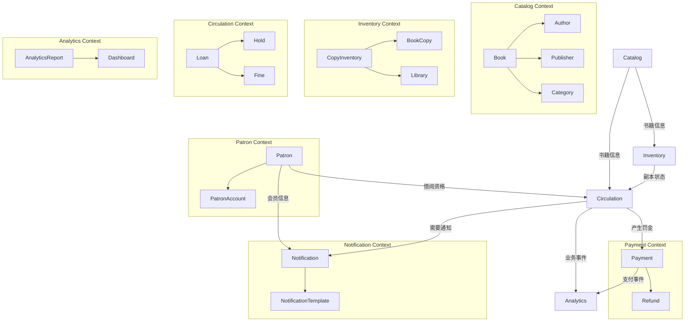
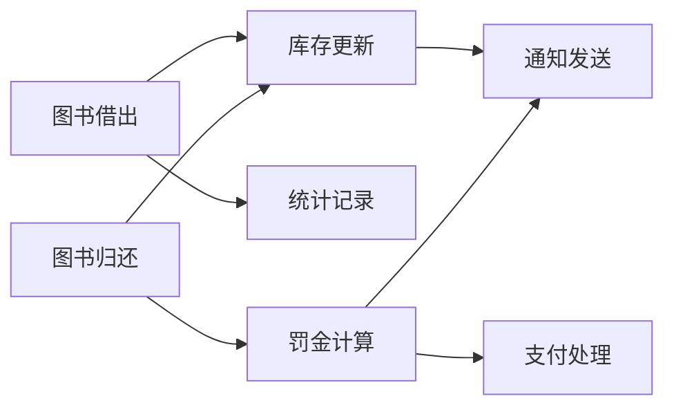
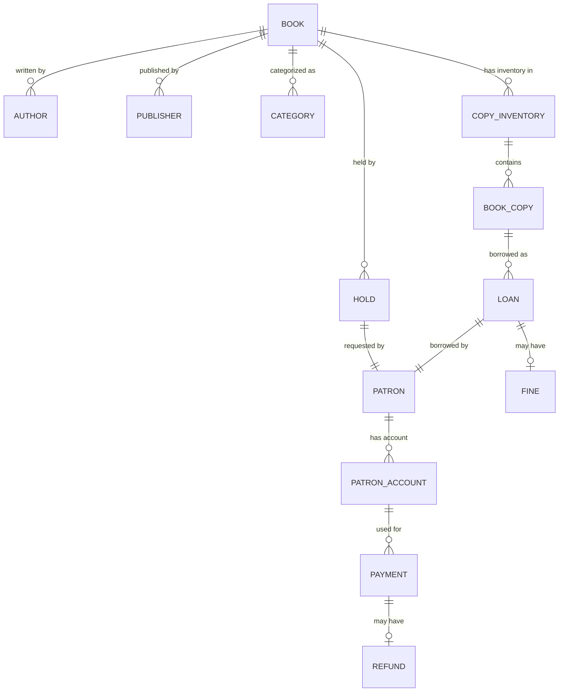
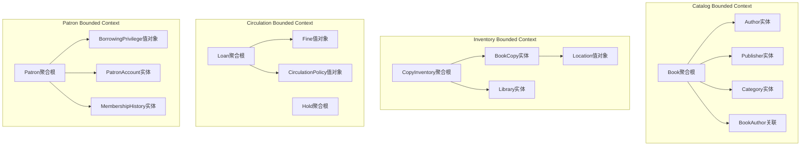
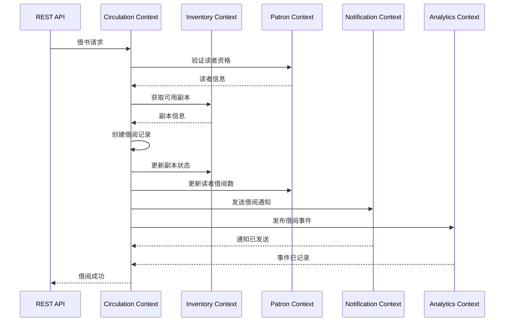
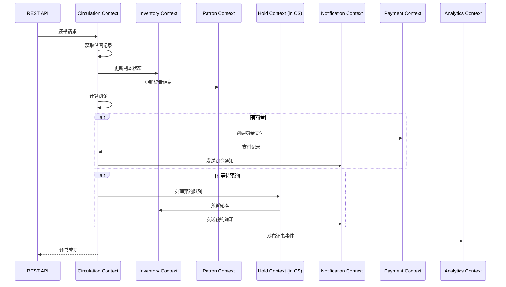

# 领域模型总体设计

## 1. 统一语言（Ubiquitous Language）

### 1.1 核心业务术语

| 术语 | 定义 | 使用上下文 |
|------|------|-----------|
| 图书（Book） | 图书馆管理的图书信息单元 | 编目上下文 |
| 副本（Copy） | 单个图书的物理副本 | 馆藏上下文 |
| 读者（Patron） | 图书馆的注册读者 | 会员上下文 |
| 借阅（Loan） | 读者借阅图书的记录 | 借阅上下文 |
| 预约（Hold） | 读者对图书的预约请求 | 借阅上下文 |
| 罚金（Fine） | 逾期产生的经济处罚 | 借阅上下文 |
| 库存（Inventory） | 图书在特定图书馆的库存 | 馆藏上下文 |
| 支付（Payment） | 财务交易记录 | 支付上下文 |
| 通知（Notification） | 消息通知记录 | 通知上下文 |

### 1.2 业务流程术语

| 术语 | 定义 |
|------|------|
| 借书流程 | 读者从图书馆借出图书的完整过程 |
| 还书流程 | 读者将图书归还给图书馆的过程 |
| 预约流程 | 读者预约不可用图书的过程 |
| 续借流程 | 延长借阅期限的过程 |
| 召回流程 | 图书馆要求提前归还图书的过程 |
| 罚金计算 | 根据逾期天数计算罚金的过程 |

## 2. 限界上下文关系图



## 3. 跨上下文映射

### 3.1 上下文映射模式

| 源上下文 | 目标上下文 | 映射模式 | 描述 |
|----------|------------|----------|------|
| Catalog | Inventory | Customer/Supplier | Catalog是书籍信息的提供者 |
| Catalog | Circulation | Customer/Supplier | Catalog提供图书基本信息 |
| Inventory | Circulation | Shared Kernel | BookCopy在两个上下文中共享标识符 |
| Patron | Circulation | Customer/Supplier | Patron是借阅服务的消费者 |
| Circulation | Payment | Open Host Service | Circulation通过公开服务触发支付 |
| Circulation | Analytics | Event-Driven | 通过领域事件传递数据 |
| All | Notification | Open Host Service | 各上下文通过通知服务发送消息 |

### 3.2 抗腐层设计

```java
package com.library.inventory.infrastructure.adapter;

import com.library.circulation.domain.model.BookId as CirculationBookId;
import com.library.catalog.domain.model.BookId as CatalogBookId;

/**
 * 上下文映射适配器
 */
@Component
public class ContextMappingAdapter {
    
    /**
     * 将编目上下文的BookId转换为馆藏上下文的BookId
     */
    public CatalogBookId toCatalogBookId(CirculationBookId circulationId) {
        return new CatalogBookId(circulationId.getValue());
    }
    
    /**
     * 将馆藏上下文的BookId转换为借阅上下文的BookId
     */
    public CirculationBookId toCirculationBookId(CatalogBookId catalogId) {
        return new CirculationBookId(catalogId.getValue());
    }
    
    /**
     * 转换图书信息DTO
     */
    public BookInfoDTO toBookInfoDTO(CatalogBook catalogBook) {
        return BookInfoDTO.builder()
            .bookId(catalogBook.getId().getValue())
            .title(catalogBook.getTitle())
            .author(catalogBook.getMainAuthor())
            .isbn(catalogBook.getIsbn().getValue())
            .publicationDate(catalogBook.getPublicationDate())
            .build();
    }
}
```

## 4. 领域事件设计

### 4.1 核心领域事件



### 4.2 事件定义

#### 图书相关事件
```java
// 图书创建事件
public class BookCreatedEvent extends DomainEvent {
    private BookId bookId;
    private ISBN isbn;
    private String title;
    private LocalDateTime createdAt;
}

// 图书发布事件
public class BookPublishedEvent extends DomainEvent {
    private BookId bookId;
    private String title;
    private LocalDateTime publishedAt;
}

// 图书删除事件
public class BookDeletedEvent extends DomainEvent {
    private BookId bookId;
    private String title;
    private LocalDateTime deletedAt;
}
```

#### 借阅相关事件
```java
// 图书借出事件
public class BookBorrowedEvent extends DomainEvent {
    private LoanId loanId;
    private CopyId copyId;
    private PatronId patronId;
    private BookId bookId;
    private LocalDateTime borrowedAt;
    private LocalDateTime dueDate;
}

// 图书归还事件
public class BookReturnedEvent extends DomainEvent {
    private LoanId loanId;
    private CopyId copyId;
    private PatronId patronId;
    private BookId bookId;
    private LocalDateTime returnedAt;
    private BigDecimal fineAmount;
}

// 借阅续期事件
public class LoanExtendedEvent extends DomainEvent {
    private LoanId loanId;
    private LocalDateTime oldDueDate;
    private LocalDateTime newDueDate;
    private int renewalCount;
    private LocalDateTime extendedAt;
}

// 召回事件
public class LoanRecalledEvent extends DomainEvent {
    private LoanId loanId;
    private LocalDateTime newDueDate;
    private String reason;
    private LocalDateTime recalledAt;
}
```

#### 预约相关事件
```java
// 预约创建事件
public class HoldPlacedEvent extends DomainEvent {
    private HoldId holdId;
    private BookId bookId;
    private PatronId patronId;
    private int queuePosition;
    private LocalDateTime placedAt;
}

// 预约完成事件
public class HoldFulfilledEvent extends DomainEvent {
    private HoldId holdId;
    private BookId bookId;
    private PatronId patronId;
    private CopyId copyId;
    private LocalDateTime availableUntil;
    private LocalDateTime fulfilledAt;
}

// 预约取消事件
public class HoldCancelledEvent extends DomainEvent {
    private HoldId holdId;
    private BookId bookId;
    private PatronId patronId;
    private String reason;
    private LocalDateTime cancelledAt;
}
```

#### 会员相关事件
```java
// 会员注册事件
public class PatronRegisteredEvent extends DomainEvent {
    private PatronId patronId;
    private String name;
    private String email;
    private PatronType patronType;
    private LocalDateTime registeredAt;
}

// 会员类型变更事件
public class PatronTypeChangedEvent extends DomainEvent {
    private PatronId patronId;
    private PatronType oldType;
    private PatronType newType;
    private String reason;
    private LocalDateTime changedAt;
}

// 会员暂停事件
public class PatronSuspendedEvent extends DomainEvent {
    private PatronId patronId;
    private String reason;
    private LocalDateTime suspendedAt;
}
```

#### 支付相关事件
```java
// 支付完成事件
public class PaymentCompletedEvent extends DomainEvent {
    private PaymentId paymentId;
    private PatronId patronId;
    private BigDecimal amount;
    private PaymentMethod paymentMethod;
    private String referenceNumber;
    private LocalDateTime paymentDate;
}

// 罚金产生事件
public class FineIncurredEvent extends DomainEvent {
    private FineId fineId;
    private LoanId loanId;
    private PatronId patronId;
    private BigDecimal fineAmount;
    private int overdueDays;
    private LocalDateTime incurredAt;
}
```

## 5. 领域模型关系

### 5.1 核心实体关系



### 5.2 聚合关系



## 6. 跨上下文协作模式

### 6.1 借书流程中的上下文协作



### 6.2 还书流程中的上下文协作



## 7. 数据一致性策略

### 7.1 强一致性场景

| 场景 | 涉及上下文 | 一致性保证机制 |
|------|------------|----------------|
| 借书操作 | Circulation, Inventory, Patron | 分布式事务（Saga模式） |
| 副本状态更新 | Inventory, Circulation | 事件驱动 + 幂等性 |
| 读者借阅数更新 | Patron, Circulation | 事件驱动 + 最终一致性 |

### 7.2 最终一致性场景

| 场景 | 涉及上下文 | 一致性窗口 |
|------|------------|-----------|
| 统计数据更新 | All contexts | 5-15分钟 |
| 通知发送 | All contexts | 1-5分钟 |
| 报表生成 | All contexts | 15-60分钟 |

## 8. 领域模型演化

### 8.1 演化策略

1. **向后兼容**: 新增字段和关系不影响现有功能
2. **版本化**: 重要数据结构变更进行版本标记
3. **数据迁移**: 使用渐进式数据迁移策略
4. **事件版本**: 领域事件包含版本信息

### 8.2 演化示例

```java
// 图书扩展信息 - 支持版本演化
@Embeddable
public class BookExtendedInfo {
    
    @Column(name = "info_version")
    private Integer version = 1;
    
    @Column(name = "digital_copy_available")
    private Boolean digitalCopyAvailable;
    
    @Column(name = "audio_book_available") 
    private Boolean audioBookAvailable;
    
    @Column(name = "extended_metadata", columnDefinition = "JSONB")
    private String extendedMetadata;
    
    public boolean supportsFormat(BookFormat format) {
        if (version >= 2) {
            // 处理新版本逻辑
            return switch (format) {
                case DIGITAL -> digitalCopyAvailable != null && digitalCopyAvailable;
                case AUDIO -> audioBookAvailable != null && audioBookAvailable;
                default -> true;
            };
        } else {
            // 兼容旧版本逻辑
            return format == BookFormat.PHYSICAL;
        }
    }
}
```

## 9. 领域模型验证

### 9.1 业务规则验证

```java
/**
 * 领域规则验证器
 */
@Component
public class DomainRuleValidator {
    
    /**
     * 验证借阅规则
     */
    public ValidationResult validateBorrowRules(BorrowContext context) {
        ValidationResult result = new ValidationResult();
        
        // 规则1: 读者必须有借阅资格
        if (!context.getPatron().canBorrow()) {
            result.addError("PATRON_NOT_ELIGIBLE", 
                "读者不具备借阅资格: " + context.getPatron().getStatus());
        }
        
        // 规则2: 副本必须可用
        if (!context.getCopy().isAvailable()) {
            result.addError("COPY_NOT_AVAILABLE",
                "副本不可用: " + context.getCopy().getStatus());
        }
        
        // 规则3: 读者不能有逾期图书
        if (context.getPatron().hasOverdueLoans()) {
            result.addError("PATRON_HAS_OVERDUE",
                "读者有逾期未还图书");
        }
        
        // 规则4: 读者不能重复借阅同一本书
        if (context.getPatron().hasBorrowedBook(context.getBookId())) {
            result.addError("DUPLICATE_BORROW",
                "读者已借阅该书");
        }
        
        // 规则5: 该书不能有等待中的预约（除非是预约人）
        if (context.getBook().hasWaitingHolds() && 
            !context.getPatron().isNextInHoldQueue(context.getBookId())) {
            result.addError("BOOK_HAS_WAITING_HOLDS",
                "该书有等待中的预约");
        }
        
        return result;
    }
}
```

### 9.2 不变量保护

```java
/**
 * 借阅聚合不变量保护
 */
@Entity
public class Loan {
    
    @PrePersist
    @PreUpdate
    private void validateInvariants() {
        // 不变量1: 活跃借阅必须有未到的归还日期
        if (this.status == LoanStatus.ACTIVE && this.dueDate == null) {
            throw new IllegalStateException("Active loan must have a due date");
        }
        
        // 不变量2: 已归还的借阅必须有归还日期
        if (this.status == LoanStatus.RETURNED && this.returnDate == null) {
            throw new IllegalStateException("Returned loan must have a return date");
        }
        
        // 不变量3: 续借次数不能超过限制
        if (this.renewalCount > this.maxRenewalsAllowed) {
            throw new IllegalStateException("Renewal count exceeds maximum allowed");
        }
        
        // 不变量4: 罚金不能超过最大金额
        if (this.fine != null && this.fine.getAmount().compareTo(MAX_FINE_AMOUNT) > 0) {
            throw new IllegalStateException("Fine amount exceeds maximum allowed");
        }
    }
}
```

## 10. 领域模型测试策略

### 10.1 测试金字塔

```
        /\
       /  \        E2E Tests (少量)
      /____\
     /      \     Integration Tests (适量)
    /________\    Unit Tests (大量)
   /          \
```

### 10.2 单元测试重点

1. **聚合测试**: 验证业务规则和不变量
2. **值对象测试**: 验证值对象的不可变性和业务逻辑
3. **领域服务测试**: 验证跨聚合的业务逻辑
4. **领域事件测试**: 验证事件发布时机和内容

### 10.3 集成测试重点

1. **仓储测试**: 验证数据持久化
2. **事件处理测试**: 验证事件订阅和处理
3. **跨上下文集成测试**: 验证上下文间协作

## 11. 总结

领域模型总体设计文档为图书馆管理系统提供了：

1. **统一语言**: 明确的业务术语和定义
2. **上下文边界**: 清晰的限界上下文划分
3. **集成方式**: 跨上下文协作和数据一致性策略
4. **事件驱动**: 完整的领域事件设计
5. **质量保证**: 领域模型验证和测试策略

该设计确保了领域模型的清晰性、一致性和可维护性，为整个系统的开发提供了坚实的基础。

---

**文档版本**: v1.0  
**创建日期**: 2026-05-03  
**最后更新**: 2026-05-03  
**状态**: 初稿完成
