# 业务流程可视化

## 1. 核心业务流程总览

### 1.1 系统核心流程图

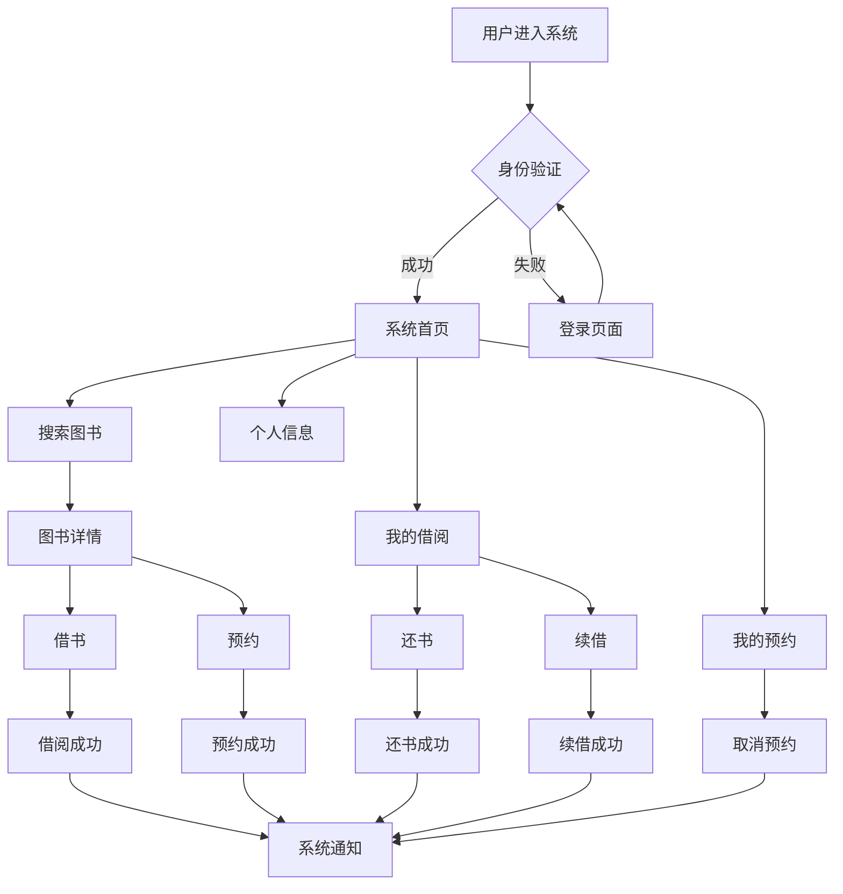
```mermaid
graph TB
    Start[用户进入系统] --> Auth{身份验证}
    Auth -->|成功| Dashboard[系统首页]
    Auth -->|失败| Login[登录页面]
    Login --> Auth
    
    Dashboard --> SearchBook[搜索图书]
    Dashboard --> MyLoans[我的借阅]
    Dashboard --> MyHolds[我的预约]
    Dashboard --> MyProfile[个人信息]
    
    SearchBook --> BookDetail[图书详情]
    BookDetail --> Borrow[借书]
    BookDetail --> Hold[预约]
    
    Borrow --> Success[借阅成功]
    Hold --> HoldSuccess[预约成功]
    
    MyLoans --> Return[还书]
    MyLoans --> Renew[续借]
    
    MyHolds --> CancelHold[取消预约]
    
    Return --> ReturnSuccess[还书成功]
    Renew --> RenewSuccess[续借成功]
    
    Success --> Notification[系统通知]
    HoldSuccess --> Notification
    ReturnSuccess --> Notification
    RenewSuccess --> Notification
    CancelHold --> Notification
```

## 2. 借书流程

### 2.1 借书流程图

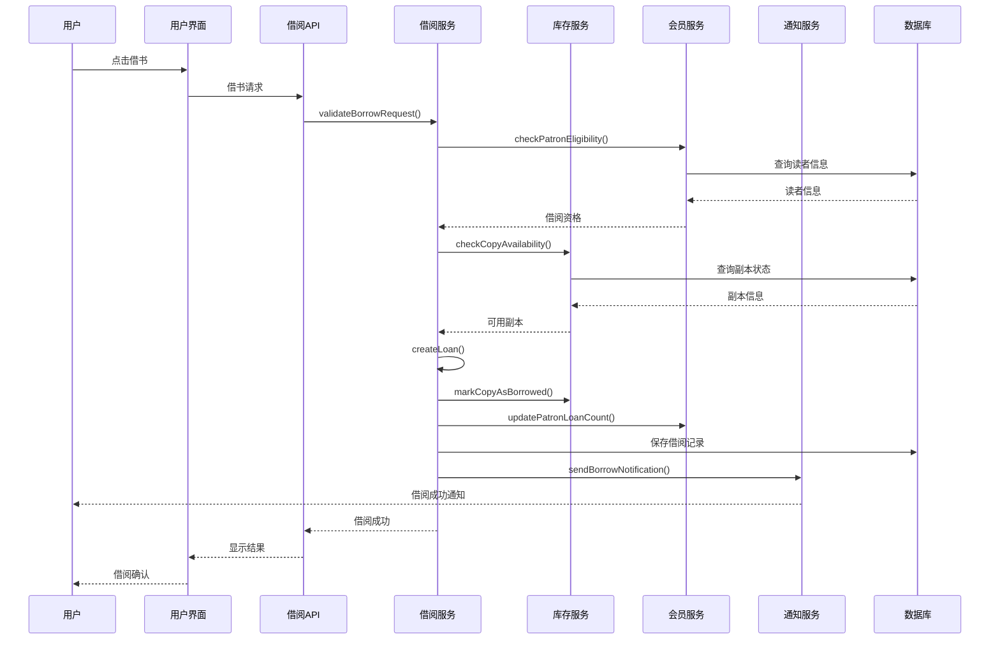
```mermaid
sequenceDiagram
    participant U as 用户
    participant UI as 用户界面
    participant API as 借阅API
    participant CS as 借阅服务
    participant IS as 库存服务
    participant PS as 会员服务
    participant NS as 通知服务
    participant DB as 数据库
    
    U->>UI: 点击借书
    UI->>API: 借书请求
    API->>CS: validateBorrowRequest()
    CS->>PS: checkPatronEligibility()
    PS->>DB: 查询读者信息
    DB-->>PS: 读者信息
    PS-->>CS: 借阅资格
    CS->>IS: checkCopyAvailability()
    IS->>DB: 查询副本状态
    DB-->>IS: 副本信息
    IS-->>CS: 可用副本
    CS->>CS: createLoan()
    CS->>IS: markCopyAsBorrowed()
    CS->>PS: updatePatronLoanCount()
    CS->>DB: 保存借阅记录
    CS->>NS: sendBorrowNotification()
    NS-->>U: 借阅成功通知
    CS-->>API: 借阅成功
    API-->>UI: 显示结果
    UI-->>U: 借阅确认
```

### 2.2 借书业务规则

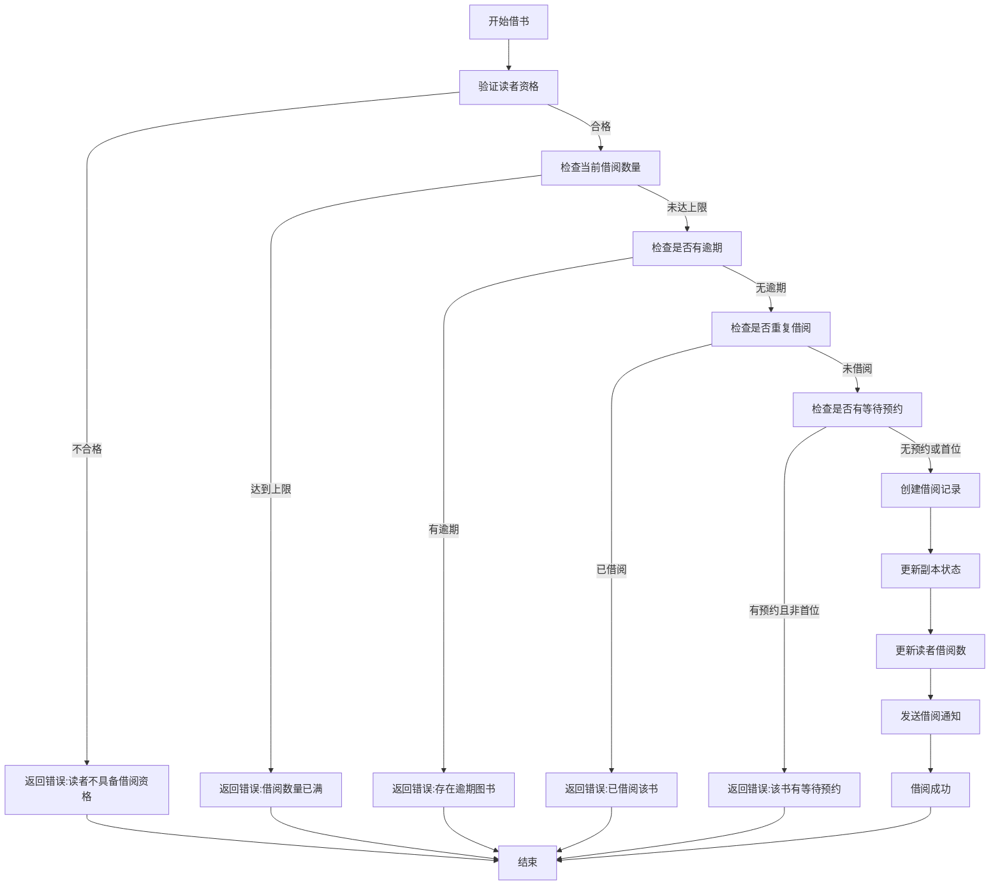
```mermaid
graph TD
    Start[开始借书] --> ValidatePatron[验证读者资格]
    ValidatePatron -->|不合格| Error1[返回错误:读者不具备借阅资格]
    
    ValidatePatron -->|合格| CheckLoans[检查当前借阅数量]
    CheckLoans -->|达到上限| Error2[返回错误:借阅数量已满]
    
    CheckLoans -->|未达上限| CheckOverdue[检查是否有逾期]
    CheckOverdue -->|有逾期| Error3[返回错误:存在逾期图书]
    
    CheckOverdue -->|无逾期| CheckDuplicate[检查是否重复借阅]
    CheckDuplicate -->|已借阅| Error4[返回错误:已借阅该书]
    
    CheckDuplicate -->|未借阅| CheckHolds[检查是否有等待预约]
    CheckHolds -->|有预约且非首位| Error5[返回错误:该书有等待预约]
    
    CheckHolds -->|无预约或首位| CreateLoan[创建借阅记录]
    CreateLoan --> UpdateCopy[更新副本状态]
    UpdateCopy --> UpdatePatron[更新读者借阅数]
    UpdatePatron --> SendNotification[发送借阅通知]
    SendNotification --> Success[借阅成功]
    
    Error1 --> End[结束]
    Error2 --> End
    Error3 --> End
    Error4 --> End
    Error5 --> End
    Success --> End
```

## 3. 还书流程

### 3.1 还书流程图

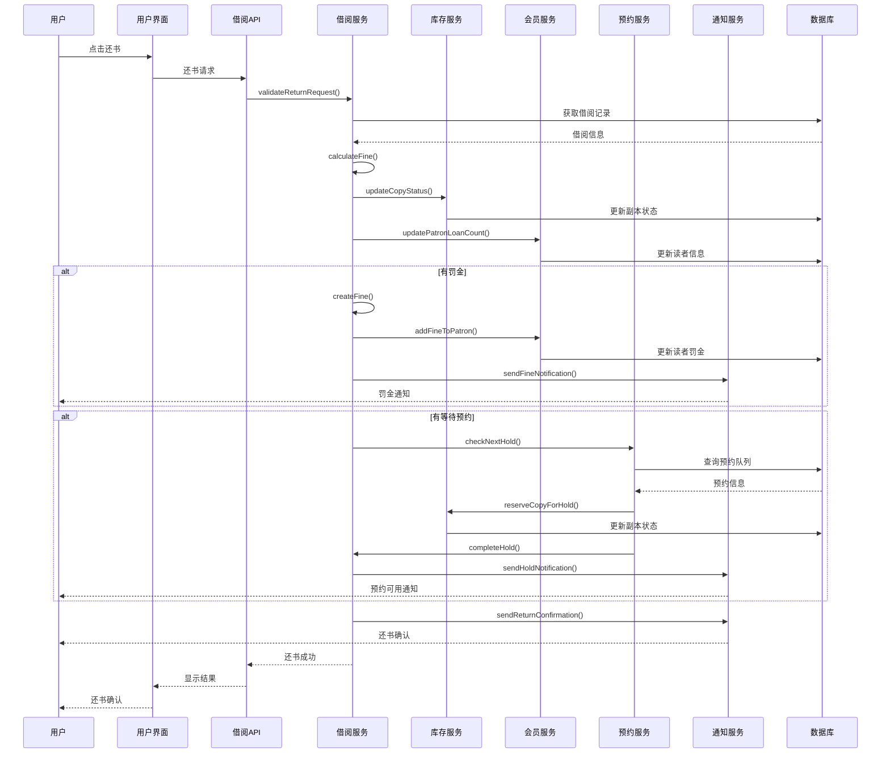
```mermaid
sequenceDiagram
    participant U as 用户
    participant UI as 用户界面
    participant API as 借阅API
    participant CS as 借阅服务
    participant IS as 库存服务
    participant PS as 会员服务
    participant HS as 预约服务
    participant NS as 通知服务
    participant DB as 数据库
    
    U->>UI: 点击还书
    UI->>API: 还书请求
    API->>CS: validateReturnRequest()
    CS->>DB: 获取借阅记录
    DB-->>CS: 借阅信息
    CS->>CS: calculateFine()
    CS->>IS: updateCopyStatus()
    IS->>DB: 更新副本状态
    CS->>PS: updatePatronLoanCount()
    PS->>DB: 更新读者信息
    
    alt 有罚金
        CS->>CS: createFine()
        CS->>PS: addFineToPatron()
        PS->>DB: 更新读者罚金
        CS->>NS: sendFineNotification()
        NS-->>U: 罚金通知
    end
    
    alt 有等待预约
        CS->>HS: checkNextHold()
        HS->>DB: 查询预约队列
        DB-->>HS: 预约信息
        HS->>IS: reserveCopyForHold()
        IS->>DB: 更新副本状态
        HS->>CS: completeHold()
        CS->>NS: sendHoldNotification()
        NS-->>U: 预约可用通知
    end
    
    CS->>NS: sendReturnConfirmation()
    NS-->>U: 还书确认
    CS-->>API: 还书成功
    API-->>UI: 显示结果
    UI-->>U: 还书确认
```

## 4. 预约流程

### 4.1 预约流程图

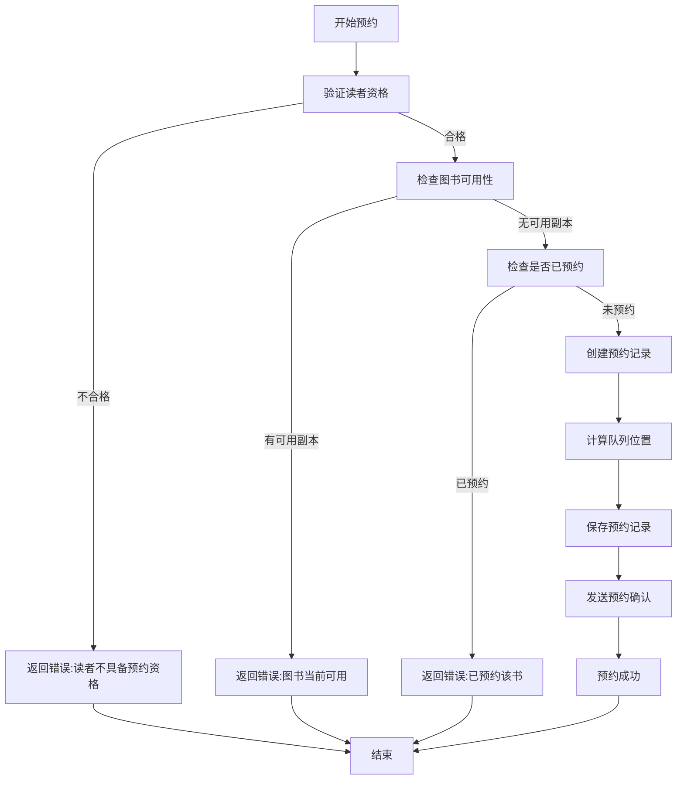
```mermaid
graph TD
    Start[开始预约] --> ValidatePatron[验证读者资格]
    ValidatePatron -->|不合格| Error1[返回错误:读者不具备预约资格]
    
    ValidatePatron -->|合格| CheckAvailable[检查图书可用性]
    CheckAvailable -->|有可用副本| Error2[返回错误:图书当前可用]
    
    CheckAvailable -->|无可用副本| CheckDuplicate[检查是否已预约]
    CheckDuplicate -->|已预约| Error3[返回错误:已预约该书]
    
    CheckDuplicate -->|未预约| CreateHold[创建预约记录]
    CreateHold --> CalculatePosition[计算队列位置]
    CalculatePosition --> SaveHold[保存预约记录]
    SaveHold --> SendNotification[发送预约确认]
    SendNotification --> Success[预约成功]
    
    Error1 --> End[结束]
    Error2 --> End
    Error3 --> End
    Success --> End
```

### 4.2 预约处理流程

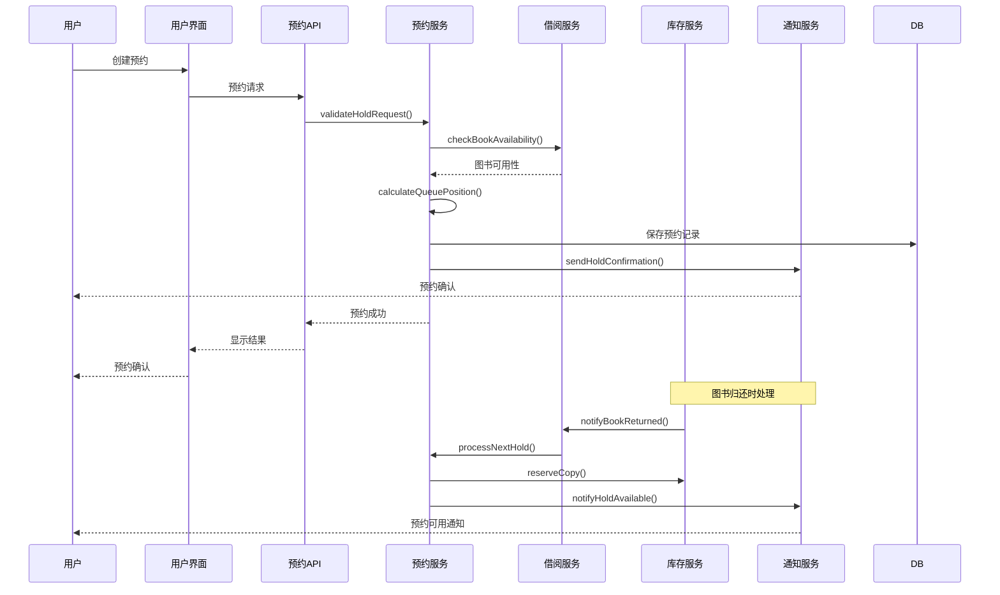
```mermaid
sequenceDiagram
    participant U as 用户
    participant UI as 用户界面
    participant API as 预约API
    participant HS as 预约服务
    participant CS as 借阅服务
    participant IS as 库存服务
    participant NS as 通知服务
    
    U->>UI: 创建预约
    UI->>API: 预约请求
    API->>HS: validateHoldRequest()
    HS->>CS: checkBookAvailability()
    CS-->>HS: 图书可用性
    HS->>HS: calculateQueuePosition()
    HS->>DB: 保存预约记录
    HS->>NS: sendHoldConfirmation()
    NS-->>U: 预约确认
    HS-->>API: 预约成功
    API-->>UI: 显示结果
    UI-->>U: 预约确认
    
    Note over IS,NS: 图书归还时处理
    IS->>CS: notifyBookReturned()
    CS->>HS: processNextHold()
    HS->>IS: reserveCopy()
    HS->>NS: notifyHoldAvailable()
    NS-->>U: 预约可用通知
```

## 5. 续借流程

### 5.1 续借流程图

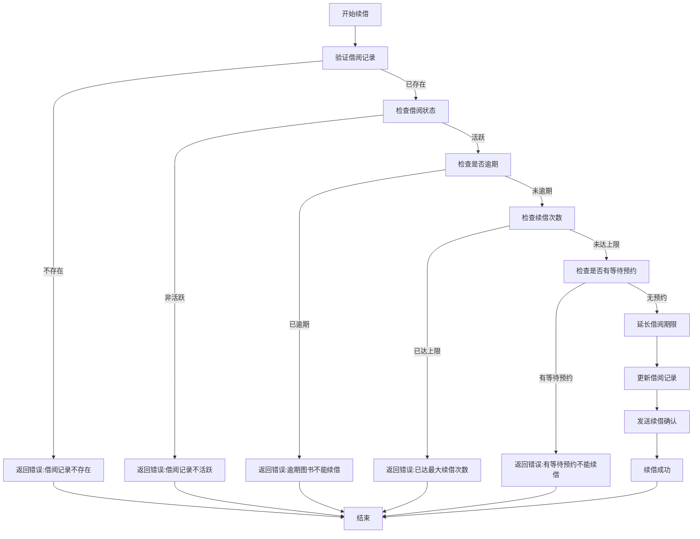
```mermaid
graph TD
    Start[开始续借] --> ValidateLoan[验证借阅记录]
    ValidateLoan -->|不存在| Error1[返回错误:借阅记录不存在]
    
    ValidateLoan -->|已存在| CheckStatus[检查借阅状态]
    CheckStatus -->|非活跃| Error2[返回错误:借阅记录不活跃]
    
    CheckStatus -->|活跃| CheckOverdue[检查是否逾期]
    CheckOverdue -->|已逾期| Error3[返回错误:逾期图书不能续借]
    
    CheckOverdue -->|未逾期| CheckRenewals[检查续借次数]
    CheckRenewals -->|已达上限| Error4[返回错误:已达最大续借次数]
    
    CheckRenewals -->|未达上限| CheckHolds[检查是否有等待预约]
    CheckHolds -->|有等待预约| Error5[返回错误:有等待预约不能续借]
    
    CheckHolds -->|无预约| ExtendLoan[延长借阅期限]
    ExtendLoan --> SaveLoan[更新借阅记录]
    SaveLoan --> SendNotification[发送续借确认]
    SendNotification --> Success[续借成功]
    
    Error1 --> End[结束]
    Error2 --> End
    Error3 --> End
    Error4 --> End
    Error5 --> End
    Success --> End
```

## 6. 召回流程

### 6.1 召回流程图

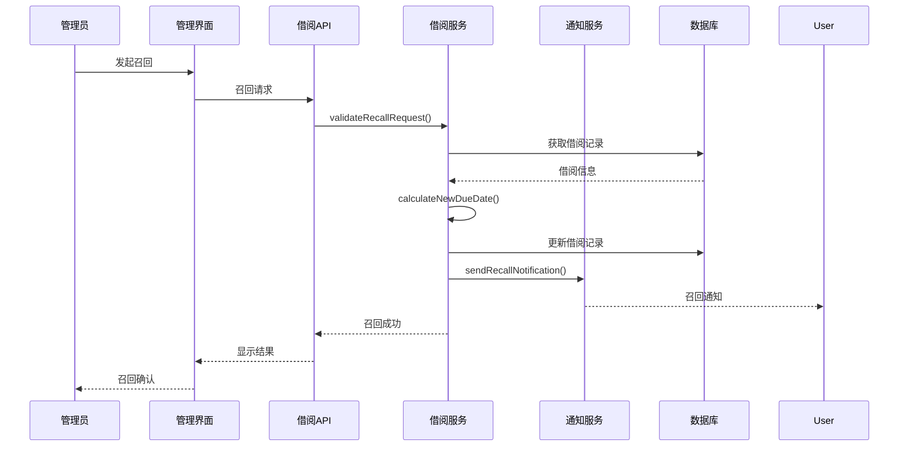
```mermaid
sequenceDiagram
    participant Lib as 管理员
    participant UI as 管理界面
    participant API as 借阅API
    participant CS as 借阅服务
    participant NS as 通知服务
    participant DB as 数据库
    
    Lib->>UI: 发起召回
    UI->>API: 召回请求
    API->>CS: validateRecallRequest()
    CS->>DB: 获取借阅记录
    DB-->>CS: 借阅信息
    CS->>CS: calculateNewDueDate()
    CS->>DB: 更新借阅记录
    CS->>NS: sendRecallNotification()
    NS-->>User: 召回通知
    CS-->>API: 召回成功
    API-->>UI: 显示结果
    UI-->>Lib: 召回确认
```

## 7. 支付流程

### 7.1 罚金支付流程

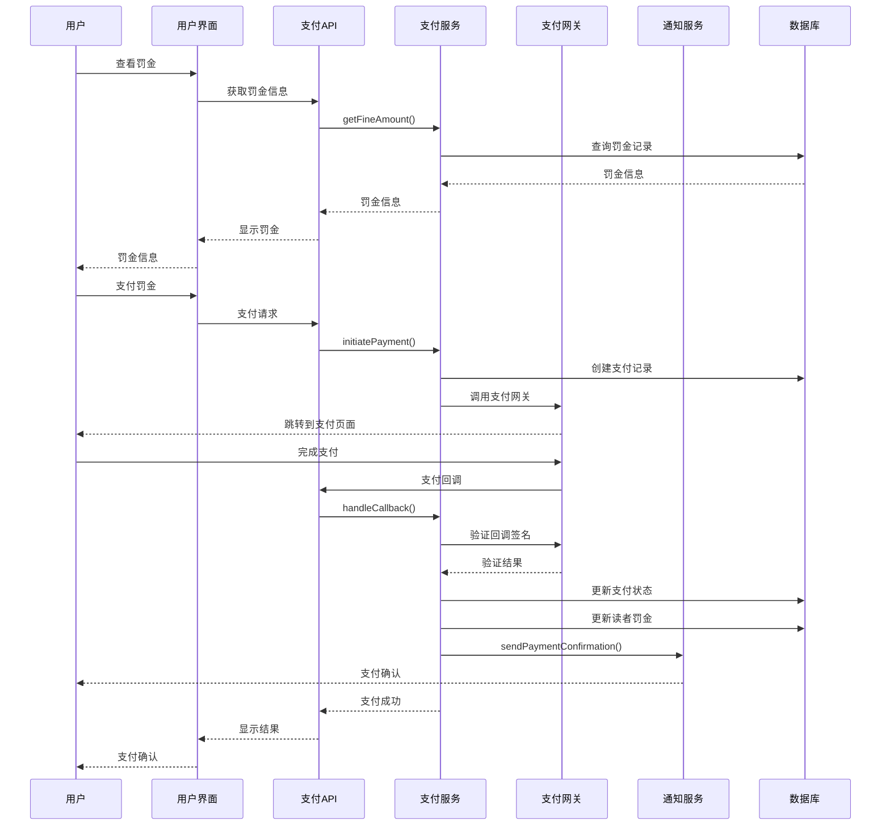
```mermaid
sequenceDiagram
    participant U as 用户
    participant UI as 用户界面
    participant API as 支付API
    participant PAYS as 支付服务
    participant GW as 支付网关
    participant NS as 通知服务
    participant DB as 数据库
    
    U->>UI: 查看罚金
    UI->>API: 获取罚金信息
    API->>PAYS: getFineAmount()
    PAYS->>DB: 查询罚金记录
    DB-->>PAYS: 罚金信息
    PAYS-->>API: 罚金信息
    API-->>UI: 显示罚金
    UI-->>U: 罚金信息
    
    U->>UI: 支付罚金
    UI->>API: 支付请求
    API->>PAYS: initiatePayment()
    PAYS->>DB: 创建支付记录
    PAYS->>GW: 调用支付网关
    GW-->>U: 跳转到支付页面
    U->>GW: 完成支付
    GW->>API: 支付回调
    API->>PAYS: handleCallback()
    PAYS->>GW: 验证回调签名
    GW-->>PAYS: 验证结果
    PAYS->>DB: 更新支付状态
    PAYS->>DB: 更新读者罚金
    PAYS->>NS: sendPaymentConfirmation()
    NS-->>U: 支付确认
    PAYS-->>API: 支付成功
    API-->>UI: 显示结果
    UI-->>U: 支付确认
```

## 8. 通知流程

### 8.1 通知发送流程

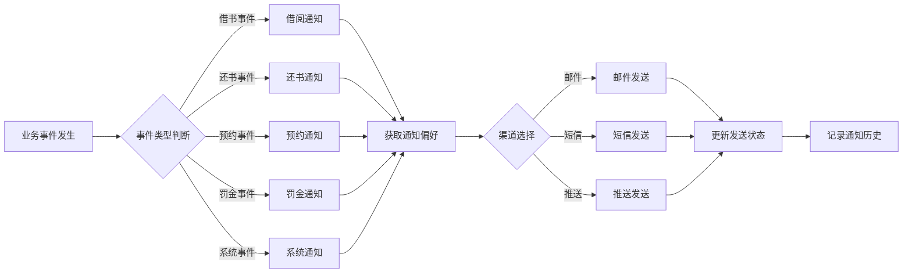
```mermaid
graph LR
    A[业务事件发生] --> B{事件类型判断}
    B -->|借书事件| C[借阅通知]
    B -->|还书事件| D[还书通知]
    B -->|预约事件| E[预约通知]
    B -->|罚金事件| F[罚金通知]
    B -->|系统事件| G[系统通知]
    
    C --> H[获取通知偏好]
    D --> H
    E --> H
    F --> H
    G --> H
    
    H --> I{渠道选择}
    I -->|邮件| J[邮件发送]
    I -->|短信| K[短信发送]
    I -->|推送| L[推送发送]
    
    J --> M[更新发送状态]
    K --> M
    L --> M
    M --> N[记录通知历史]
```

## 9. 报表生成流程

### 9.1 报表生成流程图

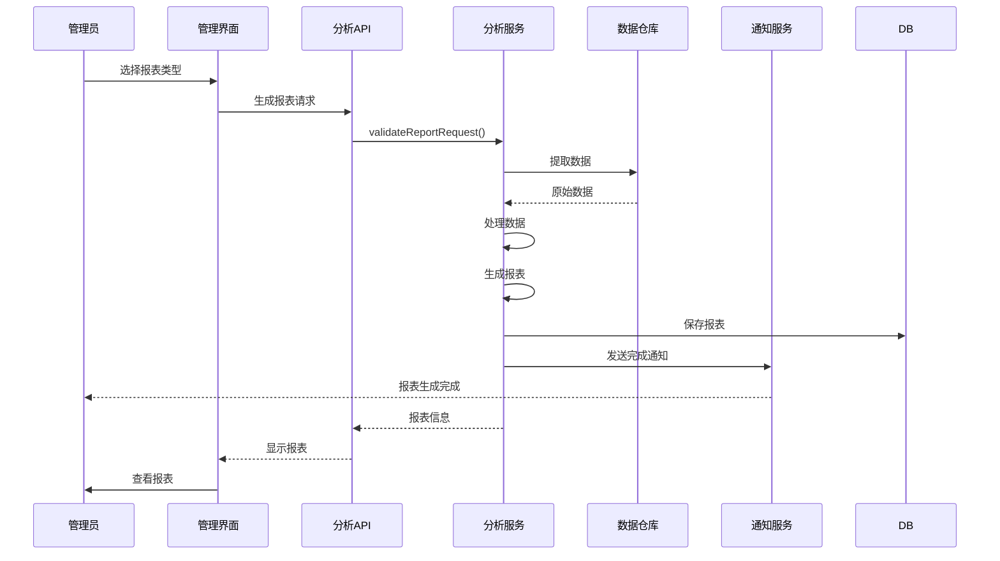
```mermaid
sequenceDiagram
    participant Admin as 管理员
    participant UI as 管理界面
    participant API as 分析API
    participant AS as 分析服务
    participant DW as 数据仓库
    participant NS as 通知服务
    
    Admin->>UI: 选择报表类型
    UI->>API: 生成报表请求
    API->>AS: validateReportRequest()
    AS->>DW: 提取数据
    DW-->>AS: 原始数据
    AS->>AS: 处理数据
    AS->>AS: 生成报表
    AS->>DB: 保存报表
    AS->>NS: 发送完成通知
    NS-->>Admin: 报表生成完成
    AS-->>API: 报表信息
    API-->>UI: 显示报表
    UI->>Admin: 查看报表
```

## 10. 系统集成流程

### 10.1 多上下文协作流程

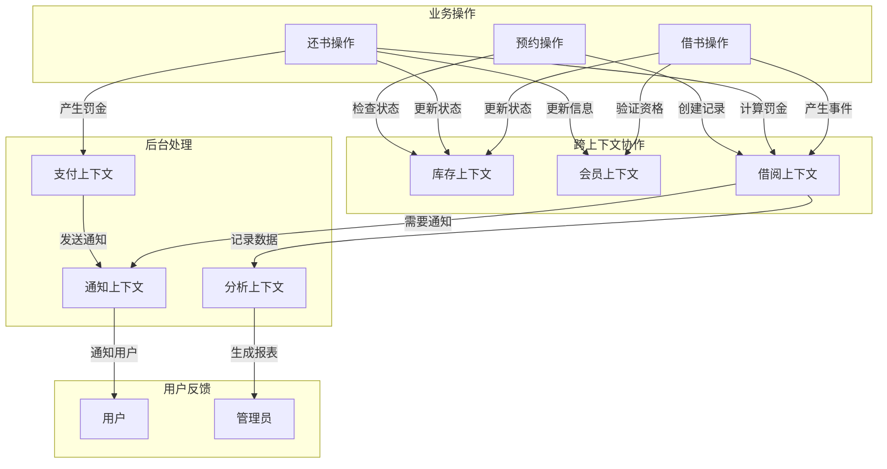
```mermaid
graph TB
    subgraph "业务操作"
        Borrow[借书操作]
        Return[还书操作]
        Hold[预约操作]
    end
    
    subgraph "跨上下文协作"
        Borrow -->|更新状态| Inventory[库存上下文]
        Borrow -->|验证资格| Patron[会员上下文]
        Borrow -->|产生事件| Circulation[借阅上下文]
        
        Return -->|更新状态| Inventory
        Return -->|更新信息| Patron
        Return -->|计算罚金| Circulation
        
        Hold -->|检查状态| Inventory
        Hold -->|创建记录| Circulation
    end
    
    subgraph "后台处理"
        Circulation -->|需要通知| Notification[通知上下文]
        Circulation -->|记录数据| Analytics[分析上下文]
        
        Return -->|产生罚金| Payment[支付上下文]
        Payment -->|发送通知| Notification
    end
    
    subgraph "用户反馈"
        Notification -->|通知用户| User[用户]
        Analytics -->|生成报表| Admin[管理员]
    end
```

## 11. 异常处理流程

### 11.1 错误处理流程

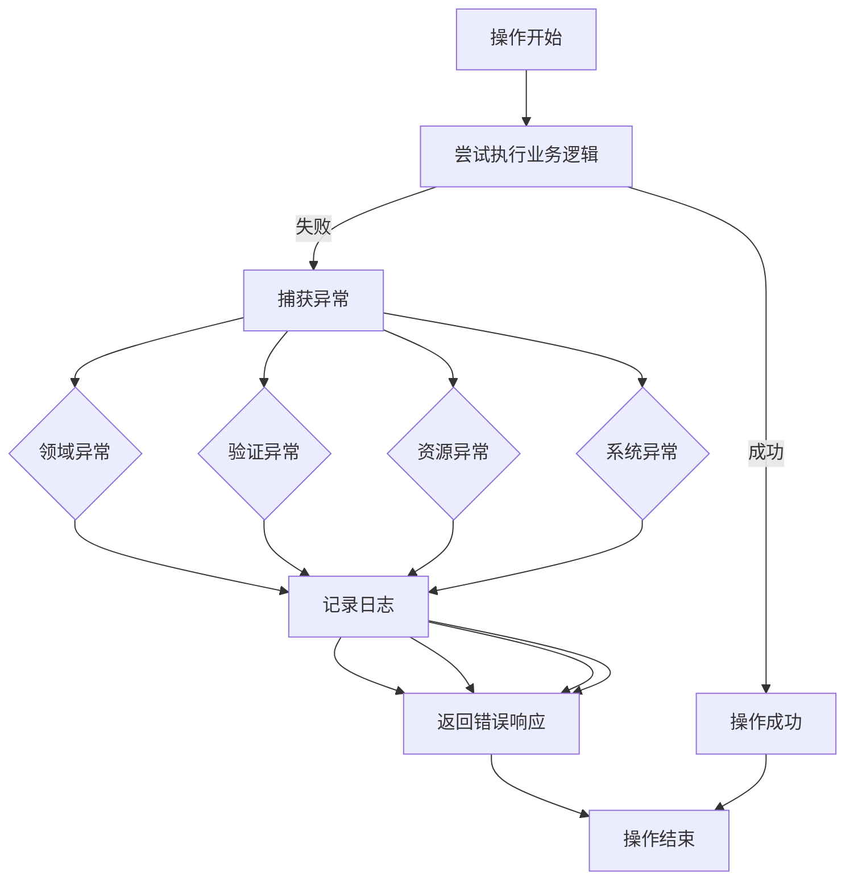
```mermaid
graph TD
    Start[操作开始] --> Try[尝试执行业务逻辑]
    Try -->|成功| Success[操作成功]
    Try -->|失败| Catch[捕获异常]
    
    Catch --> DomainException{领域异常}
    DomainException --> Log[记录日志]
    Log --> ErrorResponse[返回错误响应]
    
    Catch --> ValidationException{验证异常}
    ValidationException --> Log
    Log --> ErrorResponse
    
    Catch --> ResourceException{资源异常}
    ResourceException --> Log
    Log --> ErrorResponse
    
    Catch --> SystemException{系统异常}
    SystemException --> Log
    Log --> ErrorResponse
    
    ErrorResponse --> End[操作结束]
    Success --> End
```

## 12. 总结

业务流程可视化文档提供了图书馆系统核心业务流程的图形化展示，包括：

1. **核心流程**: 借书、还书、预约、续借等核心业务
2. **跨上下文协作**: 多个限界上下文的协作关系
3. **异常处理**: 错误处理和恢复流程
4. **系统集成**: 与外部系统的集成流程

这些流程图为开发和测试提供了清晰的指导，确保系统行为的正确性和一致性。

---

**文档版本**: v1.0  
**创建日期**: 2026-05-03  
**最后更新**: 2026-05-31  
**状态**: 初稿完成  

---

## 10. 跨上下文 Kafka 事件流（实际实现）

> **最后更新**: 2026-05-31

### 10.1 事件流全景图

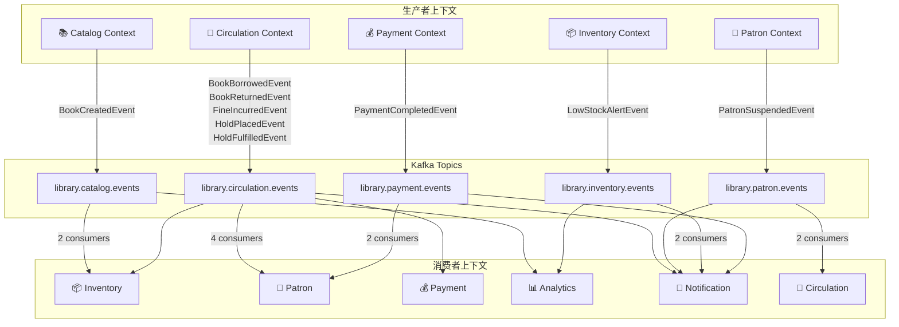
```mermaid
graph TB
    subgraph "生产者上下文"
        CATALOG["📚 Catalog Context"]
        CIRCULATION["🔄 Circulation Context"]
        PATRON["👤 Patron Context"]
        INVENTORY["📦 Inventory Context"]
        PAYMENT["💰 Payment Context"]
    end
    
    subgraph "Kafka Topics"
        T1["library.catalog.events"]
        T2["library.circulation.events"]
        T3["library.patron.events"]
        T4["library.inventory.events"]
        T5["library.payment.events"]
    end
    
    subgraph "消费者上下文"
        INV_CONS["📦 Inventory"]
        PATRON_CONS["👤 Patron"]
        PAYMENT_CONS["💰 Payment"]
        ANALYTICS_CONS["📊 Analytics"]
        NOTIF_CONS["🔔 Notification"]
        CIRC_CONS["🔄 Circulation"]
    end
    
    CATALOG -->|"BookCreatedEvent"| T1
    CIRCULATION -->|"BookBorrowedEvent<br/>BookReturnedEvent<br/>FineIncurredEvent<br/>HoldPlacedEvent<br/>HoldFulfilledEvent"| T2
    PATRON -->|"PatronSuspendedEvent"| T3
    INVENTORY -->|"LowStockAlertEvent"| T4
    PAYMENT -->|"PaymentCompletedEvent"| T5
    
    T1 -->|"2 consumers"| INV_CONS
    T1 -->|" "| ANALYTICS_CONS
    T2 -->|"4 consumers"| PATRON_CONS
    T2 -->|" "| INV_CONS
    T2 -->|" "| PAYMENT_CONS
    T2 -->|" "| NOTIF_CONS
    T3 -->|"2 consumers"| CIRC_CONS
    T3 -->|" "| NOTIF_CONS
    T4 -->|"2 consumers"| NOTIF_CONS
    T4 -->|" "| ANALYTICS_CONS
    T5 -->|"2 consumers"| PATRON_CONS
    T5 -->|" "| NOTIF_CONS
```

### 10.2 借书事件流（实际 Kafka 路径）

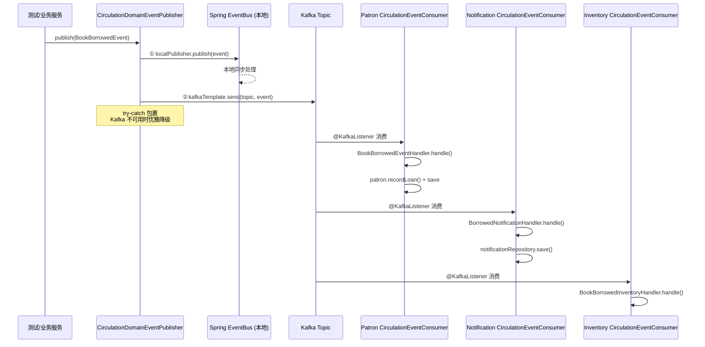
```mermaid
sequenceDiagram
    participant Test as 测试/业务服务
    participant Publisher as CirculationDomainEventPublisher
    participant Local as Spring EventBus (本地)
    participant Kafka as Kafka Topic
    participant PatronCons as Patron CirculationEventConsumer
    participant NotifCons as Notification CirculationEventConsumer
    participant InvCons as Inventory CirculationEventConsumer
    
    Test->>Publisher: publish(BookBorrowedEvent)
    Publisher->>Local: ① localPublisher.publish(event)
    Local-->>Local: 本地同步处理
    
    Publisher->>Kafka: ② kafkaTemplate.send(topic, event)
    Note over Publisher: try-catch 包裹<br/>Kafka 不可用时优雅降级
    
    Kafka->>PatronCons: @KafkaListener 消费
    PatronCons->>PatronCons: BookBorrowedEventHandler.handle()
    PatronCons->>PatronCons: patron.recordLoan() + save
    
    Kafka->>NotifCons: @KafkaListener 消费
    NotifCons->>NotifCons: BorrowedNotificationHandler.handle()
    NotifCons->>NotifCons: notificationRepository.save()
    
    Kafka->>InvCons: @KafkaListener 消费
    InvCons->>InvCons: BookBorrowedInventoryHandler.handle()
```

### 10.3 罚金-支付链式事件流

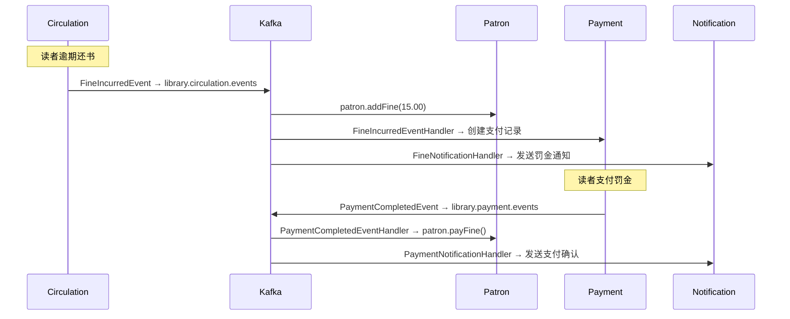
```mermaid
sequenceDiagram
    participant Circ as Circulation
    participant Kafka as Kafka
    participant Patron as Patron
    participant Payment as Payment
    participant Notif as Notification
    
    Note over Circ: 读者逾期还书
    Circ->>Kafka: FineIncurredEvent → library.circulation.events
    Kafka->>Patron: patron.addFine(15.00)
    Kafka->>Payment: FineIncurredEventHandler → 创建支付记录
    Kafka->>Notif: FineNotificationHandler → 发送罚金通知
    
    Note over Payment: 读者支付罚金
    Payment->>Kafka: PaymentCompletedEvent → library.payment.events
    Kafka->>Patron: PaymentCompletedEventHandler → patron.payFine()
    Kafka->>Notif: PaymentNotificationHandler → 发送支付确认
```

### 10.4 双发模式流程

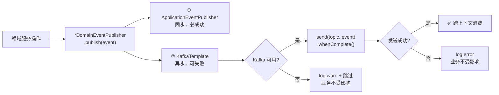
```mermaid
flowchart LR
    A["领域服务操作"] --> B["*DomainEventPublisher<br/>.publish(event)"]
    B --> C["① ApplicationEventPublisher<br/>同步，必成功"]
    B --> D["② KafkaTemplate<br/>异步，可失败"]
    D --> E{"Kafka 可用?"}
    E -->|"是"| F["send(topic, event)<br/>.whenComplete()"]
    E -->|"否"| G["log.warn + 跳过<br/>业务不受影响"]
    F --> H{"发送成功?"}
    H -->|"是"| I["✅ 跨上下文消费"]
    H -->|"否"| J["log.error<br/>业务不受影响"]
```
