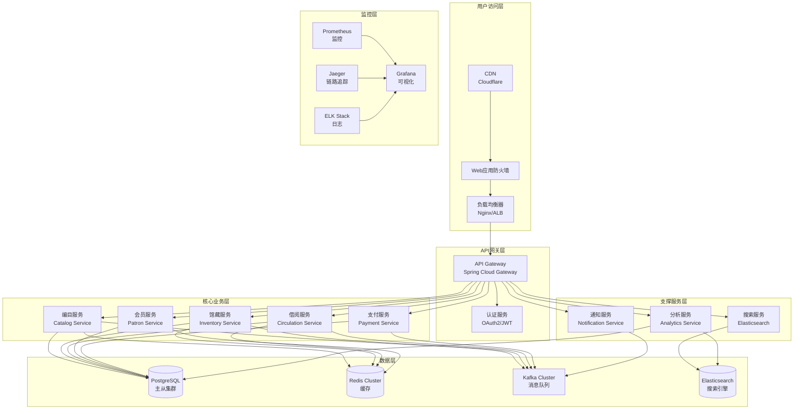
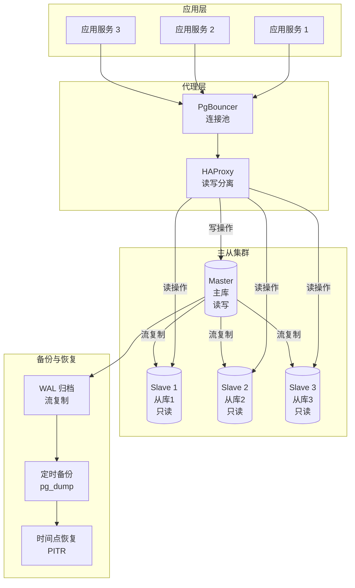
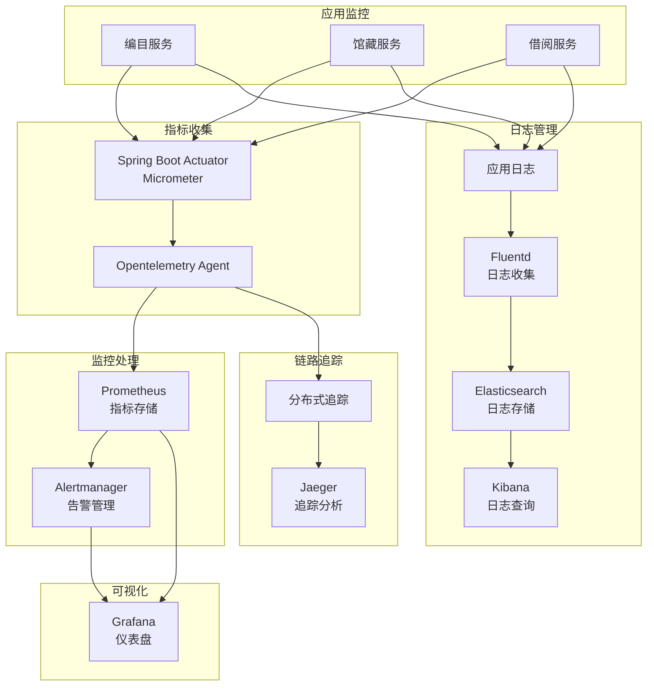
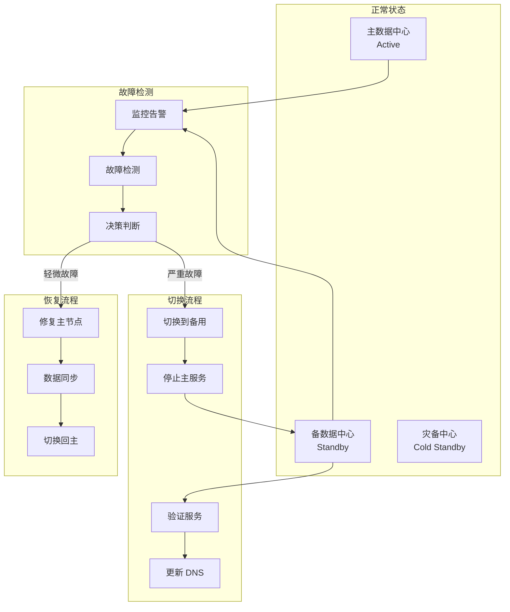

# 部署架构和扩展设计文档

## 1. 微服务部署架构

### 1.1 整体架构图



### 1.2 服务部署策略

#### 1.2.1 容器化部署

每个微服务独立容器化，采用多阶段构建优化镜像大小。

**Dockerfile 示例 (多阶段构建)**

```dockerfile
# 构建阶段
FROM maven:3.9-eclipse-temurin-21 AS builder
WORKDIR /app
COPY pom.xml .
RUN mvn dependency:go-offline
COPY src ./src
RUN mvn clean package -DskipTests

# 运行阶段
FROM eclipse-temurin:21-jre-alpine
WORKDIR /app
COPY --from=builder /app/target/*.jar app.jar
RUN addgroup -S spring && adduser -S spring -G spring
USER spring:spring
EXPOSE 8080
ENTRYPOINT ["java", "-XX:+UseContainerSupport", "-XX:MaxRAMPercentage=75.0", "-jar", "app.jar"]
```

#### 1.2.2 Kubernetes 部署配置

**Deployment 配置**

```yaml
apiVersion: apps/v1
kind: Deployment
metadata:
  name: catalog-service
  namespace: library-system
  labels:
    app: catalog-service
    version: v1
spec:
  replicas: 3
  strategy:
    type: RollingUpdate
    rollingUpdate:
      maxSurge: 1
      maxUnavailable: 0
  selector:
    matchLabels:
      app: catalog-service
  template:
    metadata:
      labels:
        app: catalog-service
        version: v1
    spec:
      containers:
      - name: catalog-service
        image: library/catalog-service:1.0.0
        ports:
        - containerPort: 8080
          name: http
          protocol: TCP
        env:
        - name: SPRING_PROFILES_ACTIVE
          value: "prod"
        - name: SPRING_DATASOURCE_URL
          valueFrom:
            secretKeyRef:
              name: database-secrets
              key: catalog-db-url
        - name: SPRING_KAFKA_BOOTSTRAP_SERVERS
          value: "kafka:9092"
        - name: JAVA_OPTS
          value: "-XX:+UseContainerSupport -XX:MaxRAMPercentage=75.0"
        resources:
          requests:
            memory: "512Mi"
            cpu: "250m"
          limits:
            memory: "1Gi"
            cpu: "500m"
        livenessProbe:
          httpGet:
            path: /actuator/health/liveness
            port: 8080
          initialDelaySeconds: 60
          periodSeconds: 10
          timeoutSeconds: 5
          failureThreshold: 3
        readinessProbe:
          httpGet:
            path: /actuator/health/readiness
            port: 8080
          initialDelaySeconds: 30
          periodSeconds: 5
          timeoutSeconds: 3
          failureThreshold: 3
        volumeMounts:
        - name: config-volume
          mountPath: /app/config
      volumes:
      - name: config-volume
        configMap:
          name: catalog-config
---
apiVersion: v1
kind: Service
metadata:
  name: catalog-service
  namespace: library-system
spec:
  type: ClusterIP
  selector:
    app: catalog-service
  ports:
  - port: 80
    targetPort: 8080
    protocol: TCP
    name: http
---
apiVersion: autoscaling/v2
kind: HorizontalPodAutoscaler
metadata:
  name: catalog-service-hpa
  namespace: library-system
spec:
  scaleTargetRef:
    apiVersion: apps/v1
    kind: Deployment
    name: catalog-service
  minReplicas: 3
  maxReplicas: 10
  metrics:
  - type: Resource
    resource:
      name: cpu
      target:
        type: Utilization
        averageUtilization: 70
  - type: Resource
    resource:
      name: memory
      target:
        type: Utilization
        averageUtilization: 80
  behavior:
    scaleDown:
      stabilizationWindowSeconds: 300
      policies:
      - type: Percent
        value: 50
        periodSeconds: 60
    scaleUp:
      stabilizationWindowSeconds: 0
      policies:
      - type: Percent
        value: 100
        periodSeconds: 60
      - type: Pods
        value: 4
        periodSeconds: 60
      selectPolicy: Max
```

## 2. 服务发现与负载均衡

### 2.1 服务注册与发现

使用 Spring Cloud Kubernetes 实现服务发现，集成 Kubernetes 原生服务发现机制。

**配置类**

```java
@Configuration
@EnableDiscoveryClient
public class ServiceDiscoveryConfig {
    
    @Bean
    public LoadBalancerClient loadBalancerClient(LoadBalancerClientFactory factory) {
        return new LoadBalancerClient() {
            @Override
            public <T> T execute(String serviceId, LoadBalancerRequest<T> request) {
                ServiceInstance instance = loadBalancer(serviceId);
                return request.apply(instance);
            }
            
            @Override
            public ServiceInstance choose(String serviceId) {
                return loadBalancer(serviceId);
            }
            
            private ServiceInstance loadBalancer(String serviceId) {
                ReactiveLoadBalancer<ServiceInstance> loadBalancer = 
                    factory.getInstance(serviceId);
                return loadBalancer.choose().block().getServer();
            }
        };
    }
}
```

### 2.2 客户端负载均衡

```java
@Configuration
public class LoadBalancerConfig {
    
    @Bean
    ReactorLoadBalancer<ServiceInstance> randomLoadBalancer(
            Environment environment,
            LoadBalancerClientFactory loadBalancerClientFactory) {
        String name = environment.getProperty(LoadBalancerClientFactory.PROPERTY_NAME);
        return new RandomLoadBalancer(
            loadBalancerClientFactory.getLazyProvider(name, ServiceInstanceListSupplier.class),
            name);
    }
}

@Service
public class InventoryServiceClient {
    
    private final WebClient.Builder webClientBuilder;
    private final LoadBalancerClient loadBalancerClient;
    
    public InventoryServiceClient(WebClient.Builder webClientBuilder,
                                   LoadBalancerClient loadBalancerClient) {
        this.webClientBuilder = webClientBuilder;
        this.loadBalancerClient = loadBalancerClient;
    }
    
    public Mono<BookCopyDTO> getBookCopy(String copyId) {
        ServiceInstance instance = loadBalancerClient.choose("inventory-service");
        String baseUrl = String.format("http://%s:%d", 
            instance.getHost(), instance.getPort());
        
        return webClientBuilder.baseUrl(baseUrl)
            .build()
            .get()
            .uri("/api/inventory/copies/{copyId}", copyId)
            .retrieve()
            .bodyToMono(BookCopyDTO.class);
    }
}
```

## 3. 数据库部署策略

### 3.1 PostgreSQL 高可用架构



### 3.2 数据库配置

**PostgreSQL 主库配置**

```yaml
# postgresql.conf
listen_addresses = '*'
port = 5432
max_connections = 200
shared_buffers = 4GB
effective_cache_size = 12GB
maintenance_work_mem = 1GB
checkpoint_completion_target = 0.9
wal_buffers = 16MB
default_statistics_target = 100
random_page_cost = 1.1
effective_io_concurrency = 200
work_mem = 4MB
min_wal_size = 1GB
max_wal_size = 4GB

# 复制配置
wal_level = replica
max_wal_senders = 10
max_replication_slots = 10
synchronous_commit = on
synchronous_standby_names = 'slave1,slave2'
```

**PostgreSQL 从库配置**

```yaml
# postgresql.conf
hot_standby = on
max_standby_streaming_delay = 30s
max_standby_archive_delay = 30s

# recovery.conf
standby_mode = on
primary_conninfo = 'host=master-db port=5432 user=replicator password=replicator_pass'
restore_command = 'cp /var/lib/postgresql/archive/%f %p'
```

### 3.3 数据库连接池配置

```java
@Configuration
public class DatabaseConfig {
    
    @Bean
    @ConfigurationProperties(prefix = "spring.datasource.hikari")
    public DataSource dataSource() {
        HikariConfig config = new HikariConfig();
        config.setJdbcUrl("jdbc:postgresql://postgres-master:5432/library");
        config.setUsername("library_user");
        config.setPassword("${DB_PASSWORD}");
        config.setDriverClassName("org.postgresql.Driver");
        
        // 连接池配置
        config.setMaximumPoolSize(20);
        config.setMinimumIdle(5);
        config.setConnectionTimeout(30000);
        config.setIdleTimeout(600000);
        config.setMaxLifetime(1800000);
        config.setLeakDetectionThreshold(60000);
        
        // 性能优化
        config.addDataSourceProperty("cachePrepStmts", "true");
        config.addDataSourceProperty("prepStmtCacheSize", "250");
        config.addDataSourceProperty("prepStmtCacheSqlLimit", "2048");
        config.addDataSourceProperty("useServerPrepStmts", "true");
        config.addDataSourceProperty("useLocalSessionState", "true");
        config.addDataSourceProperty("rewriteBatchedStatements", "true");
        config.addDataSourceProperty("cacheResultSetMetadata", "true");
        config.addDataSourceProperty("cacheServerConfiguration", "true");
        config.addDataSourceProperty("elideSetAutoCommits", "true");
        config.addDataSourceProperty("maintainTimeStats", "false");
        
        return new HikariDataSource(config);
    }
}
```

## 4. 监控和运维方案

### 4.1 监控架构



### 4.2 Prometheus 配置

**prometheus.yml**

```yaml
global:
  scrape_interval: 15s
  evaluation_interval: 15s
  external_labels:
    cluster: 'library-system'
    environment: 'production'

alerting:
  alertmanagers:
  - static_configs:
    - targets:
      - 'alertmanager:9093'

rule_files:
  - '/etc/prometheus/rules/*.yml'

scrape_configs:
  - job_name: 'kubernetes-pods'
    kubernetes_sd_configs:
    - role: pod
    relabel_configs:
    - source_labels: [__meta_kubernetes_pod_annotation_prometheus_io_scrape]
      action: keep
      regex: true
    - source_labels: [__meta_kubernetes_pod_annotation_prometheus_io_path]
      action: replace
      target_label: __metrics_path__
      regex: (.+)
    - source_labels: [__address__, __meta_kubernetes_pod_annotation_prometheus_io_port]
      action: replace
      regex: ([^:]+)(?::\d+)?;(\d+)
      replacement: $1:$2
      target_label: __address__
    - action: labelmap
      regex: __meta_kubernetes_pod_label_(.+)
    - source_labels: [__meta_kubernetes_namespace]
      action: replace
      target_label: kubernetes_namespace
    - source_labels: [__meta_kubernetes_pod_name]
      action: replace
      target_label: kubernetes_pod_name

  - job_name: 'kubernetes-nodes'
    kubernetes_sd_configs:
    - role: node
    relabel_configs:
    - action: labelmap
      regex: __meta_kubernetes_node_label_(.+)
```

### 4.3 告警规则配置

**alerts.yml**

```yaml
groups:
- name: library_system_alerts
  interval: 30s
  rules:
  # 服务可用性告警
  - alert: ServiceDown
    expr: up{job="kubernetes-pods"} == 0
    for: 1m
    labels:
      severity: critical
    annotations:
      summary: "Service {{ $labels.kubernetes_pod_name }} is down"
      description: "Service {{ $labels.kubernetes_pod_name }} in namespace {{ $labels.kubernetes_namespace }} has been down for more than 1 minute."

  # 高错误率告警
  - alert: HighErrorRate
    expr: rate(http_server_requests_seconds_count{status=~"5.."}[5m]) > 0.05
    for: 5m
    labels:
      severity: warning
    annotations:
      summary: "High error rate detected"
      description: "Service {{ $labels.kubernetes_pod_name }} has error rate of {{ $value }} errors per second."

  # 高延迟告警
  - alert: HighLatency
    expr: histogram_quantile(0.99, rate(http_server_requests_seconds_bucket[5m])) > 1
    for: 5m
    labels:
      severity: warning
    annotations:
      summary: "High latency detected"
      description: "99th percentile latency is {{ $value }}s for service {{ $labels.kubernetes_pod_name }}."

  # 数据库连接告警
  - alert: DatabaseConnectionPoolExhausted
    expr: hikaricp_connections_active / hikaricp_connections_max > 0.9
    for: 5m
    labels:
      severity: critical
    annotations:
      summary: "Database connection pool nearly exhausted"
      description: "Connection pool usage is {{ $value | humanizePercentage }}"

  # 内存使用告警
  - alert: HighMemoryUsage
    expr: (jvm_memory_used_bytes{area="heap"} / jvm_memory_max_bytes{area="heap"}) > 0.9
    for: 5m
    labels:
      severity: warning
    annotations:
      summary: "High heap memory usage"
      description: "Heap memory usage is {{ $value | humanizePercentage }}"

  # CPU 使用告警
  - alert: HighCPUUsage
    expr: rate(process_cpu_seconds_total[5m]) > 0.8
    for: 5m
    labels:
      severity: warning
    annotations:
      summary: "High CPU usage"
      description: "CPU usage is {{ $value | humanizePercentage }}"

  # Kafka 消息积压告警
  - alert: KafkaConsumerLag
    expr: kafka_consumer_lag > 1000
    for: 5m
    labels:
      severity: warning
    annotations:
      summary: "Kafka consumer lag detected"
      description: "Consumer lag for topic {{ $labels.topic }} is {{ $value }} messages"
```

### 4.4 健康检查配置

```java
@Configuration
public class HealthCheckConfig {
    
    @Bean
    public HealthIndicator customHealthIndicator(
            DataSource dataSource,
            KafkaTemplate<String, String> kafkaTemplate,
            RedisTemplate<String, String> redisTemplate) {
        
        return new HealthIndicator() {
            @Override
            public Health health() {
                Health.Builder builder = Health.up();
                
                // 数据库健康检查
                try (Connection conn = dataSource.getConnection()) {
                    if (conn.isValid(1)) {
                        builder.withDetail("database", "UP");
                    } else {
                        builder.withDetail("database", "DOWN").down();
                    }
                } catch (SQLException e) {
                    builder.withDetail("database", "ERROR: " + e.getMessage()).down();
                }
                
                // Kafka 健康检查
                try {
                    kafkaTemplate.send("health-check", "ping").get(1, TimeUnit.SECONDS);
                    builder.withDetail("kafka", "UP");
                } catch (Exception e) {
                    builder.withDetail("kafka", "DOWN");
                }
                
                // Redis 健康检查
                try {
                    redisTemplate.getConnectionFactory().getConnection().ping();
                    builder.withDetail("redis", "UP");
                } catch (Exception e) {
                    builder.withDetail("redis", "DOWN");
                }
                
                return builder.build();
            }
        };
    }
    
    @Bean
    public ReadinessState readinessState() {
        return new ReadinessState();
    }
    
    @Bean
    public LivenessState livenessState() {
        return new LivenessState();
    }
}
```

## 5. 扩展策略

### 5.1 水平扩展

#### 5.1.1 自动扩缩容策略

```yaml
apiVersion: autoscaling/v2
kind: HorizontalPodAutoscaler
metadata:
  name: circulation-service-hpa
  namespace: library-system
spec:
  scaleTargetRef:
    apiVersion: apps/v1
    kind: Deployment
    name: circulation-service
  minReplicas: 3
  maxReplicas: 15
  metrics:
  # CPU 使用率
  - type: Resource
    resource:
      name: cpu
      target:
        type: Utilization
        averageUtilization: 70
  # 内存使用率
  - type: Resource
    resource:
      name: memory
      target:
        type: Utilization
        averageUtilization: 80
  # 自定义指标：请求队列长度
  - type: Pods
    pods:
      metric:
        name: http_requests_queue_length
      target:
        type: AverageValue
        averageValue: 100
  behavior:
    scaleDown:
      stabilizationWindowSeconds: 300
      policies:
      - type: Percent
        value: 50
        periodSeconds: 60
    scaleUp:
      stabilizationWindowSeconds: 0
      policies:
      - type: Percent
        value: 100
        periodSeconds: 30
      - type: Pods
        value: 5
        periodSeconds: 30
      selectPolicy: Max
```

#### 5.1.2 数据库读写分离

```java
@Configuration
public class DataSourceConfig {
    
    @Bean
    @Primary
    @ConfigurationProperties(prefix = "spring.datasource.master")
    public DataSource masterDataSource() {
        return DataSourceBuilder.create().build();
    }
    
    @Bean
    @ConfigurationProperties(prefix = "spring.datasource.slave")
    public DataSource slaveDataSource() {
        return DataSourceBuilder.create().build();
    }
    
    @Bean
    public DataSource routingDataSource(
            DataSource masterDataSource,
            DataSource slaveDataSource) {
        
        Map<Object, Object> targetDataSources = new HashMap<>();
        targetDataSources.put("master", masterDataSource);
        targetDataSources.put("slave", slaveDataSource);
        
        RoutingDataSource routingDataSource = new RoutingDataSource();
        routingDataSource.setDefaultTargetDataSource(masterDataSource);
        routingDataSource.setTargetDataSources(targetDataSources);
        
        return routingDataSource;
    }
}

public enum DataSourceType {
    MASTER, SLAVE
}

public class RoutingDataSource extends AbstractRoutingDataSource {
    
    @Override
    protected Object determineCurrentLookupKey() {
        return DataSourceContextHolder.getDataSourceType();
    }
}

public class DataSourceContextHolder {
    
    private static final ThreadLocal<DataSourceType> contextHolder = 
        new ThreadLocal<>();
    
    public static void setDataSourceType(DataSourceType dataSourceType) {
        contextHolder.set(dataSourceType);
    }
    
    public static DataSourceType getDataSourceType() {
        return contextHolder.get();
    }
    
    public static void clearDataSourceType() {
        contextHolder.remove();
    }
}

@Aspect
@Component
public class DataSourceAspect {
    
    @Before("execution(* com.example.library.repository..*.save*(..)) || " +
            "execution(* com.example.library.repository..*.delete*(..)) || " +
            "execution(* com.example.library.repository..*.update*(..))")
    public void setWriteDataSourceType() {
        DataSourceContextHolder.setDataSourceType(DataSourceType.MASTER);
    }
    
    @Before("execution(* com.example.library.repository..*.find*(..)) || " +
            "execution(* com.example.library.repository..*.get*(..)) || " +
            "execution(* com.example.library.repository..*.query*(..))")
    public void setReadDataSourceType() {
        DataSourceContextHolder.setDataSourceType(DataSourceType.SLAVE);
    }
    
    @After("execution(* com.example.library.repository..*(..))")
    public void clearDataSourceType() {
        DataSourceContextHolder.clearDataSourceType();
    }
}
```

### 5.2 垂直扩展

#### 5.2.1 JVM 性能调优

```bash
# 生产环境 JVM 参数
JAVA_OPTS="
  -XX:+UseContainerSupport
  -XX:MaxRAMPercentage=75.0
  -XX:+UseG1GC
  -XX:MaxGCPauseMillis=200
  -XX:G1HeapRegionSize=16m
  -XX:+UseStringDeduplication
  -XX:+OptimizeStringConcat
  -XX:+UseCompressedOops
  -XX:+UseCompressedClassPointers
  -Djava.awt.headless=true
  -Dfile.encoding=UTF-8
  -Duser.timezone=Asia/Shanghai
  -Dspring.jmx.enabled=false
  -Dspring.kafka.listener.concurrency=3
  -Dspring.datasource.hikari.maximum-pool-size=20
"
```

#### 5.2.2 数据库性能优化

```sql
-- 创建索引
CREATE INDEX idx_book_isbn ON catalog.book(isbn);
CREATE INDEX idx_book_title ON catalog.book USING gin(to_tsvector('english', title));
CREATE INDEX idx_loan_patron_id ON circulation.loan(patron_id);
CREATE INDEX idx_loan_copy_id ON circulation.loan(copy_id);
CREATE INDEX idx_loan_status ON circulation.loan(status);
CREATE INDEX idx_loan_due_date ON circulation.loan(due_date);

-- 分区表
CREATE TABLE circulation.loan (
    loan_id BIGSERIAL,
    copy_id BIGINT NOT NULL,
    patron_id BIGINT NOT NULL,
    loan_date TIMESTAMP NOT NULL,
    due_date TIMESTAMP NOT NULL,
    return_date TIMESTAMP,
    status VARCHAR(20) NOT NULL,
    PRIMARY KEY (loan_id, loan_date)
) PARTITION BY RANGE (loan_date);

-- 创建分区
CREATE TABLE circulation.loan_2024_q1 PARTITION OF circulation.loan
    FOR VALUES FROM ('2024-01-01') TO ('2024-04-01');

CREATE TABLE circulation.loan_2024_q2 PARTITION OF circulation.loan
    FOR VALUES FROM ('2024-04-01') TO ('2024-07-01');

-- 查询优化
EXPLAIN ANALYZE
SELECT l.*, p.name, b.title
FROM circulation.loan l
JOIN patron.patron p ON l.patron_id = p.patron_id
JOIN catalog.book b ON l.copy_id IN (
    SELECT copy_id FROM inventory.book_copy WHERE book_id = b.book_id
)
WHERE l.status = 'ACTIVE' AND l.due_date < CURRENT_TIMESTAMP;
```

### 5.3 缓存扩展策略

#### 5.3.1 多级缓存架构

```java
@Configuration
@EnableCaching
public class CacheConfig {
    
    @Bean
    public CacheManager cacheManager(RedisConnectionFactory redisConnectionFactory) {
        
        // L1 缓存：Caffeine (本地缓存)
        CaffeineCacheManager caffeineCacheManager = new CaffeineCacheManager();
        caffeineCacheManager.setCaffeine(Caffeine.newBuilder()
            .expireAfterWrite(5, TimeUnit.MINUTES)
            .maximumSize(1000)
            .recordStats());
        
        // L2 缓存：Redis (分布式缓存)
        RedisCacheConfiguration redisCacheConfig = RedisCacheConfiguration.defaultCacheConfig()
            .entryTtl(Duration.ofHours(1))
            .serializeKeysWith(
                RedisSerializationContext.SerializationPair.fromSerializer(
                    new StringRedisSerializer()))
            .serializeValuesWith(
                RedisSerializationContext.SerializationPair.fromSerializer(
                    new GenericJackson2JsonRedisSerializer()))
            .disableCachingNullValues();
        
        RedisCacheManager redisCacheManager = RedisCacheManager.builder(
                redisConnectionFactory)
            .cacheDefaults(redisCacheConfig)
            .transactionAware()
            .build();
        
        // 组合缓存管理器
        CompositeCacheManager compositeCacheManager = new CompositeCacheManager(
            caffeineCacheManager, redisCacheManager);
        compositeCacheManager.setFallbackToNoOp(true);
        
        return compositeCacheManager;
    }
    
    @Bean
    public RedisTemplate<String, Object> redisTemplate(
            RedisConnectionFactory redisConnectionFactory) {
        
        RedisTemplate<String, Object> template = new RedisTemplate<>();
        template.setConnectionFactory(redisConnectionFactory);
        
        StringRedisSerializer stringSerializer = new StringRedisSerializer();
        GenericJackson2JsonRedisSerializer jsonSerializer = 
            new GenericJackson2JsonRedisSerializer();
        
        template.setKeySerializer(stringSerializer);
        template.setHashKeySerializer(stringSerializer);
        template.setValueSerializer(jsonSerializer);
        template.setHashValueSerializer(jsonSerializer);
        
        template.afterPropertiesSet();
        return template;
    }
}

@Service
public class BookService {
    
    @Cacheable(value = "books", key = "#bookId", unless = "#result == null")
    public BookDTO getBookById(Long bookId) {
        // 查询数据库
        return bookRepository.findById(bookId)
            .map(this::toDTO)
            .orElse(null);
    }
    
    @CacheEvict(value = "books", key = "#book.bookId")
    public BookDTO updateBook(BookDTO book) {
        Book entity = toEntity(book);
        Book saved = bookRepository.save(entity);
        return toDTO(saved);
    }
    
    @CacheEvict(value = "books", allEntries = true)
    public void clearAllBooksCache() {
        // 清空所有图书缓存
    }
}
```

## 6. 容灾与备份策略

### 6.1 数据备份策略

```bash
#!/bin/bash
# 数据库备份脚本

BACKUP_DIR="/var/backups/postgresql"
DATE=$(date +%Y%m%d_%H%M%S)
RETENTION_DAYS=30

# 创建备份目录
mkdir -p $BACKUP_DIR

# 备份数据库
pg_dump -h postgres-master -U postgres -d library | gzip > $BACKUP_DIR/library_$DATE.sql.gz

# 上传到对象存储
aws s3 cp $BACKUP_DIR/library_$DATE.sql.gz s3://library-backups/postgresql/

# 清理过期备份
find $BACKUP_DIR -name "library_*.sql.gz" -mtime +$RETENTION_DAYS -delete

# 记录备份日志
echo "Backup completed: library_$DATE.sql.gz" >> $BACKUP_DIR/backup.log
```

### 6.2 灾难恢复计划



### 6.3 故障转移配置

```java
@Configuration
public class FailoverConfig {
    
    @Bean
    public CircuitBreakerRegistry circuitBreakerRegistry() {
        CircuitBreakerConfig config = CircuitBreakerConfig.custom()
            .failureRateThreshold(50)
            .waitDurationInOpenState(Duration.ofSeconds(30))
            .permittedNumberOfCallsInHalfOpenState(5)
            .slidingWindowType(SlidingWindowType.COUNT_BASED)
            .slidingWindowSize(10)
            .build();
        
        return CircuitBreakerRegistry.of(config);
    }
    
    @Bean
    public RetryRegistry retryRegistry() {
        RetryConfig config = RetryConfig.custom()
            .maxAttempts(3)
            .waitDuration(Duration.ofMillis(500))
            .retryOnException(e -> e instanceof ConnectException)
            .build();
        
        return RetryRegistry.of(config);
    }
    
    @Bean
    public TimeLimiterRegistry timeLimiterRegistry() {
        TimeLimiterConfig config = TimeLimiterConfig.custom()
            .timeoutDuration(Duration.ofSeconds(5))
            .cancelRunningFuture(true)
            .build();
        
        return TimeLimiterRegistry.of(config);
    }
}

@Service
public class ResilientServiceClient {
    
    private final WebClient webClient;
    private final CircuitBreaker circuitBreaker;
    private final Retry retry;
    private final TimeLimiter timeLimiter;
    
    public ResilientServiceClient(WebClient webClient,
                                   CircuitBreakerRegistry circuitBreakerRegistry,
                                   RetryRegistry retryRegistry,
                                   TimeLimiterRegistry timeLimiterRegistry) {
        this.webClient = webClient;
        this.circuitBreaker = circuitBreakerRegistry.circuitBreaker("inventoryService");
        this.retry = retryRegistry.retry("inventoryService");
        this.timeLimiter = timeLimiterRegistry.timeLimiter("inventoryService");
    }
    
    public Mono<BookCopyDTO> getBookCopyWithRetry(String copyId) {
        Supplier<CompletableFuture<BookCopyDTO>> supplier = () -> 
            webClient.get()
                .uri("/api/inventory/copies/{copyId}", copyId)
                .retrieve()
                .bodyToMono(BookCopyDTO.class)
                .toFuture();
        
        return Mono.fromFuture(
            TimeLimiter.decorateFutureSupplier(timeLimiter,
                CircuitBreaker.decorateSupplier(circuitBreaker,
                    Retry.decorateSupplier(retry, supplier)))
        ).onErrorResume(e -> {
            if (e instanceof CallNotPermittedException) {
                // 熔断器打开，使用降级逻辑
                return getBookCopyFromCache(copyId);
            }
            return Mono.error(e);
        });
    }
    
    private Mono<BookCopyDTO> getBookCopyFromCache(String copyId) {
        // 从缓存获取数据
        return Mono.empty();
    }
}
```

## 7. 性能优化

### 7.1 查询优化

```java
@Repository
public interface BookRepository extends JpaRepository<Book, Long> {
    
    // 使用@EntityGraph 优化关联查询
    @EntityGraph(attributePaths = {"authors", "publisher", "category"})
    @Query("SELECT b FROM Book b WHERE b.isbn.isbn13 = :isbn")
    Optional<Book> findByIsbn(@Param("isbn") String isbn);
    
    // 使用 @QueryHint 优化查询
    @QueryHints({
        @QueryHint(name = "org.hibernate.fetchSize", value = "50"),
        @QueryHint(name = "org.hibernate.cacheable", value = "true"),
        @QueryHint(name = "org.hibernate.cacheRegion", value = "books")
    })
    @Query("SELECT b FROM Book b WHERE b.title LIKE %:title%")
    Page<Book> findByTitleContaining(@Param("title") String title, Pageable pageable);
    
    // 使用投影减少数据传输
    @Query("SELECT new com.example.library.dto.BookSummaryDTO(b.bookId, b.title, b.isbn.isbn13) " +
           "FROM Book b WHERE b.category.categoryId = :categoryId")
    List<BookSummaryDTO> findSummariesByCategoryId(@Param("categoryId") Long categoryId);
}

// 投影接口
public interface BookSummary {
    Long getBookId();
    String getTitle();
    String getIsbn();
}

// 批量操作优化
@Service
public class BookBatchService {
    
    @Transactional
    public void batchInsertBooks(List<BookDTO> books) {
        int batchSize = 100;
        List<Book> batch = new ArrayList<>(batchSize);
        
        for (BookDTO bookDTO : books) {
            batch.add(toEntity(bookDTO));
            
            if (batch.size() >= batchSize) {
                bookRepository.saveAll(batch);
                batch.clear();
                entityManager.flush();
                entityManager.clear();
            }
        }
        
        if (!batch.isEmpty()) {
            bookRepository.saveAll(batch);
        }
    }
}
```

### 7.2 异步处理优化

```java
@Configuration
@EnableAsync
public class AsyncConfig {
    
    @Bean(name = "taskExecutor")
    public Executor taskExecutor() {
        ThreadPoolTaskExecutor executor = new ThreadPoolTaskExecutor();
        executor.setCorePoolSize(10);
        executor.setMaxPoolSize(50);
        executor.setQueueCapacity(100);
        executor.setThreadNamePrefix("async-");
        executor.setRejectedExecutionHandler(new ThreadPoolExecutor.CallerRunsPolicy());
        executor.initialize();
        return executor;
    }
    
    @Bean(name = "kafkaListenerExecutor")
    public Executor kafkaListenerExecutor() {
        ThreadPoolTaskExecutor executor = new ThreadPoolTaskExecutor();
        executor.setCorePoolSize(5);
        executor.setMaxPoolSize(20);
        executor.setQueueCapacity(50);
        executor.setThreadNamePrefix("kafka-");
        executor.setRejectedExecutionHandler(new ThreadPoolExecutor.AbortPolicy());
        executor.initialize();
        return executor;
    }
}

@Service
public class AsyncNotificationService {
    
    @Async("taskExecutor")
    public CompletableFuture<Void> sendOverdueNotification(Loan loan) {
        try {
            // 发送逾期通知
            notificationService.sendOverdueNotice(loan);
            return CompletableFuture.completedFuture(null);
        } catch (Exception e) {
            log.error("Failed to send overdue notification for loan: {}", 
                loan.getLoanId(), e);
            return CompletableFuture.failedFuture(e);
        }
    }
    
    @Async("taskExecutor")
    public CompletableFuture<Void> sendHoldAvailableNotification(Hold hold) {
        // 异步发送预约可用通知
        notificationService.sendHoldAvailableNotice(hold);
        return CompletableFuture.completedFuture(null);
    }
}

@KafkaListener(
    topics = "loan-events",
    containerFactory = "kafkaListenerContainerFactory",
    concurrency = "3"
)
public void handleLoanEvent(LoanEvent event) {
    // 异步处理借阅事件
    eventProcessor.processEvent(event);
}
```

## 8. 安全加固

### 8.1 网络安全

```yaml
# NetworkPolicy 配置
apiVersion: networking.k8s.io/v1
kind: NetworkPolicy
metadata:
  name: library-system-network-policy
  namespace: library-system
spec:
  podSelector: {}
  policyTypes:
  - Ingress
  - Egress
  ingress:
  - from:
    - namespaceSelector:
        matchLabels:
          name: ingress-nginx
    ports:
    - protocol: TCP
      port: 8080
  egress:
  - to:
    - namespaceSelector: {}
    ports:
    - protocol: TCP
      port: 5432  # PostgreSQL
    - protocol: TCP
      port: 6379  # Redis
    - protocol: TCP
      port: 9092  # Kafka
```

### 8.2 容器安全

```dockerfile
# 使用非 root 用户运行
FROM eclipse-temurin:21-jre-alpine

# 创建非 root 用户
RUN addgroup -S spring && adduser -S spring -G spring

# 安装安全更新
RUN apk update && apk upgrade && apk add --no-cache curl ca-certificates

# 复制应用
COPY --chown=spring:spring target/*.jar app.jar

# 切换到非 root 用户
USER spring:spring

# 健康检查
HEALTHCHECK --interval=30s --timeout=3s --start-period=60s --retries=3 \
    CMD curl -f http://localhost:8080/actuator/health || exit 1

# 只开放必要端口
EXPOSE 8080

ENTRYPOINT ["java", "-jar", "app.jar"]
```

## 9. 部署清单

### 9.1 环境准备

```bash
# 1. 创建命名空间
kubectl create namespace library-system

# 2. 创建配置和密钥
kubectl create secret generic database-secrets \
  --from-literal=catalog-db-url=jdbc:postgresql://postgres-master:5432/catalog \
  --from-literal=inventory-db-url=jdbc:postgresql://postgres-master:5432/inventory \
  --from-literal=circulation-db-url=jdbc:postgresql://postgres-master:5432/circulation \
  --from-literal=patron-db-url=jdbc:postgresql://postgres-master:5432/patron \
  --from-literal=payment-db-url=jdbc:postgresql://postgres-master:5432/payment \
  -n library-system

kubectl create configmap app-config \
  --from-file=config/application-prod.yml \
  -n library-system

# 3. 部署数据库
kubectl apply -f k8s/postgresql/

# 4. 部署 Redis
kubectl apply -f k8s/redis/

# 5. 部署 Kafka
kubectl apply -f k8s/kafka/

# 6. 部署 Elasticsearch
kubectl apply -f k8s/elasticsearch/

# 7. 部署应用服务
kubectl apply -f k8s/services/

# 8. 部署监控组件
kubectl apply -f k8s/monitoring/

# 9. 部署 Ingress
kubectl apply -f k8s/ingress/
```

### 9.2 验证部署

```bash
# 检查 Pod 状态
kubectl get pods -n library-system

# 检查服务状态
kubectl get svc -n library-system

# 检查部署状态
kubectl rollout status deployment/catalog-service -n library-system

# 查看日志
kubectl logs -f deployment/catalog-service -n library-system

# 进入 Pod 调试
kubectl exec -it <pod-name> -n library-system -- /bin/sh

# 测试健康检查
kubectl port-forward svc/catalog-service 8080:80 -n library-system
curl http://localhost:8080/actuator/health
```

## 10. 运维最佳实践

### 10.1 日志管理

```yaml
# Fluentd 配置
apiVersion: v1
kind: ConfigMap
metadata:
  name: fluentd-config
  namespace: library-system
data:
  fluent.conf: |
    <source>
      @type tail
      path /var/log/containers/*.log
      pos_file /var/log/fluentd-containers.log.pos
      tag kubernetes.*
      read_from_head true
      <parse>
        @type json
        time_format %Y-%m-%dT%H:%M:%S.%NZ
      </parse>
    </source>
    
    <filter kubernetes.**>
      @type kubernetes_metadata
    </filter>
    
    <match **>
      @type elasticsearch
      host elasticsearch
      port 9200
      logstash_format true
      logstash_prefix library-system
      <buffer>
        @type file
        path /var/log/fluentd-buffers/kubernetes.system.buffer
        flush_mode interval
        flush_interval 5s
      </buffer>
    </match>
```

### 10.2 配置管理

```java
@Configuration
@RefreshScope
public class DynamicConfig {
    
    @Value("${library.max.loans.per.patron:5}")
    private int maxLoansPerPatron;
    
    @Value("${library.loan.period.days:30}")
    private int loanPeriodDays;
    
    @Value("${library.fine.rate.per.day:0.50}")
    private BigDecimal fineRatePerDay;
    
    @Bean
    public CirculationPolicy circulationPolicy() {
        return new CirculationPolicy(maxLoansPerPatron, loanPeriodDays, fineRatePerDay);
    }
    
    // 动态更新配置
    @Scheduled(fixedRate = 60000)
    public void refreshConfiguration() {
        // 从配置中心获取最新配置
        // 更新内存中的配置
    }
}
```

### 10.3 版本管理

```bash
# 版本发布流程
#!/bin/bash

VERSION=$1
ENVIRONMENT=$2

# 1. 构建镜像
docker build -t library/catalog-service:$VERSION .

# 2. 推送镜像
docker push library/catalog-service:$VERSION

# 3. 更新 Kubernetes 部署
kubectl set image deployment/catalog-service \
  catalog-service=library/catalog-service:$VERSION \
  -n library-system

# 4. 等待滚动更新完成
kubectl rollout status deployment/catalog-service -n library-system

# 5. 验证部署
kubectl get pods -n library-system -l app=catalog-service

# 6. 如果失败，回滚
# kubectl rollout undo deployment/catalog-service -n library-system
```

---

**文档版本**: v1.0  
**创建日期**: 2026-05-02  
**最后更新**: 2026-05-02  
**负责人**: 架构设计团队
