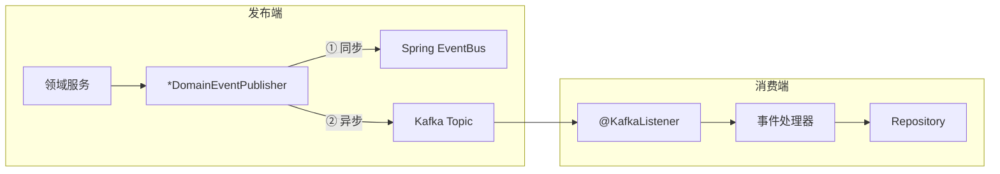

# 事件驱动架构实现说明

> 本文档说明项目中 Kafka 事件驱动架构的实际实现

## 架构概览



## 双发模式 (Double Publishing)

每个上下文有独立的 `*DomainEventPublisher`，统一模式：

```java
@Component("catalogDomainEventPublisher")
public class CatalogDomainEventPublisher {
    private final DomainEventPublisher localPublisher;  // Spring ApplicationEventPublisher
    private final KafkaTemplate<String, DomainEvent> kafkaTemplate;  // 可选注入

    public void publish(DomainEvent event) {
        localPublisher.publish(event);  // ① 本地同步，必成功
        if (kafkaTemplate == null) return;  // Kafka 不可用时优雅降级
        try {
            kafkaTemplate.send(topicName, event.getEventId(), event)
                .whenComplete((result, ex) -> { ... });
        } catch (Exception e) {
            log.error(...);  // 失败不影响业务
        }
    }
}
```

### 关键设计决策

| 决策 | 实现 | 原因 |
|------|------|------|
| Kafka 可选注入 | `ObjectProvider<KafkaTemplate>` | 测试环境可能没有 Kafka |
| 发送失败不影响业务 | `try-catch` + `whenComplete` | 业务优先，事件可丢失 |
| Bean 名称隔离 | `@Component("catalogDomainEventPublisher")` | 避免多模块 Bean 冲突 |
| Topic 配置化 | `Environment.getProperty()` | 不同环境不同 Topic |

### 7 个发布者

| 发布者 | Bean 名称 | 默认 Topic |
|--------|----------|-----------|
| CatalogDomainEventPublisher | catalogDomainEventPublisher | library.catalog.events |
| CirculationDomainEventPublisher | circulationDomainEventPublisher | library.circulation.events |
| InventoryDomainEventPublisher | inventoryDomainEventPublisher | library.inventory.events |
| PatronDomainEventPublisher | patronDomainEventPublisher | library.patron.events |
| PaymentDomainEventPublisher | paymentDomainEventPublisher | library.payment.events |
| AnalyticsDomainEventPublisher | analyticsDomainEventPublisher | library.analytics.events |

> 注：Notification 上下文只有消费者，没有 Kafka 发布者。

## Kafka 消费者

### 消费者统一模式

```java
@Component
public class CirculationEventConsumer {
    @KafkaListener(topics = "library.circulation.events",
                   groupId = "library.patron.consumer.circulation")
    public void onCirculationEvent(ConsumerRecord<String, String> record) {
        JsonNode event = objectMapper.readTree(record.value());
        String eventType = event.get("eventType").asText();
        switch (eventType) {
            case "BookBorrowedEvent" -> borrowedHandler.handle(event);
            case "BookReturnedEvent" -> returnedHandler.handle(event);
            case "FineIncurredEvent" -> fineHandler.handle(event);
        }
    }
}
```

### 12 个消费者 & 事件路由

| Topic | 消费模块 | Group ID | 处理的事件 |
|-------|---------|----------|-----------|
| library.catalog.events | Inventory | library.inventory.consumer.catalog | BookCreatedEvent |
| library.catalog.events | Analytics | library.analytics.consumer.catalog | BookCreatedEvent |
| library.circulation.events | **Patron** | library.patron.consumer.circulation | BookBorrowed, BookReturned, FineIncurred |
| library.circulation.events | **Notification** | library.notification.consumer.circulation | Borrowed, Returned, Fine, HoldPlaced, HoldFulfilled, Overdue |
| library.circulation.events | **Inventory** | library.inventory.consumer.circulation | BookBorrowed, BookReturned |
| library.circulation.events | **Payment** | library.payment.consumer.circulation | FineIncurred |
| library.patron.events | Circulation | library.circulation.consumer.patron | PatronSuspended |
| library.patron.events | Notification | library.notification.consumer.patron | PatronSuspended |
| library.inventory.events | Notification | library.notification.consumer.inventory | LowStockAlert |
| library.inventory.events | Analytics | library.analytics.consumer.inventory | LowStockAlert |
| library.payment.events | **Patron** | library.patron.consumer.payment | PaymentCompleted |
| library.payment.events | **Notification** | library.notification.consumer.payment | PaymentCompleted |

### 上下文间通信关系图

```
                    ┌──────────────┐
                    │   Catalog    │
                    │  (编目上下文) │
                    └──────┬───────┘
                           │ BookCreatedEvent
                    ┌──────┼──────────────────┐
                    ▼      ▼                   ▼
             ┌──────────┐ ┌──────────┐  ┌───────────┐
             │ Inventory│ │ Analytics│  │           │
             │ (库存)   │ │ (分析)   │  │           │
             └────┬─────┘ └──────────┘  │           │
                  │ LowStockAlert        │           │
                  ├──────────────┐       │           │
                  ▼              ▼       │           │
           ┌───────────┐ ┌──────────┐   │           │
           │Notification│ │ Analytics│   │           │
           └───────────┘ └──────────┘   │           │
                                        │           │
    ┌──────────────┐                    │           │
    │ Circulation  │────────────────────┘           │
    │  (流通上下文) │── BookBorrowed ──→ Patron      │
    └──────┬───────┘── BookBorrowed ──→ Inventory   │
           │          ├── BookReturned → Patron     │
           │          ├── BookReturned → Inventory   │
           │          ├── FineIncurred → Patron     │
           │          ├── FineIncurred → Payment     │
           │          └── HoldPlaced/HoldFulfilled   │
           │              /Overdue ──→ Notification  │
           │                                         │
           │◄── PatronSuspendedEvent ── Patron ──────┘
           │                     │
           │   Payment ── PaymentCompletedEvent
           │       │     ──→ Patron (减罚款)
           │       │     ──→ Notification
           └───────┘
```

### 双向通信关系

1. **Circulation ↔ Patron**: Circulation 发 BookBorrowedEvent → Patron 处理；Patron 发 PatronSuspendedEvent → Circulation 处理
2. **Circulation → Payment → Patron**（链式）: FineIncurredEvent → Payment 创建记录 → PaymentCompletedEvent → Patron 减罚款

## 事件处理器（application/handler/）

| 模块 | Handler | 处理的事件 | 作用 |
|------|---------|-----------|------|
| Inventory | BookCreatedEventHandler | BookCreatedEvent | 创建库存记录 |
| Inventory | BookBorrowedInventoryHandler | BookBorrowedEvent | 更新副本状态 |
| Inventory | BookReturnedInventoryHandler | BookReturnedEvent | 更新副本状态 |
| Patron | BookBorrowedEventHandler | BookBorrowedEvent | patron.recordLoan() |
| Patron | BookReturnedEventHandler | BookReturnedEvent | patron.recordReturn() |
| Patron | FineIncurredEventHandler | FineIncurredEvent | patron.addFine() |
| Patron | PaymentCompletedEventHandler | PaymentCompletedEvent | patron.payFine() |
| Payment | FineIncurredEventHandler | FineIncurredEvent | 创建 Payment 记录 |
| Circulation | PatronSuspendedEventHandler | PatronSuspendedEvent | 记录暂停事件 |
| Analytics | BookCreatedAnalyticsHandler | BookCreatedEvent | 记录统计 |
| Analytics | LowStockAnalyticsHandler | LowStockAlertEvent | 记录统计 |
| Notification | BorrowedNotificationHandler | BookBorrowedEvent | 创建借阅通知 |
| Notification | ReturnedNotificationHandler | BookReturnedEvent | 创建归还通知 |
| Notification | FineNotificationHandler | FineIncurredEvent | 创建罚金通知 |
| Notification | HoldNotificationHandler | HoldPlacedEvent, HoldFulfilledEvent | 创建预约通知 |
| Notification | LowStockNotificationHandler | LowStockAlertEvent | 通知 LIBRARIAN |
| Notification | PatronStatusNotificationHandler | PatronSuspendedEvent | 创建状态变更通知 |
| Notification | PaymentNotificationHandler | PaymentCompletedEvent | 创建支付确认通知 |
| Notification | OverdueNotificationHandler | OverdueNoticeEvent | 创建逾期通知 |

## 各模块领域事件统计

| 模块 | 领域事件数量 | 事件列表 |
|------|------------|---------|
| Catalog | 4 | BookCreated, BookUpdated, BookPublished, BookDeleted |
| Inventory | 8 | InventoryCreated, CopyAdded, CopiesBatchAdded, CopyBorrowed, CopyReturned, CopyDamaged, CopyLost, LowStockAlert |
| Circulation | 14 | BookBorrowed, BookReturned, LoanRenewed, LoanRecalled, LoanCancelled, FineIncurred, DueDateReminder, OverdueNotice, HoldPlaced, HoldFulfilled, HoldPickedUp, HoldCancelled, HoldExpired, HoldExpiredNotPickedUp |
| Patron | 6 | PatronRegistered, PatronUpdated, PatronSuspended, PatronReactivated, PatronTerminated, PatronTypeChanged |
| Payment | 6 | PaymentCreated, PaymentCompleted, PaymentFailed, PaymentCancelled, RefundRequested, RefundCompleted |
| Analytics | 4 | ReportCreated, ReportCompleted, ReportFailed, ReportCancelled |
| Notification | 4 | NotificationCreated, NotificationDelivered, NotificationFailed, NotificationRead |
| **合计** | **46** | |

> 数据截至 2026-05-31
